# isobar - [https://deepwiki.com/discohead/isobar/](https://deepwiki.com/discohead/isobar/)

## Table of Contents

1. [Overview](#1-overview)
2. [Core Concepts](#2-core-concepts)
   - 2.1 [Pattern System](#21-pattern-system)
   - 2.2 [Timeline and Event Scheduling](#22-timeline-and-event-scheduling)
   - 2.3 [Event System and Constants](#23-event-system-and-constants)
   - 2.4 [Musical Theory Integration](#24-musical-theory-integration)
3. [Pattern Library](#3-pattern-library)
   - 3.1 [Core Patterns](#31-core-patterns)
   - 3.2 [Sequence Patterns](#32-sequence-patterns)
   - 3.3 [Stochastic Patterns](#33-stochastic-patterns)
   - 3.4 [Musical Patterns](#34-musical-patterns)
   - 3.5 [Transformation Patterns](#35-transformation-patterns)
   - 3.6 [Static and Context Patterns](#36-static-and-context-patterns)
4. [I/O and Integration](#4-io-and-integration)
   - 4.1 [MIDI Integration](#41-midi-integration)
   - 4.2 [Audio Integration](#42-audio-integration)
   - 4.3 [Network and Control Integration](#43-network-and-control-integration)
5. [Advanced Topics](#5-advanced-topics)
   - 5.1 [Clock Sources and Synchronization](#51-clock-sources-and-synchronization)
   - 5.2 [Shorthand Interface](#52-shorthand-interface)
   - 5.3 [External Controller Integration](#53-external-controller-integration)
6. [Development and Utilities](#6-development-and-utilities)
   - 6.1 [Core Utilities](#61-core-utilities)
   - 6.2 [Documentation and Testing](#62-documentation-and-testing)
   - 6.3 [Exception Handling](#63-exception-handling)

---

## 1. Overview

This document provides a high-level introduction to the isobar library, its purpose for algorithmic composition, and the core architectural systems that enable musical pattern generation and event scheduling. 

isobar is a Python library for creating and manipulating musical patterns, designed for use in algorithmic composition, generative music, and sonification. It enables rapid expression of complex musical ideas through a pattern-based approach, with support for various output destinations including MIDI devices, audio engines, and network protocols.

### Core Architecture

isobar's architecture consists of four primary subsystems that work together to generate, schedule, and output musical events:

#### System Architecture Overview

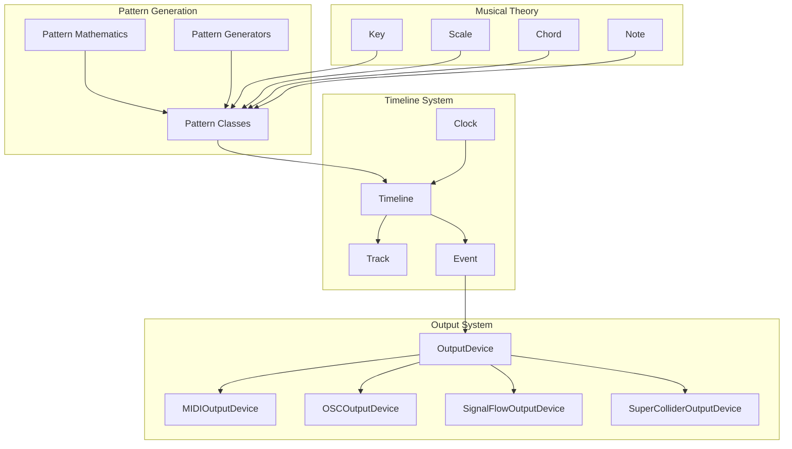

### Pattern System

The Pattern system is isobar's core abstraction for generating musical data. Patterns implement an iterator protocol and can be combined using mathematical operations to create complex behaviors.

#### Pattern Hierarchy and Data Flow

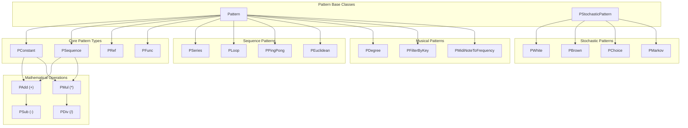

Patterns generate values through the `__next__()` method and can be reset via `reset()`. Mathematical operations between patterns create composite patterns that combine their outputs.

### Timeline and Event Processing

The `Timeline` class serves as the central orchestrator, managing tempo, scheduling events, and coordinating multiple `Track` objects. Events are structured dictionaries containing musical information.

#### Timeline Event Flow

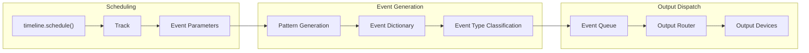

Events contain properties such as `note`, `duration`, `amplitude`, and `channel`, with additional properties routed based on the target output device.

### Output and I/O Systems

isobar supports multiple output destinations through the `OutputDevice` abstraction. Each device type handles specific event properties and protocols.

#### Output Device Architecture

```mermaid
graph TB
    subgraph "OutputDevice Base"
        OD["OutputDevice"]
        OEVENT["send_event()"]
        ONOTE["send_note()"]
        OCONTROL["send_control()"]
    end
    
    subgraph "MIDI System"
        MIDI["MIDIOutputDevice"]
        MIDIIN["MIDIInputDevice"] 
        MIDIFILE["MIDIFileOutputDevice"]
        MPE["MPEOutputDevice"]
    end
    
    subgraph "Audio Systems"
        SF["SignalFlowOutputDevice"]
        SC["SuperColliderOutputDevice"]
        FS["FluidSynthOutputDevice"]
    end
    
    subgraph "Control Systems"
        OSC["OSCOutputDevice"]
        CV["CVOutputDevice"]
        SOCK["SocketIOOutputDevice"]
    end
    
    OD --> OEVENT
    OD --> ONOTE
    OD --> OCONTROL
    
    OD --> MIDI
    OD --> MIDIIN
    OD --> MIDIFILE
    OD --> MPE
    OD --> SF
    OD --> SC
    OD --> FS
    OD --> OSC
    OD --> CV
    OD --> SOCK
```

### Key Code Entities

The following table maps the primary architectural concepts to their corresponding Python classes and modules:

| Concept | Primary Class | Module Location | Purpose |
|---------|---------------|-----------------|---------|
| Pattern Generation | `Pattern` | `isobar.pattern` | Abstract base for all pattern classes |
| Event Scheduling | `Timeline` | `isobar.timelines` | Central orchestrator and tempo management |
| Event Sequencing | `Track` | `isobar.timelines` | Individual pattern sequences |
| Musical Events | `dict` | `isobar.constants` | Structured event data |
| Device Output | `OutputDevice` | `isobar.io` | Abstract base for output destinations |
| Musical Theory | `Key`, `Scale`, `Chord` | `isobar.key`, `isobar.scale`, `isobar.chord` | Musical data structures |
| Timing Control | `Clock` | `isobar.timelines` | Tempo and synchronization |
| Value Generation | `PSequence`, `PWhite`, etc. | `isobar.pattern.*` | Specific pattern implementations |

### Data Flow Summary

A typical isobar program follows this execution pattern:

1. **Pattern Creation**: Instantiate pattern objects (`PSequence`, `PWhite`, etc.) to generate musical data
2. **Timeline Setup**: Create a `Timeline` with specified tempo and output device
3. **Event Scheduling**: Call `timeline.schedule()` with a dictionary mapping event properties to patterns
4. **Event Generation**: Timeline requests values from patterns and constructs event dictionaries  
5. **Output Dispatch**: Events are routed to appropriate output devices based on event type and device capabilities
6. **External Output**: Devices translate events to their native protocols (MIDI, OSC, audio signals, etc.)

This architecture enables rapid prototyping of algorithmic compositions while maintaining flexibility for complex musical structures and real-time performance scenarios.

---

## 2. Core Concepts

This document introduces the fundamental concepts that underpin the isobar algorithmic composition system. It provides an architectural overview of the four primary subsystems and explains how they interact to generate musical events.

### Purpose and Scope

The isobar system is built around four core conceptual pillars that work together to enable algorithmic composition:

1. **Pattern System** - Generates musical data through iterator-based patterns
2. **Timeline and Event Scheduling** - Orchestrates temporal sequencing and event dispatch  
3. **Event System** - Defines structured event dictionaries with typed parameters
4. **Musical Theory Integration** - Provides abstractions for keys, scales, and harmonic structures

These systems combine to transform algorithmic specifications into timed musical events that can be routed to various output devices.

### Architectural Overview

The isobar architecture follows a pipeline model where patterns generate data, timelines schedule events, and output devices render results:

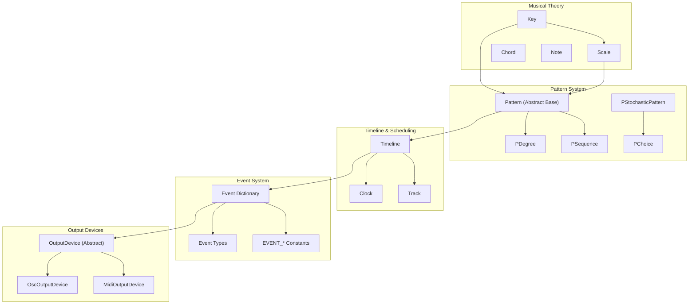

### 2.1 Pattern System

The Pattern System is the foundational abstraction layer in isobar that generates sequences of musical and control data.

#### Pattern Base Architecture

The Pattern System is built around an abstract base class that implements the Python iterator protocol. All patterns inherit from the `Pattern` class and must implement the `__next__()` method to generate sequential values.

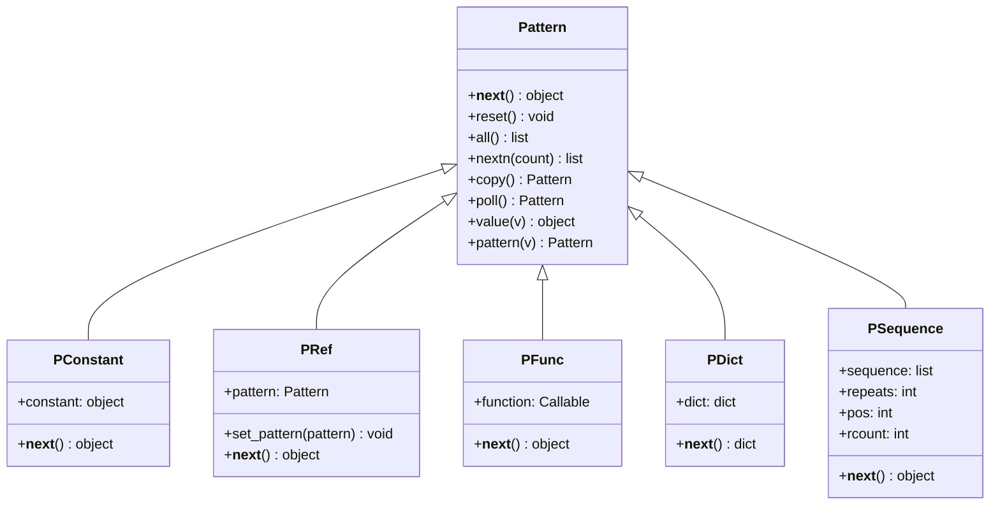

#### Iterator Protocol and Value Resolution

Patterns implement Python's iterator protocol, generating values through the `__next__()` method and raising `StopIteration` when exhausted. The system includes a recursive value resolution mechanism that can handle nested patterns and complex data structures.

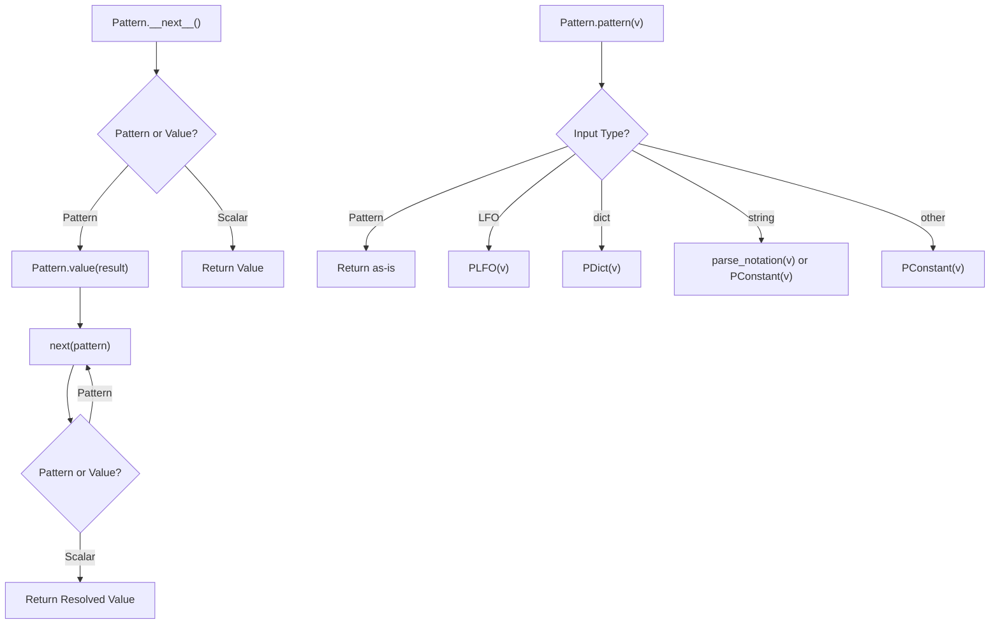

The value resolution system handles several key operations:
- **Recursive Resolution**: `Pattern.value()` recursively resolves nested patterns until reaching scalar values
- **Pattern Wrapping**: `Pattern.pattern()` automatically wraps non-pattern values in appropriate pattern classes
- **Type Coercion**: Automatic conversion of strings, dicts, and LFO objects into corresponding pattern types

#### Pattern Composition and Operators

Patterns support extensive composition through arithmetic and logical operators, creating new patterns that operate on the outputs of existing patterns. All binary operators are implemented as pattern classes that extend `PBinOp`.

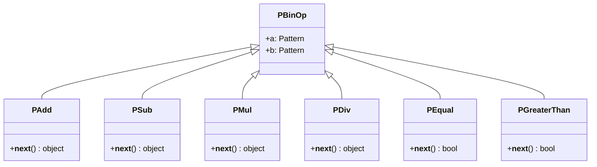

The operator overloading system supports:
- **Arithmetic**: `+`, `-`, `*`, `/`, `//`, `%`, `**`
- **Bitwise**: `<<`, `>>`
- **Comparison**: `==`, `!=`, `<`, `>`, `<=`, `>=`
- **Logical**: `&` (and)
- **Unary**: `-` (negation), `abs()`

#### Core Pattern Categories

The pattern system is organized into several functional categories, each serving specific roles in musical composition and control.

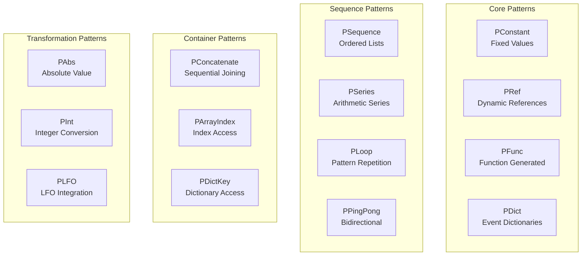

##### Core Patterns
- **`PConstant`**: Returns fixed values indefinitely
- **`PRef`**: Holds dynamic references to other patterns, allowing runtime pattern replacement
- **`PFunc`**: Executes functions to generate values
- **`PDict`**: Manages collections of named patterns for event generation

##### Sequence Patterns  
- **`PSequence`**: Cycles through lists of values with configurable repetition
- **`PSeries`**: Generates arithmetic progressions
- **`PLoop`**: Repeats finite patterns indefinitely
- **`PPingPong`**: Alternates pattern direction

##### Container Patterns
- **`PConcatenate`**: Chains multiple patterns sequentially
- **`PArrayIndex`**: Accesses array elements by pattern-driven indices
- **`PDictKey`**: Retrieves dictionary values by pattern-driven keys

#### Pattern State Management

Patterns maintain internal state that advances with each `__next__()` call. The state management system provides mechanisms for resetting patterns and controlling pattern lifecycle.

```mermaid
stateDiagram-v2
    [*] --> Initial
    Initial --> Active: __next__()
    Active --> Active: __next__()
    Active --> Exhausted: StopIteration
    Active --> Initial: reset()
    Exhausted --> Initial: reset()
    
    note right of Active: State variables:<br/>pos, count, values
    note right of Initial: All state variables<br/>reset to construction values
```

##### Reset Mechanism
The `reset()` method restores patterns to their initial construction state by:
- Recursively resetting all contained Pattern objects
- Resetting Pattern objects in lists and dictionaries
- Restoring internal counters and position variables

##### State Variables
Common state variables include:
- **Position counters**: Track current index in sequences
- **Repeat counters**: Track iteration counts for looping patterns  
- **Cached values**: Store computed results for optimization
- **Internal patterns**: Nested pattern objects that must be reset

##### Pattern Copying
The `copy()` method creates deep copies of patterns, preserving state while allowing independent operation:

```python
pattern_a = PSequence([1, 2, 3])
pattern_b = pattern_a.copy()  # Independent copy
```

#### Integration Points

The Pattern System integrates with other isobar systems through several key interfaces:

| Integration Point | Description | Key Classes |
|------------------|-------------|-------------|
| **Timeline Integration** | Patterns generate event property values | `PDict`, `PCurrentTime` |
| **MIDI Integration** | Patterns respond to MIDI control input | `PMIDIControl` |
| **LFO Integration** | Patterns wrap oscillator objects | `PLFO` |
| **Static Patterns** | Patterns maintain constant values over time | `PStaticPattern` |
| **Hardware Integration** | Patterns interface with controllers | `PMonomeArcControl` |

### 2.2 Timeline and Event Scheduling

This covers the Timeline and Event Scheduling system, which serves as the central orchestrator for all musical events in isobar. The Timeline coordinates timing, manages multiple event sequences (Tracks), and handles output to various devices.

#### Core Architecture

The Timeline system operates as a hierarchical scheduling engine where a single `Timeline` object manages multiple `Track` objects, each containing sequences of `Event` objects. Clock sources provide timing signals, and events are dispatched to output devices.

##### Timeline System Class Hierarchy

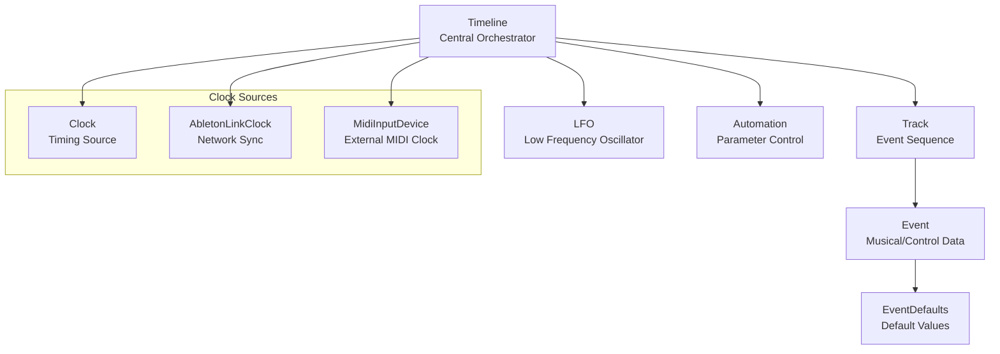

##### Event Processing Flow

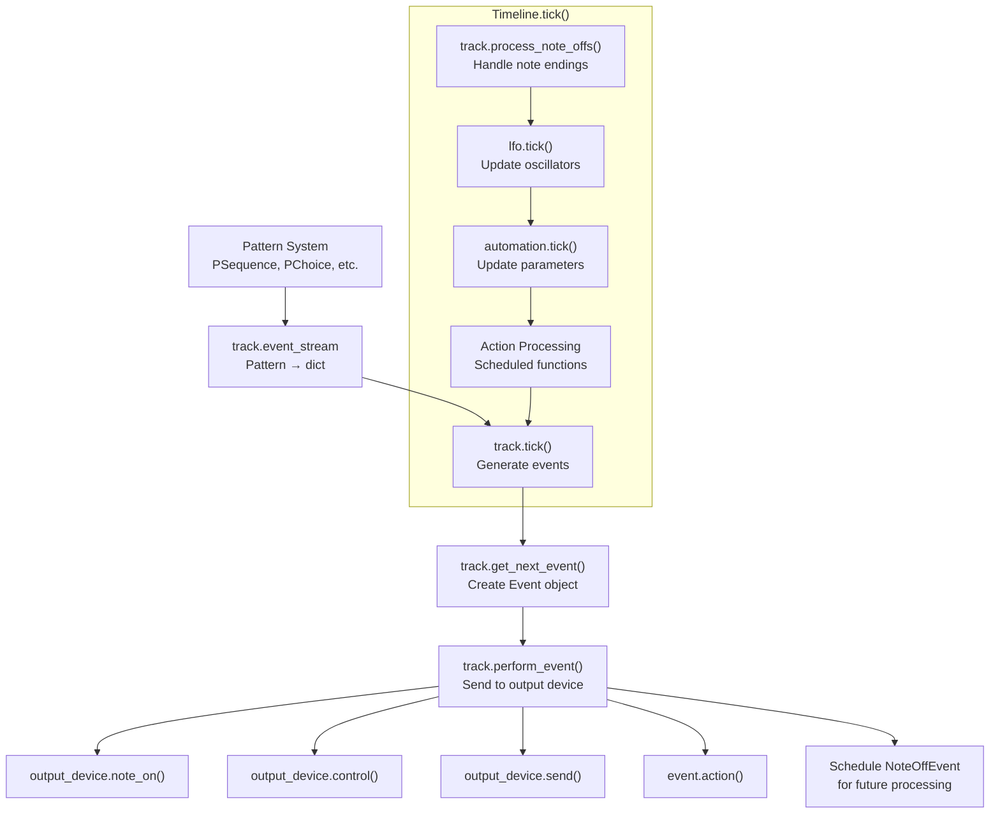

#### Timeline Management

The `Timeline` class serves as the central coordinator, managing timing, tracks, and output devices. It operates on a tick-based system where each tick represents a small time quantum.

##### Timeline Properties and Configuration

| Property | Type | Description | Default |
|----------|------|-------------|---------|
| `tempo` | `float` | Beats per minute | `DEFAULT_TEMPO` |
| `ticks_per_beat` | `int` | Timing resolution (PPQN) | `DEFAULT_TICKS_PER_BEAT` |
| `current_time` | `float` | Current position in beats | `0.0` |
| `stop_when_done` | `bool` | Auto-stop when no tracks active | `False` |
| `ignore_exceptions` | `bool` | Continue on track errors | `False` |

##### Track Scheduling and Management

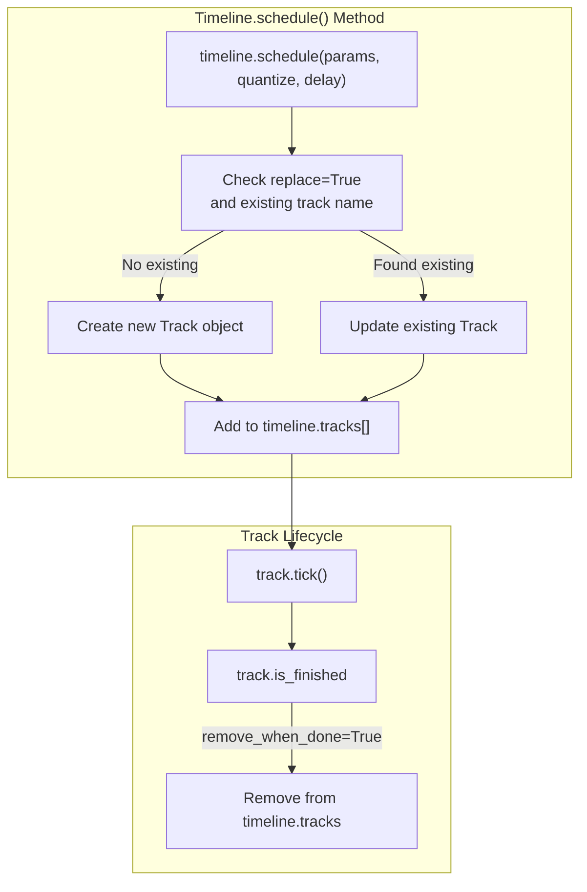

The `schedule()` method creates new `Track` objects and manages their lifecycle:

```python
# Basic track scheduling
track = timeline.schedule({
    "note": PSequence([60, 64, 67]),
    "duration": 0.5
})

# Quantized scheduling (start on next beat)
track = timeline.schedule({
    "note": 60
}, quantize=1.0)

# Named track with replacement
track = timeline.schedule({
    "note": 72
}, name="melody", replace=True)
```

#### Track and Event Processing

Each `Track` maintains its own timeline and generates `Event` objects from patterns. Events are classified by type and routed to appropriate output handlers.

##### Event Types and Classification

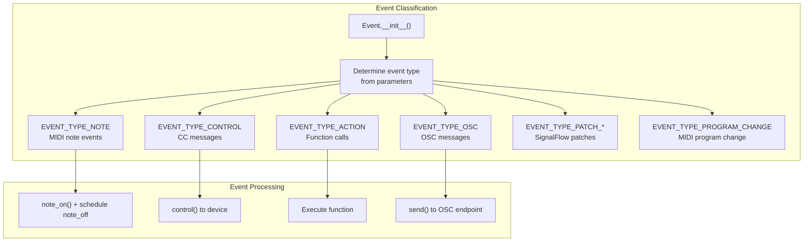

##### Note-Off Scheduling

Isobar automatically handles note-off events based on `duration` and `gate` parameters:

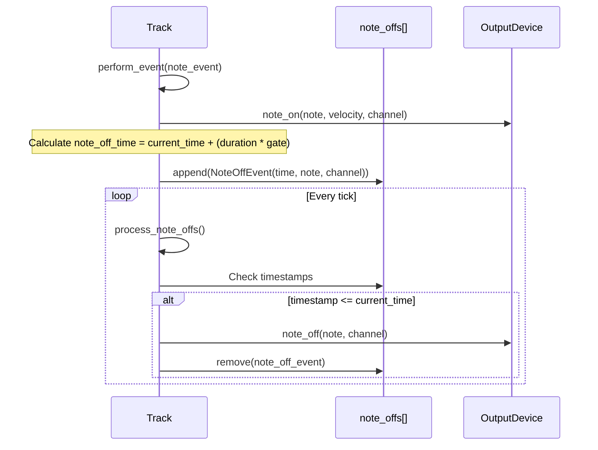

#### Clock Sources and Timing

The Timeline system supports multiple clock sources for synchronization with external systems.

##### Clock Source Types

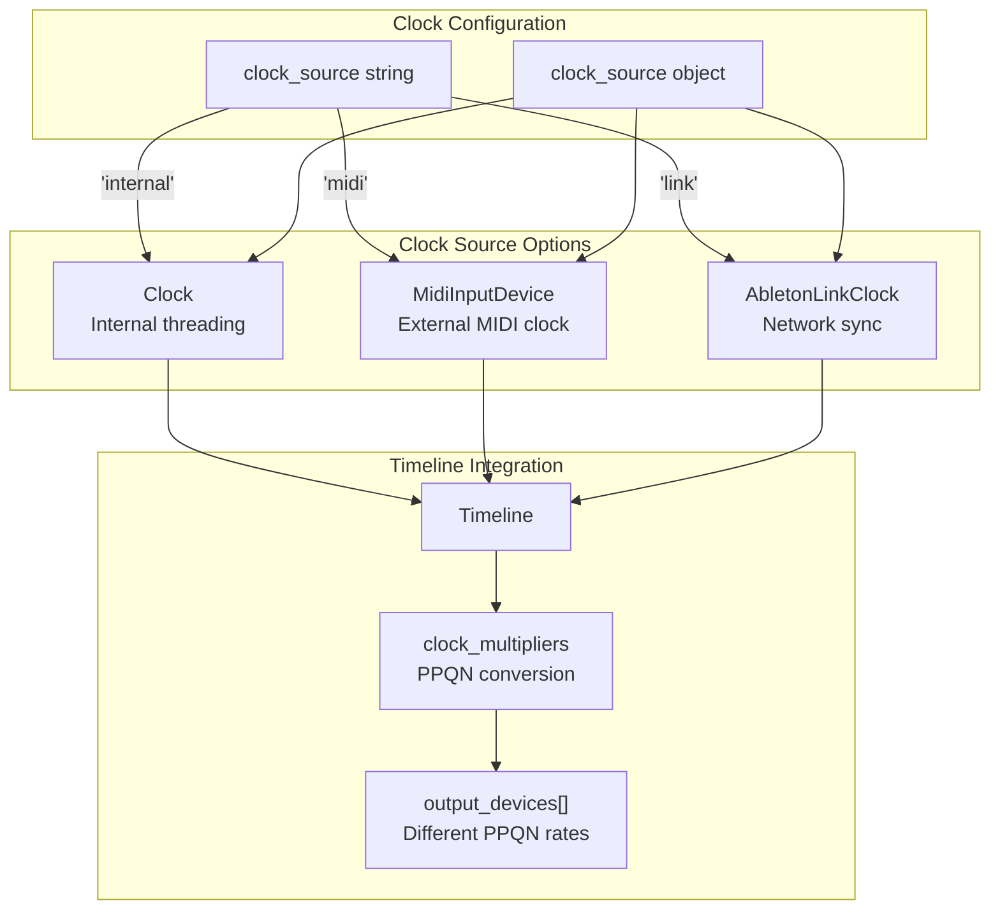

Clock multipliers handle timing conversion between different devices with varying `ticks_per_beat` requirements.

##### Tempo and Time Conversion

The Timeline provides utilities for converting between beats and seconds:

| Method | Purpose | Formula |
|--------|---------|---------|
| `beats_to_seconds(beats)` | Convert beat duration to seconds | `beats * 60.0 / tempo` |
| `seconds_to_beats(seconds)` | Convert second duration to beats | `seconds * tempo / 60.0` |
| `tick_duration` | Duration of one tick in beats | `1.0 / ticks_per_beat` |

#### Quantization and Scheduling

The system supports precise timing control through quantization and delay parameters.

##### Quantization Behavior

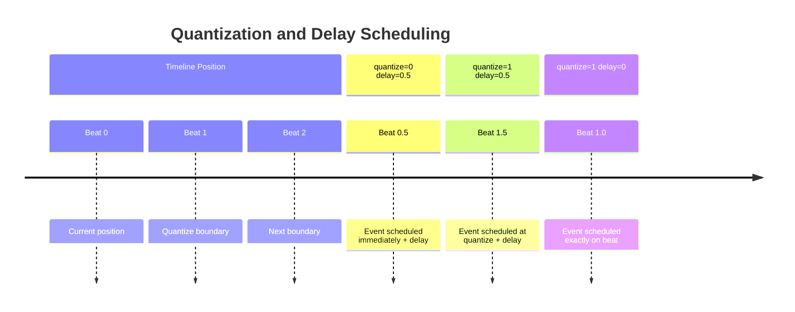

The quantization logic calculates scheduling time as:
```python
scheduled_time = self.current_time
if quantize:
    scheduled_time = quantize * math.ceil(float(self.current_time) / quantize)
scheduled_time += delay
```

#### Advanced Timeline Features

##### LFO (Low Frequency Oscillator)

LFOs provide continuous parameter modulation that runs independently of tracks:

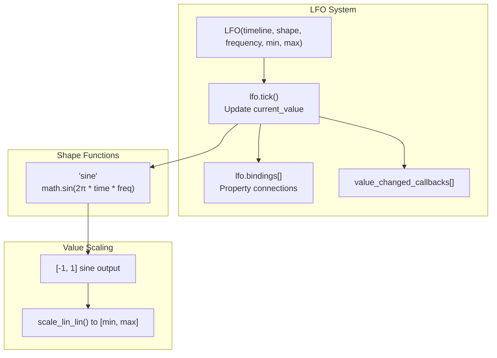

##### Automation System

The Automation system provides sophisticated parameter control with envelopes and modulation:

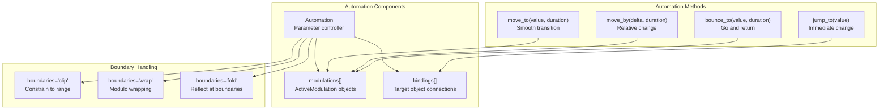

### 2.3 Event System and Constants

This document details the event dictionary structure, event types, and system constants that form the core data layer of the isobar library. Events are the fundamental units of musical data that flow through the Timeline system to generate output.

#### Event Structure Overview

The isobar event system centers around dictionary-based events that contain musical and control information. Each event is represented by the `Event` class, which processes raw dictionary data into a structured object with type-specific behavior.

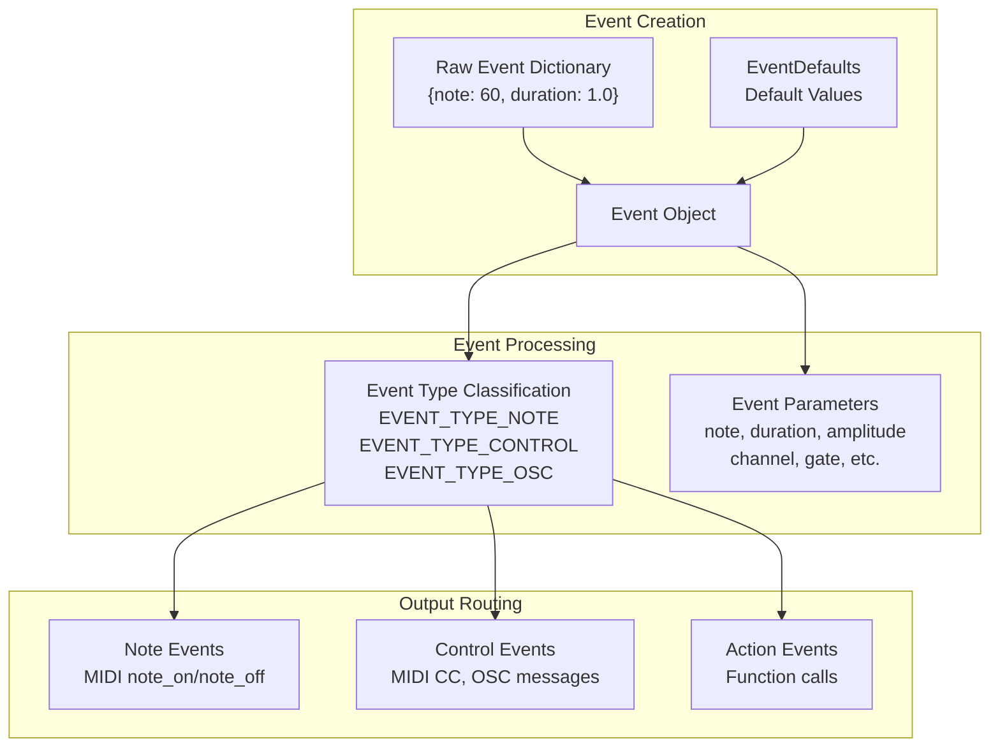

| Component | Description |
|-----------|-------------|
| `Event` | Core event class that processes dictionaries into structured objects |
| `EventDefaults` | Provides default values for all event parameters |
| Event Dictionary | Raw dictionary containing event parameters |

#### Event Types

Events are classified into distinct types based on their content and intended output behavior. The event type determines how the `Track.perform_event()` method processes the event.

```mermaid
graph TD
    subgraph "Event Type Detection"
        EventDict["Event Dictionary"]
        EventDict --> HasAction{"Has 'action' key?"}
        EventDict --> HasPatch{"Has 'patch' key?"}
        EventDict --> HasControl{"Has 'control' key?"}
        EventDict --> HasOSC{"Has 'osc_address' key?"}
        EventDict --> HasNote{"Has 'note' or 'degree' key?"}
        
        HasAction -->|Yes| ActionType["EVENT_TYPE_ACTION"]
        HasPatch -->|Yes| PatchType["EVENT_TYPE_PATCH_*"]
        HasControl -->|Yes| ControlType["EVENT_TYPE_CONTROL"]
        HasOSC -->|Yes| OSCType["EVENT_TYPE_OSC"]
        HasNote -->|Yes| NoteType["EVENT_TYPE_NOTE"]
    end
    
    subgraph "Event Type Constants"
        ActionType
        PatchType
        ControlType  
        OSCType
        NoteType
        ProgramChangeType["EVENT_TYPE_PROGRAM_CHANGE"]
        SuperColliderType["EVENT_TYPE_SUPERCOLLIDER"]
    end
```

| Constant | Value | Purpose |
|----------|-------|---------|
| `EVENT_TYPE_NOTE` | "note" | MIDI note events with pitch, velocity, duration |
| `EVENT_TYPE_CONTROL` | "control" | MIDI control change or continuous controller events |
| `EVENT_TYPE_PROGRAM_CHANGE` | "program_change" | MIDI program change events |
| `EVENT_TYPE_OSC` | "osc" | Open Sound Control message events |
| `EVENT_TYPE_ACTION` | "action" | Function call events for custom behavior |
| `EVENT_TYPE_PATCH_CREATE` | "patch" | SignalFlow patch creation events |
| `EVENT_TYPE_PATCH_TRIGGER` | "trigger" | SignalFlow patch trigger events |
| `EVENT_TYPE_PATCH_SET` | "set" | SignalFlow patch parameter update events |
| `EVENT_TYPE_SUPERCOLLIDER` | "supercollider" | SuperCollider synth creation events |

#### Event Parameters

Event parameters are the individual properties that define an event's musical and technical characteristics. These parameters are defined as string constants to ensure consistency across the codebase.

##### Core Musical Parameters

```mermaid
graph LR
    subgraph "Note Events"
        NoteParam["EVENT_NOTE<br/>'note'"]
        DegreeParam["EVENT_DEGREE<br/>'degree'"]
        DurationParam["EVENT_DURATION<br/>'duration'"]
        AmplitudeParam["EVENT_AMPLITUDE<br/>'amplitude'"]
        GateParam["EVENT_GATE<br/>'gate'"]
        ChannelParam["EVENT_CHANNEL<br/>'channel'"]
    end
    
    subgraph "Musical Context"
        KeyParam["EVENT_KEY<br/>'key'"]
        ScaleParam["EVENT_SCALE<br/>'scale'"]
        OctaveParam["EVENT_OCTAVE<br/>'octave'"]
        TransposeParam["EVENT_TRANSPOSE<br/>'transpose'"]
    end
    
    subgraph "Timing Control"
        QuantizeParam["EVENT_QUANTIZE<br/>'quantize'"]
        DelayParam["EVENT_DELAY<br/>'delay'"]
        TimeParam["EVENT_TIME<br/>'time'"]
    end
```

| Parameter | Default Value | Description |
|-----------|---------------|-------------|
| `EVENT_NOTE` | None | MIDI note number (0-127) |
| `EVENT_DEGREE` | None | Scale degree for tonal events |
| `EVENT_DURATION` | 1.0 | Event duration in beats |
| `EVENT_AMPLITUDE` | 64 | MIDI velocity/amplitude (0-127) |
| `EVENT_GATE` | 1.0 | Note duration multiplier (0.0-1.0) |
| `EVENT_CHANNEL` | 0 | MIDI channel (0-15) |
| `EVENT_OCTAVE` | 0 | Octave offset for pitch calculation |
| `EVENT_TRANSPOSE` | 0 | Semitone transposition offset |

##### Specialized Parameters

Different event types require specialized parameters for their specific functionality:

**Control Events**
- `EVENT_CONTROL`: MIDI control change number
- `EVENT_VALUE`: Control change value

**OSC Events**  
- `EVENT_OSC_ADDRESS`: OSC address path
- `EVENT_OSC_PARAMS`: List of OSC parameter values

**Action Events**
- `EVENT_ACTION`: Function to execute
- `EVENT_ACTION_ARGS`: Dictionary of function arguments

**Patch Events**
- `EVENT_PATCH`: Patch object or specification
- `EVENT_PATCH_PARAMS`: Dictionary of patch parameters
- `EVENT_PATCH_OUTPUT`: Output routing specification

#### System Constants

The constants system provides centralized definitions for timing, defaults, and system limits throughout isobar.

##### Timing Constants

```mermaid
graph TB
    subgraph "Clock Resolution"
        DefaultTPB["DEFAULT_TICKS_PER_BEAT<br/>480"]
        MidiTPB["MIDI_CLOCK_TICKS_PER_BEAT<br/>24"]
        DefaultTPB --> HighRes["High Resolution<br/>~1ms at 120bpm"]
        MidiTPB --> MidiSync["MIDI Standard<br/>24 PPQN"]
    end
    
    subgraph "Tempo & Timing"
        DefaultTempo["DEFAULT_TEMPO<br/>120"]
        MaxClockRate["MAX_CLOCK_RATE<br/>1e6"]
        Forever["FOREVER<br/>sys.maxsize"]
        ClockDelay["MIN_CLOCK_DELAY_WARNING_TIME<br/>0.02"]
    end
```

| Constant | Value | Purpose |
|----------|-------|---------|
| `DEFAULT_TICKS_PER_BEAT` | 480 | High-resolution timing (480 PPQN) |
| `MIDI_CLOCK_TICKS_PER_BEAT` | 24 | Standard MIDI clock resolution |
| `DEFAULT_TEMPO` | 120 | Default BPM for internal clocks |
| `MAX_CLOCK_RATE` | 1e6 | Maximum clock rate for fast Timeline execution |
| `FOREVER` | `sys.maxsize` | Value for neverending events |
| `MIN_CLOCK_DELAY_WARNING_TIME` | 0.02 | Threshold for clock delay warnings (seconds) |

##### Default Event Values

```mermaid
graph LR
    subgraph "Musical Defaults"
        DefChannel["DEFAULT_EVENT_CHANNEL<br/>0"]
        DefDuration["DEFAULT_EVENT_DURATION<br/>1"]
        DefGate["DEFAULT_EVENT_GATE<br/>1.0"]
        DefAmplitude["DEFAULT_EVENT_AMPLITUDE<br/>64"]
    end
    
    subgraph "Pitch Defaults"
        DefOctave["DEFAULT_EVENT_OCTAVE<br/>0"]
        DefTranspose["DEFAULT_EVENT_TRANSPOSE<br/>0"]
    end
    
    subgraph "Timing Defaults"
        DefQuantize["DEFAULT_EVENT_QUANTIZE<br/>0"]
        DefDelay["DEFAULT_EVENT_DELAY<br/>0"]
    end
```

| Constant | Value | Description |
|----------|-------|-------------|
| `DEFAULT_EVENT_CHANNEL` | 0 | MIDI channel 1 (zero-indexed) |
| `DEFAULT_EVENT_DURATION` | 1 | One beat duration |
| `DEFAULT_EVENT_GATE` | 1.0 | Full note duration (no shortening) |
| `DEFAULT_EVENT_AMPLITUDE` | 64 | Medium velocity (50% of 127) |
| `DEFAULT_EVENT_OCTAVE` | 0 | No octave offset |
| `DEFAULT_EVENT_TRANSPOSE` | 0 | No transposition |
| `DEFAULT_EVENT_QUANTIZE` | 0 | No quantization |
| `DEFAULT_EVENT_DELAY` | 0 | No delay |

##### Interpolation Constants

For control events that require smooth transitions between values:

| Constant | Purpose |
|----------|---------|
| `INTERPOLATION_NONE` | No interpolation between values |
| `INTERPOLATION_LINEAR` | Linear interpolation between values |  
| `INTERPOLATION_COSINE` | Cosine-based smooth interpolation |

#### Event Processing Flow

Events flow through several stages from creation to output, with each stage adding context and performing transformations.

```mermaid
flowchart TD
    subgraph "Event Creation"
        PatternDict["Pattern generates<br/>raw dictionary"]
        UserDict["User provides<br/>event dictionary"]
        PatternDict --> EventConstruct
        UserDict --> EventConstruct
    end
    
    subgraph "Event Construction"
        EventConstruct["Event.__init__()"]
        ApplyDefaults["Apply EventDefaults"]
        ProcessDegree["Process degree → note<br/>using Key/Scale"]
        ClassifyType["Classify event type<br/>based on parameters"]
        
        EventConstruct --> ApplyDefaults
        ApplyDefaults --> ProcessDegree
        ProcessDegree --> ClassifyType
    end
    
    subgraph "Event Execution"
        TrackPerform["Track.perform_event()"]
        CheckMuted["Check if track muted"]
        EventSwitch["Switch on event.type"]
        
        ClassifyType --> TrackPerform
        TrackPerform --> CheckMuted
        CheckMuted --> EventSwitch
    end
    
    subgraph "Output Dispatch"
        EventSwitch --> NoteOn["Note On<br/>output_device.note_on()"]
        EventSwitch --> ControlChange["Control Change<br/>output_device.control()"]
        EventSwitch --> OSCMessage["OSC Message<br/>output_device.send()"]
        EventSwitch --> ActionCall["Action Call<br/>event.action()"]
    end
```

Key Processing Steps:

1. **Event Construction**: Raw dictionaries are processed by `Event.__init__()` which applies defaults, handles legacy parameter names, and processes musical transformations like degree-to-note conversion.

2. **Type Classification**: Events are classified based on which parameters they contain, determining their processing path through `Track.perform_event()`.

3. **Parameter Validation**: Event parameters are validated against `ALL_EVENT_PARAMETERS` list to catch typos and invalid keys.

4. **Musical Transformation**: Degree values are converted to MIDI notes using the event's `Key` and `Scale` context, with octave and transpose offsets applied.

5. **Output Routing**: Based on event type, the appropriate output device method is called to generate MIDI, OSC, or other output.

### 2.4 Musical Theory Integration

This section documents isobar's musical theory integration system, which provides abstractions for working with musical concepts like scales, keys, chords, and notes. These components serve as the foundation for generating musically meaningful patterns and sequences. 

The musical theory system integrates directly with the Pattern System to enable musical transformations and mappings.

#### Core Musical Theory Architecture

The musical theory integration consists of four primary classes that work together to represent musical concepts:

```mermaid
graph TB
    subgraph "Musical Theory Core"
        Note[Note<br/>"Basic note representation"]
        Scale[Scale<br/>"Semitone collections"]
        Key[Key<br/>"Tonic + Scale combination"]
        Chord[Chord<br/>"Interval-based harmonies"]
    end
    
    subgraph "Utility Functions"
        NoteConv["note_name_to_midi_note()<br/>midi_note_to_note_name()"]
        FreqConv["frequency_to_midi_note()<br/>midi_note_to_frequency()"]
        MusCalc["Musical calculations<br/>semitone mappings"]
    end
    
    subgraph "Pattern Integration"
        PDegree["PDegree<br/>Scale degree mapping"]
        PFilterByKey["PFilterByKey<br/>Key-based filtering"]
        PMidiNoteToFreq["PMidiNoteToFrequency<br/>Frequency conversion"]
    end
    
    Scale --> Key
    Note --> NoteConv
    NoteConv --> FreqConv
    MusCalc --> Scale
    MusCalc --> Key
    
    Key --> PDegree
    Key --> PFilterByKey
    NoteConv --> PMidiNoteToFreq
    
    style Note fill:#f9f9f9
    style Scale fill:#f9f9f9  
    style Key fill:#f9f9f9
    style Chord fill:#f9f9f9
```

#### Scale System

The `Scale` class represents collections of semitones that define musical scales. Scales serve as the foundation for key-based musical operations.

##### Scale Class Structure

```mermaid
classDiagram
    class Scale {
        +list~int~ semitones
        +list~float~ weights
        +str name
        +int octave_size
        +dict dict
        +get(n) int
        +indexOf(note) int
        +copy() Scale
        +change() Scale
        +shuffle() Scale
        +fromnotes(notes) Scale
        +byname(name) Scale
        +random() Scale
        +random_note() int
    }
    
    class WeightedScale {
        +list~float~ weights
        +fromnotes(notes) WeightedScale
        +fromorder(notes) WeightedScale
    }
    
    Scale <|-- WeightedScale
```

##### Predefined Scales

The system includes numerous predefined scales accessible as class attributes:

| Scale Type | Semitones | Usage |
|------------|-----------|--------|
| `Scale.major` | [0, 2, 4, 5, 7, 9, 11] | Standard major scale |
| `Scale.minor` | [0, 2, 3, 5, 7, 8, 10] | Natural minor scale |
| `Scale.chromatic` | [0, 1, 2, 3, 4, 5, 6, 7, 8, 9, 10, 11] | All semitones |
| `Scale.majorPenta` | [0, 2, 4, 7, 9] | Pentatonic major |
| `Scale.dorian` | [0, 2, 3, 5, 7, 9, 10] | Dorian mode |

##### Scale Operations

The `Scale.get()` method maps scale degrees to actual semitones, handling octave wrapping:

```python
# Scale degree 7 in C major = first note of next octave
major_scale = Scale([0, 2, 4, 5, 7, 9, 11])
note = major_scale.get(7)  # Returns 12 (C + octave)
```

#### Key System  

The `Key` class combines a tonic note with a scale to create a complete harmonic context. Keys enable musical operations like degree-to-pitch mapping and harmonic analysis.

##### Key Class Architecture

```mermaid
graph TB
    subgraph "Key Components"
        Tonic[tonic<br/>"Root note (int/str)"]
        ScaleRef[scale<br/>"Scale reference"]
    end
    
    subgraph "Key Methods"
        GetMethod["get(degree)<br/>Returns semitone"]
        ContainsMethod["__contains__(semitone)<br/>Tests membership"]
        SemitonesProperty["semitones property<br/>Returns key notes"]
        NearestNote["nearest_note(note)<br/>Finds closest key note"]
    end
    
    subgraph "Advanced Operations"
        VoiceLeading["voiceleading(other)<br/>Parsimonious voice leading"]
        Distance["distance(other)<br/>Harmonic distance"]
        FadeTo["fadeto(other, level)<br/>Interpolation between keys"]
    end
    
    Tonic --> GetMethod
    ScaleRef --> GetMethod
    GetMethod --> SemitonesProperty
    SemitonesProperty --> ContainsMethod
    SemitonesProperty --> NearestNote
    
    SemitonesProperty --> VoiceLeading
    VoiceLeading --> Distance
    SemitonesProperty --> FadeTo
```

##### Key Construction

Keys can be constructed using MIDI note numbers or note names:

```python
# Using MIDI note number and scale object
key1 = Key(0, Scale.major)

# Using note name and scale name
key2 = Key("C", "major") 

# Combined string notation
key3 = Key("F# minor")
```

##### Key Operations

The key system provides several essential operations:

- **Degree mapping**: `key.get(degree)` or `key[degree]` maps scale degrees to MIDI notes
- **Membership testing**: `note in key` tests if a note belongs to the key
- **Nearest note**: `key.nearest_note(note)` finds the closest key-valid note

#### Chord System

The `Chord` class represents harmonic structures using interval-based definitions. Chords generate semitone collections from root notes and interval patterns.

##### Chord Structure

```mermaid
graph LR
    subgraph "Chord Definition"
        Root[root<br/>"Base semitone"]
        Intervals[intervals<br/>"List of intervals"]
        Name[name<br/>"Chord identifier"]
    end
    
    subgraph "Chord Output"
        Semitones[semitones property<br/>"Calculated note collection"]
    end
    
    Root --> Semitones
    Intervals --> Semitones
    
    subgraph "Predefined Chords"
        Major["Chord.major<br/>[4, 3, 5]"]
        Minor["Chord.minor<br/>[3, 4, 5]"] 
        Dim["Chord.diminished<br/>[3, 3, 6]"]
        Aug["Chord.augmented<br/>[4, 4, 4]"]
    end
    
    Major --> Semitones
    Minor --> Semitones
```

##### Chord Generation

The chord system supports both predefined and generated chords:

```python
# Predefined chord types
major_chord = Chord.major    # [4, 3, 5] intervals
minor_chord = Chord.minor    # [3, 4, 5] intervals

# Generate arbitrary chord
arbitrary = Chord.arbitrary("custom")

# Random chord with random root
random_chord = Chord.random()
```

#### Note Utilities

The system provides comprehensive utilities for note name conversion, frequency mapping, and musical calculations.

##### Note Conversion Functions

```mermaid
flowchart TB
    subgraph "Note Representations"
        NoteName["Note Names<br/>'C4', 'F#3', 'Bb2'"]
        MIDINote["MIDI Notes<br/>0-127 integers"]
        Frequency["Frequencies<br/>Hz values"]
    end
    
    subgraph "Conversion Functions"
        NameToMIDI["note_name_to_midi_note()"]
        MIDIToName["midi_note_to_note_name()"]
        FreqToMIDI["frequency_to_midi_note()"]
        MIDIToFreq["midi_note_to_frequency()"]
        NameToFreq["note_name_to_frequency()"]
    end
    
    NoteName -->|"NameToMIDI"| MIDINote
    MIDINote -->|"MIDIToName"| NoteName
    Frequency -->|"FreqToMIDI"| MIDINote
    MIDINote -->|"MIDIToFreq"| Frequency
    NoteName -->|"NameToFreq"| Frequency
```

##### Note Name Conventions

The system uses a middle C = C4 convention where MIDI note 60 corresponds to C4:

```python
note_name_to_midi_note("C4")   # Returns 60
midi_note_to_note_name(60)     # Returns "C4"
note_name_to_frequency("A4")   # Returns 440.0
```

##### Frequency Calculations

The system supports precise frequency calculations and conversions:

- **Equal temperament**: Standard 12-tone equal temperament tuning
- **Just intonation**: `midi_note_to_frequency_just_intonation()` for pure ratios
- **Semitone ratios**: `midi_semitones_to_frequency_ratio()` for interval calculations

#### Integration with Pattern System

The musical theory classes integrate seamlessly with isobar's pattern system, enabling musical transformations and generation.

##### Musical Pattern Integration

```mermaid
graph TB
    subgraph "Pattern System"
        Pattern[Pattern<br/>"Base iterator"]
        Degree[PDegree<br/>"Scale degree pattern"]
        Filter[PFilterByKey<br/>"Key filtering pattern"]
        Convert[PMidiNoteToFrequency<br/>"Frequency conversion"]
    end
    
    subgraph "Musical Theory"
        KeyObj[Key<br/>"Harmonic context"]
        ScaleObj[Scale<br/>"Note collections"]
        Utils[Utility Functions<br/>"Conversions"]
    end
    
    subgraph "Musical Output"
        ScaleDegrees["Scale degree sequences"]
        FilteredNotes["Key-valid note sequences"] 
        Frequencies["Frequency sequences"]
    end
    
    Pattern --> Degree
    KeyObj --> Degree
    ScaleObj --> Degree
    Degree --> ScaleDegrees
    
    Pattern --> Filter
    KeyObj --> Filter
    Filter --> FilteredNotes
    
    Pattern --> Convert
    Utils --> Convert
    Convert --> Frequencies
```

##### Example Integration

The musical theory system enables patterns like:

```python
# Scale degree pattern using Key
key = Key("C", "major")
degrees = PSequence([0, 1, 2, 3, 4, 5, 6, 7])
notes = PDegree(degrees, key)  # Maps to C major scale

# Key-based filtering
notes = PWhite(0, 127)  # Random MIDI notes
filtered = PFilterByKey(notes, key)  # Only C major notes

# Frequency conversion
frequencies = PMidiNoteToFrequency(notes)
```

This integration allows the pattern system to work naturally with musical concepts while maintaining the flexibility of the underlying pattern abstractions.

---

## 3. Pattern Library

### Purpose and Scope

The Pattern Library provides a comprehensive collection of pattern classes for generating musical sequences, values, and control data in isobar. This page documents all available pattern types, their relationships, and usage patterns.

### Pattern Base System

The pattern system is built around the abstract `Pattern` class which implements the Python iterator protocol. All patterns inherit from this base class and provide a `__next__()` method to generate sequential values.

#### Pattern Abstract Base Class

The core `Pattern` class provides the foundation for all pattern types:

- **Iterator Protocol**: Implements `__iter__()` and `__next__()` for Python iteration
- **Arithmetic Operations**: Overloads all standard operators (`+`, `-`, `*`, `/`, `%`, `**`, `<<`, `>>`)
- **Comparison Operations**: Supports `==`, `!=`, `<`, `>`, `<=`, `>=`, `&` operators
- **State Management**: Provides `reset()` method to restore initial state
- **Value Resolution**: Static methods `value()` and `pattern()` for recursive pattern evaluation
- **Utility Methods**: `nextn()`, `all()`, `copy()`, `poll()` for debugging and introspection

```mermaid
graph TD
    Pattern["Pattern (Abstract Base)"] --> PConstant["PConstant"]
    Pattern --> PRef["PRef"] 
    Pattern --> PFunc["PFunc"]
    Pattern --> PDict["PDict"]
    Pattern --> PArrayIndex["PArrayIndex"]
    Pattern --> PConcatenate["PConcatenate"]
    Pattern --> PBinOp["PBinOp (Abstract)"]
    
    PBinOp --> PAdd["PAdd (+)"]
    PBinOp --> PSub["PSub (-)"] 
    PBinOp --> PMul["PMul (*)"]
    PBinOp --> PDiv["PDiv (/)"]
    PBinOp --> PMod["PMod (%)"]
    PBinOp --> PPow["PPow (**)"]
    PBinOp --> PEqual["PEqual (==)"]
    PBinOp --> PGreaterThan["PGreaterThan (>)"]
    PBinOp --> PLessThan["PLessThan (<)"]
```

#### Pattern Value Resolution

The pattern system supports recursive value resolution through the `Pattern.value()` static method. When a pattern returns another pattern, the system automatically resolves nested patterns to scalar values:

```mermaid
flowchart LR
    Input["Pattern Input"] --> Check{"Is Pattern?"}
    Check -->|Yes| Recurse["next(pattern)"]
    Check -->|No| Scalar["Return Scalar"]
    Recurse --> Check
    Scalar --> Output["Final Value"]
```

### Pattern Categories

The pattern library is organized into several functional categories based on their primary purpose and behavior:

#### Core Patterns

Fundamental building blocks that provide basic value generation and reference capabilities:

| Pattern | Purpose | Example |
|---------|---------|---------|
| `PConstant` | Fixed value | `PConstant(60)` → 60, 60, 60... |
| `PRef` | Dynamic reference | `PRef(pattern)` allows runtime pattern swapping |
| `PFunc` | Function-generated values | `PFunc(lambda: random.randint(0,127))` |
| `PDict` | Structured event data | `PDict({"note": [60,67], "velocity": [80,100]})` |
| `PArrayIndex` | Array element access | `PArrayIndex([10,20,30], PSequence([0,1,2]))` |

#### Sequence Patterns

Generate ordered sequences, series, and deterministic progressions:

| Pattern | Purpose | Example |
|---------|---------|---------|
| `PSequence` | Ordered list iteration | `PSequence([1,2,3], repeats=2)` |
| `PSeries` | Arithmetic progression | `PSeries(start=0, step=2)` → 0,2,4,6... |
| `PRange` | Bounded range | `PRange(0, 10, 2)` → 0,2,4,6,8 |
| `PGeom` | Geometric progression | `PGeom(1, 2)` → 1,2,4,8,16... |
| `PImpulse` | Periodic trigger | `PImpulse(4)` → 1,0,0,0,1,0,0,0... |

#### Sequence Manipulation Patterns

Transform and manipulate existing sequences:

| Pattern | Purpose | Example |
|---------|---------|---------|
| `PLoop` | Finite pattern repetition | `PLoop(PSequence([1,2,3], 1), 5)` |
| `PPingPong` | Bidirectional traversal | `PPingPong(PSequence([1,2,3]), 3)` |
| `PCreep` | Sliding window iteration | `PCreep(PSeries(), length=3, creep=1)` |
| `PStutter` | Value repetition | `PStutter(PSeries(), count=2)` |
| `PReverse` | Sequence reversal | `PReverse(PSequence([1,2,3]))` |

#### Rhythmic and Euclidean Patterns

Specialized patterns for rhythm generation:

| Pattern | Purpose | Example |
|---------|---------|---------|
| `PEuclidean` | Euclidean rhythm generation | `PEuclidean(5, 8)` distributes 5 events over 8 steps |
| `PArpeggiator` | Chord arpeggiation | `PArpeggiator(Chord.major, PArpeggiator.UP)` |

### Pattern Composition and Arithmetic

Patterns support comprehensive arithmetic and logical operations through operator overloading. These operations create new patterns that apply the specified operation element-wise:

```mermaid
graph LR
    PatternA["Pattern A"] --> Add["+"]
    PatternB["Pattern B"] --> Add
    Add --> PAdd["PAdd Pattern"]
    
    PatternC["Pattern C"] --> Mult["*"]
    Scalar["Scalar Value"] --> Mult
    Mult --> PMul["PMul Pattern"]
    
    PAdd --> Combine["Combined Operations"]
    PMul --> Combine
    Combine --> Result["Final Pattern"]
```

#### Binary Operations

All standard arithmetic operators create composite patterns:

- **Arithmetic**: `+`, `-`, `*`, `/`, `//`, `%`, `**`
- **Bitwise**: `<<`, `>>`  
- **Comparison**: `==`, `!=`, `<`, `>`, `<=`, `>=`
- **Logical**: `&` (and)

#### Null Value Handling

Binary operations return `None` when either operand is `None`, maintaining rest/silence semantics in musical sequences.

### Pattern State Management and Lifecycle

#### Reset and State Restoration

The `reset()` method recursively resets all patterns and their dependencies to initial state:

```mermaid
flowchart TD
    Reset["pattern.reset()"] --> ScanFields["Scan object fields"]
    ScanFields --> CheckType{"Field type?"}
    CheckType -->|Pattern| ResetPattern["field.reset()"]
    CheckType -->|List| ScanList["Scan list items"]
    CheckType -->|Dict| ScanDict["Scan dict values"]
    CheckType -->|Other| Skip["Skip field"]
    
    ScanList --> CheckItem{"Item is Pattern?"}
    CheckItem -->|Yes| ResetItem["item.reset()"]
    CheckItem -->|No| Continue["Continue scan"]
    
    ScanDict --> CheckValue{"Value is Pattern?"}
    CheckValue -->|Yes| ResetValue["value.reset()"]
    CheckValue -->|No| ContinueDict["Continue scan"]
    
    ResetPattern --> Complete["Reset complete"]
    ResetItem --> Complete
    ResetValue --> Complete
    Skip --> Complete
    Continue --> Complete
    ContinueDict --> Complete
```

#### Pattern Copying

The `copy()` method creates deep copies of patterns with independent state, essential for using the same pattern logic in multiple contexts without state interference.

### Stochastic Pattern System

Stochastic patterns inherit from `PStochasticPattern` which provides independent random number generator state for reproducible sequences. This allows patterns to be seeded for deterministic pseudo-random behavior.

#### Key Stochastic Patterns

Based on the class hierarchy diagrams shown earlier, stochastic patterns include:

- `PWhite`: White noise (uniform random)
- `PBrown`: Brownian motion (random walk)  
- `PChoice`: Random selection from options
- `PMarkov`: Markov chain generation

### Advanced Pattern Types

#### Container and Structural Patterns

- **`PDict`**: Creates structured event dictionaries from arrays or nested patterns
- **`PConcatenate`**: Sequences multiple patterns end-to-end

#### Algorithmic Generation Patterns

- **`PArpeggiator`**: Chord arpeggiation with multiple algorithms (UP, DOWN, CONVERGE, DIVERGE, etc.)
- **`PEuclidean`**: Implements Bjorklund's algorithm for Euclidean rhythm generation
- **`PExplorer`**: Evolutionary pattern modification with operations like mutate, rotate, swap

#### Meta-Patterns

- **`PPatternGeneratorAction`**: Generates new patterns dynamically via function calls
- **`PSequenceAction`**: Applies transformations to sequences iteratively

### Static and Context Patterns

Static patterns maintain state without advancing on each `next()` call, useful for temporal structure and shared state:

- **`PStaticPattern`**: Holds pattern values for specified durations
- **`PCurrentTime`**: Returns current timeline time
- **`PGlobals`**: Accesses shared global variables

These patterns enable coordination across multiple timeline tracks and temporal orchestration of compositional changes.

### Integration with Timeline System

Patterns integrate with the Timeline system through the event scheduling mechanism. The Timeline evaluates patterns at each step, resolving nested patterns and applying the values to event properties before dispatching to output devices.

```mermaid
flowchart LR
    Timeline["Timeline"] --> Schedule["Schedule Events"]
    Schedule --> Evaluate["Evaluate Patterns"]
    Evaluate --> Resolve["Pattern.value()"]
    Resolve --> CreateEvent["Create Event Dict"]
    CreateEvent --> Dispatch["Dispatch to Device"]
    
    Patterns["Pattern Library"] --> Evaluate
    StaticPatterns["Static Patterns"] --> Evaluate
    GlobalState["PGlobals"] --> Evaluate
```

### 3.1 Core Patterns

This document covers the fundamental building block patterns that form the foundation of the isobar pattern system. These core patterns provide basic functionality for constant values, dynamic references, function-based generation, data structure manipulation, and arithmetic operations that all other patterns build upon.

#### Pattern Base Class

The `Pattern` class serves as the abstract base class for all patterns in isobar, implementing the iterator protocol and providing essential functionality for pattern composition and manipulation.

##### Core Iterator Protocol

All patterns implement Python's iterator protocol through key methods:

| Method | Purpose |
|--------|---------|
| `__next__()` | Returns the next value in the pattern sequence |
| `__iter__()` | Returns the pattern itself as an iterator |
| `reset()` | Resets pattern to initial state |

##### Value Resolution and Pattern Conversion

The Pattern class provides static methods for value resolution and pattern conversion:

- `Pattern.value(v)` - Recursively resolves patterns to scalar values
- `Pattern.pattern(v)` - Converts various types to Pattern objects

##### Utility Methods

| Method | Purpose | Returns |
|--------|---------|---------|
| `nextn(count)` | Get next N values | List of values |
| `all(maximum)` | Get all values up to maximum | List of values |
| `poll(on)` | Enable/disable output debugging | Pattern instance |
| `copy()` | Create deep copy of pattern | Pattern copy |

#### Fundamental Core Patterns

##### PConstant

`PConstant` returns a fixed value indefinitely, serving as the simplest pattern type and the foundation for wrapping scalar values.

```python
# Always returns the same value
p = PConstant(42)
p.nextn(5)  # [42, 42, 42, 42, 42]
```

##### PRef

`PRef` contains a reference to another pattern that can be dynamically replaced during execution, enabling real-time pattern switching.

```python
# Dynamic pattern reference
inner = PSequence([1, 2, 3])
ref = PRef(inner)
ref.set_pattern(PSequence([4, 5, 6]))  # Switch pattern
```

Key methods:
- `set_pattern(pattern)` - Replace the referenced pattern

##### PFunc

`PFunc` generates values by calling a function on each iteration, allowing incorporation of external logic and real-time computation.

```python
# Function-based pattern
import datetime
p = PFunc(lambda: datetime.datetime.now().second)
```

#### Container and Access Patterns

##### PDict

`PDict` constructs patterns from dictionaries or arrays of dictionaries, providing structured data handling for complex musical events.

**Input formats**:
- Dictionary of arrays: `{"note": [60, 67], "velocity": [64, 32]}`
- Array of dictionaries: `[{"note": 60, "velocity": 64}, {"note": 67, "velocity": 32}]`

Key capabilities:
- MIDI file I/O via `load(filename)` and `save(filename)`
- Dictionary-like access with `__getitem__`, `__setitem__`
- Attribute-style access for syntactic convenience

##### PArrayIndex and PDictKey

`PArrayIndex` extracts values from arrays by index, while `PDictKey` extracts values from dictionaries by key. Both support dynamic indexing through patterns.

- `PArrayIndex(list, index)` - Array access
- `PDictKey(dict, key)` - Dictionary access

##### PConcatenate

`PConcatenate` joins multiple pattern sequences end-to-end, useful for creating longer composite patterns.

```python
# Concatenate multiple patterns
p1 = PSequence([1, 2, 3], 2)
p2 = PSequence([9, 8, 7], 2) 
concat = PConcatenate([p1, p2])
```

#### Utility Patterns

##### Type Conversion Patterns

| Pattern | Purpose |
|---------|---------|
| `PAbs` | Absolute value transformation |
| `PInt` | Integer conversion |

##### LFO Integration

`PLFO` wraps Low Frequency Oscillator objects for integration with the pattern system:

```python
# LFO pattern wrapper
lfo = LFO(frequency=0.5, waveform="sine")
p = PLFO(lfo)
```

#### Binary Operations and Arithmetic

The Pattern class overloads all standard arithmetic and comparison operators, enabling natural mathematical expressions between patterns and scalars.

##### Arithmetic Operations

```mermaid
graph TB
    subgraph "Arithmetic Operators"
        PAdd["PAdd<br/>__add__ (+)"]
        PSub["PSub<br/>__sub__ (-)"]
        PMul["PMul<br/>__mul__ (*)"]
        PDiv["PDiv<br/>__truediv__ (/)"]
        PFloorDiv["PFloorDiv<br/>__floordiv__ (//)"]
        PMod["PMod<br/>__mod__ (%)"]
        PPow["PPow<br/>__pow__ (**)"]
    end
    
    subgraph "Bitwise Operators"
        PLShift["PLShift<br/>__lshift__ (<<)"]
        PRShift["PRShift<br/>__rshift__ (>>)"]
    end
    
    subgraph "Comparison Operators"
        PEqual["PEqual<br/>__eq__ (==)"]
        PNotEqual["PNotEqual<br/>__ne__ (!=)"]
        PGreaterThan["PGreaterThan<br/>__gt__ (>)"]
        PLessThan["PLessThan<br/>__lt__ (<)"]
        PGreaterThanOrEqual["PGreaterThanOrEqual<br/>__ge__ (>=)"]
        PLessThanOrEqual["PLessThanOrEqual<br/>__le__ (<=)"]
    end
    
    subgraph "Logical Operators"
        PAnd["PAnd<br/>__and__ (&)"]
        PAbs["PAbs<br/>__abs__ (abs())"]
    end
```

##### Binary Operation Base Class

All binary operations inherit from `PBinOp`, which handles operand storage and provides the foundation for operator implementations:

```python
class PBinOp(Pattern):
    def __init__(self, a, b):
        self.a = a  # Left operand
        self.b = b  # Right operand
```

##### Operator Implementation Pattern

Each binary operator follows a consistent implementation pattern:

1. Extract values using `Pattern.value()` for both operands
2. Handle `None` values (representing rests) appropriately  
3. Apply the mathematical operation
4. Return `None` if either operand is `None`

Example from `PAdd`:
```python
def __next__(self):
    a = Pattern.value(self.a)
    b = Pattern.value(self.b)
    return None if a is None or b is None else a + b
```

#### Core Pattern Hierarchy

```mermaid
graph TD
    Pattern["Pattern<br/>Abstract Base Class"]
    
    subgraph "Fundamental Patterns"
        PConstant["PConstant<br/>Fixed Values"]
        PRef["PRef<br/>Dynamic References"]
        PFunc["PFunc<br/>Function Generated"]
    end
    
    subgraph "Container Patterns"
        PDict["PDict<br/>Dictionary Patterns"]
        PArrayIndex["PArrayIndex<br/>Array Access"]
        PDictKey["PDictKey<br/>Dictionary Access"]
        PConcatenate["PConcatenate<br/>Sequence Joining"]
    end
    
    subgraph "Utility Patterns"
        PAbs["PAbs<br/>Absolute Value"]
        PInt["PInt<br/>Integer Conversion"]
        PLFO["PLFO<br/>LFO Wrapper"]
    end
    
    subgraph "Binary Operations"
        PBinOp["PBinOp<br/>Base Class"]
        PAdd["PAdd<br/>Addition"]
        PSub["PSub<br/>Subtraction"]
        PMul["PMul<br/>Multiplication"]
        PDiv["PDiv<br/>Division"]
        PEqual["PEqual<br/>Equality"]
        PGreaterThan["PGreaterThan<br/>Comparison"]
    end
    
    Pattern --> PConstant
    Pattern --> PRef
    Pattern --> PFunc
    Pattern --> PDict
    Pattern --> PArrayIndex
    Pattern --> PDictKey
    Pattern --> PConcatenate
    Pattern --> PAbs
    Pattern --> PInt
    Pattern --> PLFO
    Pattern --> PBinOp
    
    PBinOp --> PAdd
    PBinOp --> PSub
    PBinOp --> PMul
    PBinOp --> PDiv
    PBinOp --> PEqual
    PBinOp --> PGreaterThan
```

#### Pattern Value Resolution Flow

```mermaid
flowchart TD
    Input["Input Value"] --> IsPattern{"Is Pattern?"}
    
    IsPattern -->|Yes| CallNext["Call __next__()"]
    IsPattern -->|No| IsTuple{"Is Tuple?"}
    
    CallNext --> RecursiveValue["Pattern.value(result)"]
    RecursiveValue --> Output["Resolved Value"]
    
    IsTuple -->|Yes| ProcessTuple["Process Each Element"]
    IsTuple -->|No| ReturnDirect["Return Directly"]
    
    ProcessTuple --> TupleResult["Tuple of Resolved Values"]
    ReturnDirect --> Output
    TupleResult --> Output
    
    subgraph "Pattern Creation Flow"
        CreateInput["Input to Pattern.pattern()"] --> IsAlreadyPattern{"Already Pattern?"}
        IsAlreadyPattern -->|Yes| ReturnPattern["Return As-Is"]
        IsAlreadyPattern -->|No| IsLFO{"Is LFO?"}
        IsLFO -->|Yes| CreatePLFO["Create PLFO"]
        IsLFO -->|No| IsDict{"Is Dict?"}
        IsDict -->|Yes| CreatePDict["Create PDict"]
        IsDict -->|No| IsString{"Is String?"}
        IsString -->|Yes| ParseNotation["Parse Notation"]
        IsString -->|No| CreateConstant["Create PConstant"]
        
        CreatePLFO --> PatternOutput["Pattern Object"]
        CreatePDict --> PatternOutput
        ParseNotation --> PatternOutput
        CreateConstant --> PatternOutput
        ReturnPattern --> PatternOutput
    end
```

### 3.2 Sequence Patterns

Sequence patterns generate ordered sequences of values based on lists, mathematical progressions, and algorithmic transformations. These patterns form the backbone of structured musical content generation in isobar, providing predictable, repeatable sequences that can be looped, modified, and combined.

#### Core Sequence Patterns

The fundamental sequence patterns provide basic list iteration and mathematical progressions.

##### Pattern Classes and Hierarchy

```mermaid
graph TD
    Pattern["Pattern<br/>Core Iterator Protocol"]
    
    subgraph "List-Based Sequences"
        PSequence["PSequence<br/>Ordered List Repetition"]
        PArrayIndex["PArrayIndex<br/>Index-Based Access"]
    end
    
    subgraph "Mathematical Progressions" 
        PSeries["PSeries<br/>Arithmetic Progression"]
        PRange["PRange<br/>Bounded Arithmetic Series"]
        PGeom["PGeom<br/>Geometric Progression"]
        PImpulse["PImpulse<br/>Periodic Impulse Generator"]
    end
    
    subgraph "Repetition Control"
        PLoop["PLoop<br/>Pattern Repetition"]
        PStutter["PStutter<br/>Element Repetition"]
        PPingPong["PPingPong<br/>Bidirectional Traversal"]
        PCreep["PCreep<br/>Sliding Window Loop"]
    end
    
    Pattern --> PSequence
    Pattern --> PArrayIndex
    Pattern --> PSeries
    Pattern --> PRange
    Pattern --> PGeom
    Pattern --> PImpulse
    Pattern --> PLoop
    Pattern --> PStutter
    Pattern --> PPingPong
    Pattern --> PCreep
```

##### List-Based Sequences

`PSequence` is the most fundamental sequence pattern, taking a list and cycling through its elements for a specified number of repeats. It supports pattern arguments for dynamic sequence content and implements the subscript operator for list-like access.

```mermaid
graph LR
    Input["sequence = [1, 2, 3]<br/>repeats = 2"]
    PSeq["PSequence"]
    Output["1, 2, 3, 1, 2, 3"]
    
    Input --> PSeq --> Output
    
    subgraph "Internal State"
        pos["pos: current index"]
        rcount["rcount: repeat counter"]
    end
    
    PSeq --> pos
    PSeq --> rcount
```

`PArrayIndex` provides indexed access to arrays with pattern-based indices, supporting null index handling for rest generation.

##### Mathematical Progressions

Mathematical sequence generators create predictable numeric progressions:

| Pattern | Formula | Example Parameters | Output |
|---------|---------|-------------------|---------|
| `PSeries` | `start + step * n` | start=3, step=2 | 3, 5, 7, 9, ... |
| `PRange` | `start + step * n` (bounded) | start=0, end=10, step=2 | 0, 2, 4, 6, 8 |
| `PGeom` | `start * multiply^n` | start=1, multiply=2 | 1, 2, 4, 8, 16, ... |
| `PImpulse` | `1 if n % period == 0 else 0` | period=4 | 1, 0, 0, 0, 1, 0, ... |

#### Loop and Repetition Patterns

These patterns control how sequences repeat and traverse their content.

##### Repetition Control Flow

```mermaid
graph TD
    Input["Source Pattern"]
    
    subgraph "Repetition Strategies"
        PLoop["PLoop<br/>Complete Pattern Loops"]
        PStutter["PStutter<br/>Element-Level Repetition"]
        PPingPong["PPingPong<br/>Bidirectional Traversal"]
        PCreep["PCreep<br/>Sliding Window"]
    end
    
    subgraph "Output Behaviors"
        LoopOut["[1,2,3] → [1,2,3,1,2,3,1,2,3]"]
        StutterOut["[1,2,3] → [1,1,2,2,3,3]"]
        PingOut["[1,2,3] → [1,2,3,2,1,2,3,2]"]
        CreepOut["[1,2,3,4,5] → [1,2,3,1,2,3,2,3,4]"]
    end
    
    Input --> PLoop --> LoopOut
    Input --> PStutter --> StutterOut
    Input --> PPingPong --> PingOut
    Input --> PCreep --> CreepOut
```

`PLoop` caches the complete output of a finite pattern and repeats it. This is essential for patterns that don't natively loop or have finite output.

`PStutter` repeats each individual element a specified number of times, equivalent to `PCreep(pattern, 1, 1, count)`.

`PPingPong` reverses direction at sequence boundaries, creating back-and-forth traversal. The pattern reads all values during initialization.

`PCreep` implements a sliding window that advances by `creep` positions after `repeats` repetitions, with probabilistic repeat control.

#### Subsequence and Transformation Patterns

These patterns extract, modify, or reorder sequence content.

##### Sequence Operations

```mermaid
graph TD
    subgraph "Source Patterns"
        Infinite["PSeries(0, 1)<br/>Infinite Source"]
        Finite["PSequence([1,2,3,4,5])<br/>Finite Source"]
    end
    
    subgraph "Subsequence Operations"
        PSubseq["PSubsequence<br/>Extract Range"]
        PReverse["PReverse<br/>Reverse Order"]
        PInterp["PInterpolate<br/>Value Interpolation"]
    end
    
    subgraph "Results"
        SubOut["offset=2, length=3<br/>[2, 3, 4]"]
        RevOut["[5, 4, 3, 2, 1]"]
        InterpOut["steps=4<br/>[0, 0.25, 0.5, 0.75, 1.0]"]
    end
    
    Infinite --> PSubseq --> SubOut
    Finite --> PReverse --> RevOut
    Finite --> PInterp --> InterpOut
```

`PSubsequence` extracts a finite range from any pattern, buffering values as needed from infinite sources.

`PReverse` reverses finite sequences by reading all values during reset and creating a reversed iterator.

`PInterpolate` generates intermediate values between pattern outputs using linear, cosine, or no interpolation modes, with support for zero-duration steps for instant value changes.

#### Trigger and Control Patterns

These patterns respond to triggers or provide timing control signals.

##### Trigger-Based Pattern Control

```mermaid
graph TD
    subgraph "Control Sources"
        Trigger["PImpulse(4)<br/>Trigger Signal"]
        Clock["External Clock<br/>Reset Events"]
    end
    
    subgraph "Controlled Patterns"
        PReset["PReset<br/>Pattern Reset on Trigger"]
        PCounter["PCounter<br/>Zero-Crossing Counter"]
    end
    
    subgraph "Behaviors"
        ResetBeh["PSeries(0,1) resets to 0<br/>on each trigger pulse"]
        CountBeh["Increments on each<br/>positive zero-crossing"]
    end
    
    Trigger --> PReset --> ResetBeh
    Trigger --> PCounter --> CountBeh
    Clock --> PReset
```

`PReset` monitors a trigger pattern and resets its source pattern whenever the trigger value is positive, enabling synchronized pattern restarts.

`PCounter` tracks zero-crossings in trigger signals, incrementing a counter each time the trigger transitions from non-positive to positive, useful for measure counting or section tracking.

`PImpulse` generates periodic trigger signals, outputting 1 every `period` events and 0 otherwise, serving as a basic clock divider.

#### Filtering and Processing Patterns

These patterns modify sequence content by filtering, padding, or removing elements.

##### Content Processing Pipeline

```mermaid
graph LR
    subgraph "Input Processing"
        Raw["[1, 2, None, 2, 3, None]"]
    end
    
    subgraph "Filter Operations"
        PCollapse["PCollapse<br/>Remove Rests"]
        PNoRepeats["PNoRepeats<br/>Remove Consecutive Duplicates"]
        PPad["PPad<br/>Extend to Length"]
        PPadMult["PPadToMultiple<br/>Pad to Multiple"]
    end
    
    subgraph "Outputs"
        CollapseOut["[1, 2, 2, 3]"]
        NoRepOut["[1, 2, 3]"]
        PadOut["[1, 2, None, 2, 3, None, None, None]"]
        MultOut["[1, 2, None, 2, 3, None, None, None]<br/>length divisible by 4"]
    end
    
    Raw --> PCollapse --> CollapseOut
    Raw --> PNoRepeats --> NoRepOut
    Raw --> PPad --> PadOut
    Raw --> PPadMult --> MultOut
```

`PCollapse` skips over rest values (None), continuously polling its input until a non-None value is found.

`PNoRepeats` filters out consecutive duplicate values, maintaining state of the last emitted value for comparison.

`PPad` extends patterns to a specified length by appending rest values, useful for creating fixed-length sequences.

`PPadToMultiple` pads sequences until their length is divisible by a specified multiple, with minimum padding requirements, commonly used for bar-aligned patterns.

#### Advanced Sequence Patterns

Sophisticated algorithmic sequence generators for complex musical structures.

##### Arpeggiator Pattern Types

```mermaid
graph TD
    subgraph "Arpeggiator Types"
        UP["UP<br/>[0,1,2,3]"]
        DOWN["DOWN<br/>[3,2,1,0]"]
        CONVERGE["CONVERGE<br/>[0,3,1,2]"]
        DIVERGE["DIVERGE<br/>[1,2,0,3]"]
        UPDOWN["UPDOWN<br/>[0,1,2,3,2,1]"]
        RANDOM["RANDOM<br/>Shuffled Order"]
    end
    
    subgraph "Complex Types"
        BUILD["BUILD<br/>[0, 0,1, 0,1,2, 0,1,2,3]"]
        BREAK["BREAK<br/>[3, 3,2, 3,2,1, 3,2,1,0]"]
        ROOTBOUNCE["ROOTBOUNCE<br/>[0,1,0,2,0,3,0,2,0,1,0]"]
    end
    
    Chord["chord = [0,4,7,12]"] --> UP
    Chord --> DOWN
    Chord --> CONVERGE
    Chord --> DIVERGE
    Chord --> UPDOWN
    Chord --> RANDOM
    Chord --> BUILD
    Chord --> BREAK
    Chord --> ROOTBOUNCE
```

`PArpeggiator` generates various arpeggio patterns from chord or note arrays. It extends `PStochasticPattern` for deterministic random modes and supports both simple directional patterns and complex algorithmic sequences.

##### Euclidean Rhythm Generation

```mermaid
graph TD
    subgraph "Euclidean Algorithm"
        Input["mod=5, length=8"]
        Bjorklund["Bjorklund Algorithm<br/>Even Distribution"]
        Output["[1, None, 1, 1, None, 1, 1, None]"]
    end
    
    subgraph "Algorithm Steps"
        Initial["[(1,), (1,), (1,), (1,), (1,)<br/>(None,), (None,), (None,)]"]
        Split["Split: [(1,)*5] + [(None,)*3]"]
        Interleave["Interleave and Repeat<br/>Until Minimal Remainder"]
        Final["Result: Maximally Even<br/>Distribution of Events"]
    end
    
    Input --> Bjorklund --> Output
    Initial --> Split --> Interleave --> Final
```

`PEuclidean` implements Bjorklund's algorithm to generate maximally even distributions of rhythmic events, commonly used in world music traditions. The algorithm recursively splits and interleaves sequences until achieving optimal spacing.

### 3.3 Stochastic Patterns

This document covers the stochastic (chance-based) pattern classes in isobar that generate pseudo-random or probabilistic musical sequences. These patterns provide various forms of randomness, from simple white noise to complex Markov chains, enabling algorithmic composition with controlled unpredictability.

#### Purpose and Scope

Stochastic patterns in isobar generate values using random number generators with controllable parameters. Unlike deterministic patterns, these patterns produce different output sequences on each run, unless explicitly seeded. All stochastic patterns inherit from `PStochasticPattern`, which provides independent random number generation and reproducible seeding capabilities.

#### Base Stochastic Pattern Class

All chance-based patterns inherit from `PStochasticPattern`, which provides isolated random number generation to ensure reproducible sequences independent of other system randomness.

```mermaid
classDiagram
    class Pattern {
        +__next__()
        +reset()
        +value()
    }
    
    class PStochasticPattern {
        +rng: Random
        +_seed: int
        +__init__()
        +reset()
        +seed(seed)
    }
    
    class PWhite {
        +min: float
        +max: float
        +length: int
        +__next__()
    }
    
    class PBrown {
        +initial_value: float
        +step: float
        +min: float
        +max: float
        +value: float
        +__next__()
    }
    
    class PChoice {
        +values: list
        +weights: list
        +__next__()
    }
    
    class PMarkov {
        +nodes: dict
        +node: any
        +__next__()
    }
    
    Pattern <|-- PStochasticPattern
    PStochasticPattern <|-- PWhite
    PStochasticPattern <|-- PBrown
    PStochasticPattern <|-- PChoice
    PStochasticPattern <|-- PMarkov
```

##### Independent Random Number Generation

Each `PStochasticPattern` instance maintains its own `random.Random()` generator, initialized with a unique seed at creation time. This ensures that:

- Pattern sequences are reproducible when the same seed is used
- Multiple stochastic patterns don't interfere with each other's randomness
- Patterns can be reset to replay the same random sequence

| Method | Purpose |
|--------|---------|
| `seed(seed)` | Set a new seed and return self for chaining |
| `reset()` | Re-seed with the original seed to replay sequence |

#### Basic Noise Patterns

##### White Noise - PWhite

`PWhite` generates uniformly distributed random values between `min` and `max`. The output type (int or float) is determined by the input types.

```mermaid
graph LR
    subgraph "PWhite Generation Process"
        min["min"] --> uniform["rng.uniform()"]
        max["max"] --> uniform
        uniform --> typecheck{"Input Type?"}
        typecheck -->|"float"| floatout["Float Output"]
        typecheck -->|"int"| intout["Int Output"]
    end
```

**Parameters:**
- `min`: Minimum value (default 0.0)
- `max`: Maximum value (default 1.0) 
- `length`: Number of values to generate (0 = endless)

**Usage Examples:**
```python
# Integer white noise 0-10
PWhite(0, 10)

# Float white noise -1.0 to 1.0
PWhite(-1.0, 1.0)

# Limited length sequence
PWhite(60, 72, length=16)
```

##### Brownian Motion - PBrown

`PBrown` generates a random walk starting from `initial_value`, where each step moves by a random amount within `[-step, +step]`, constrained by `min` and `max` bounds.

```mermaid
flowchart TD
    start["initial_value"] --> current["Current Value"]
    current --> step_calc["Generate Random Step<br/>±step"]
    step_calc --> add["Add Step to Current"]
    add --> clamp["Clamp to [min, max]"]
    clamp --> output["Output Current Value"]
    clamp --> current
```

**Parameters:**
- `initial_value`: Starting value
- `step`: Maximum step size per iteration
- `min`: Lower bound (default -sys.maxsize)
- `max`: Upper bound (default sys.maxsize)

#### Choice and Sampling Patterns

##### Random Choice - PChoice

`PChoice` selects random elements from a list of `values`, optionally weighted by `weights`. This is fundamental for creating probabilistic sequences from discrete sets.

```mermaid
graph TB
    subgraph "PChoice Selection Process"
        values["values: [a, b, c, d]"]
        weights["weights: [1, 3, 2, 1]"]
        
        values --> wchoice["Weighted Choice Algorithm"]
        weights --> wchoice
        wchoice --> selection["Selected Value"]
        
        subgraph "Weight Distribution"
            w1["a: 14.3%"]
            w2["b: 42.9%"] 
            w3["c: 28.6%"]
            w4["d: 14.3%"]
        end
    end
```

**Parameters:**
- `values`: List of values to choose from
- `weights`: Optional list of selection weights (same length as values)

##### Sampling Without Replacement - PSample

`PSample` selects multiple random elements from `values` without replacement, returning a list of `count` elements on each iteration.

**Parameters:**
- `values`: List of values to sample from
- `count`: Number of elements to select per iteration
- `weights`: Optional weights for selection probability

##### Shuffled Sequences - PShuffle

`PShuffle` creates randomized permutations of a list of values, reshuffling after each complete iteration.

**Parameters:**
- `values`: List to shuffle
- `repeats`: Number of shuffle cycles (default sys.maxsize)

#### Probability-Based Event Patterns

##### Coin Toss - PCoin

`PCoin` generates binary 0/1 values based on a `probability` of returning 1. Supports both random and regular (rhythmic) modes.

```mermaid
graph LR
    subgraph "PCoin Modes"
        prob["probability"] --> mode{"regular?"}
        mode -->|"False"| random["Random Mode<br/>rng.uniform() < prob"]
        mode -->|"True"| regular["Regular Mode<br/>Accumulate probability"]
        random --> output1["0 or 1"]
        regular --> output2["0 or 1"]
    end
```

**Parameters:**
- `probability`: Chance of returning 1 (0.0 to 1.0)
- `regular`: If True, triggers regularly based on probability

##### Event Skipping - PSkip

`PSkip` wraps another pattern and probabilistically skips events, returning `None` when events are skipped.

**Parameters:**
- `pattern`: Pattern to wrap
- `play`: Probability of playing events (1 - skip probability)
- `regular`: If True, skips events at regular intervals

##### Binary State Switching - PFlipFlop

`PFlipFlop` maintains a binary state (0 or 1) that switches based on separate probabilities for transitions.

**Parameters:**
- `initial`: Starting state (0 or 1)
- `p_on`: Probability of switching from 0 to 1
- `p_off`: Probability of switching from 1 to 0

#### Advanced Stochastic Patterns

##### Markov Chains - PMarkov

`PMarkov` generates sequences using first-order Markov chains, where the next value depends only on the current state. Chains can be learned from sequences or specified as node dictionaries.

```mermaid
graph TD
    subgraph "Markov Chain Structure"
        state1["State A"] --> state1prob["Transitions:<br/>[B, B, C]"]
        state2["State B"] --> state2prob["Transitions:<br/>[A, C, C]"] 
        state3["State C"] --> state3prob["Transitions:<br/>[A, A, B]"]
        
        state1prob --> next1["Next: B (66%), C (33%)"]
        state2prob --> next2["Next: A (33%), C (66%)"]
        state3prob --> next3["Next: A (66%), B (33%)"]
    end
```

**Construction Methods:**
- From sequence: `PMarkov([1, 2, 1, 3, 2, 3, 1])` (learns transitions)
- From dictionary: `PMarkov({1: [2, 3], 2: [1, 3], 3: [1, 1]})` (explicit probabilities)

**Key Components:**
- `MarkovLearner`: Builds chains from sequential data
- `MarkovParallelLearners`: Creates multiple synchronized chains
- `MarkovGrapher`: Visualizes chain structure

##### Random Walk - PRandomWalk

`PRandomWalk` navigates through a list by taking random steps of varying sizes and directions.

**Parameters:**
- `values`: List to walk through
- `min`: Minimum step size
- `max`: Maximum step size  
- `wrap`: Whether to wrap around list boundaries

##### Exponential Distribution - PRandomExponential

`PRandomExponential` generates values uniformly distributed on an exponential curve, useful for creating natural-feeling time intervals or amplitude distributions.

**Parameters:**
- `min`: Minimum value (must be positive)
- `max`: Maximum value (must be positive)

#### Pattern Transformation and Utility

##### Input Shuffling - PShuffleInput

`PShuffleInput` takes values from another pattern in groups and reorders them before output.

**Parameters:**
- `pattern`: Source pattern to read from
- `every`: Number of values to group and shuffle

##### Random Impulse Sequences - PRandomImpulseSequence

`PRandomImpulseSequence` generates rhythmic patterns of 0s and 1s with controllable density and evolutionary operations.

**Key Features:**
- Probability-based impulse generation
- Exploration operations (switch, mutate, rotate)
- Dynamic length adjustment

#### Seeding and Reproducibility

All stochastic patterns support explicit seeding for reproducible sequences:

```python
# Seed at creation and use in scheduling
timeline.schedule({
    "note": PWhite(60, 72, length=8).seed(42),
    "duration": PChoice([0.25, 0.5, 1.0]).seed(123)
})

# Seed after creation
pattern = PBrown(60, 2, 50, 80)
pattern.seed(999)
```

The `seed()` method returns `self`, enabling method chaining in pattern scheduling contexts.

### 3.4 Musical Patterns

This document covers the musical patterns in isobar that integrate musical theory concepts with the pattern system. These patterns provide transformations between musical abstractions (scales, keys, degrees) and concrete values (MIDI notes, frequencies).

#### Pattern Overview

Musical patterns bridge the gap between abstract musical concepts and concrete numerical values used in digital music systems. They operate on musical data structures like keys and scales to generate MIDI notes, filter notes based on harmonic content, and convert between different musical representations.

```mermaid
graph TB
    subgraph "Musical Theory Layer"
        KEY["Key"]
        SCALE["Scale"] 
        DEGREE["Scale Degree"]
    end
    
    subgraph "Musical Patterns"
        PDEGREE["PDegree"]
        PFILTER["PFilterByKey"]
        PNEAREST["PNearestNoteInKey"]
        PTONIC["PKeyTonic"]
        PSCALE["PKeyScale"]
    end
    
    subgraph "Conversion Patterns"
        PMIDI["PMidiNoteToFrequency"]
        PSEMI["PMidiSemitonesToFrequencyRatio"]
    end
    
    subgraph "Output Values"
        MIDI["MIDI Notes"]
        FREQ["Frequencies"]
        RATIO["Frequency Ratios"]
    end
    
    DEGREE --> PDEGREE
    SCALE --> PDEGREE
    PDEGREE --> MIDI
    
    KEY --> PFILTER
    KEY --> PNEAREST
    KEY --> PTONIC
    KEY --> PSCALE
    
    PFILTER --> MIDI
    PNEAREST --> MIDI
    PTONIC --> MIDI
    PSCALE --> SCALE
    
    MIDI --> PMIDI
    MIDI --> PSEMI
    PMIDI --> FREQ
    PSEMI --> RATIO
```

#### Core Scale and Key Patterns

##### PDegree

`PDegree` maps scale degree indices to MIDI note values within a specified scale. This is the fundamental pattern for generating melodic content based on scale structures.

| Parameter | Type | Description |
|-----------|------|-------------|
| `degree` | Pattern | Scale degree indices (0-based) |
| `scale` | Scale | Scale to map degrees to notes |

The pattern supports both individual degrees and tuples of degrees for generating chords or harmonies.

```mermaid
graph LR
    INPUT["Scale Degrees<br/>0, 1, 2, 7, 8"]
    PDEGREE["PDegree<br/>(Scale.major)"]
    OUTPUT["MIDI Notes<br/>0, 2, 4, 12, 14"]
    
    INPUT --> PDEGREE
    PDEGREE --> OUTPUT
```

##### PFilterByKey

`PFilterByKey` filters input notes, returning `None` for notes not present in the specified key. This pattern is useful for enforcing harmonic constraints on melodic patterns.

| Parameter | Type | Description |
|-----------|------|-------------|
| `pattern` | Pattern | Source pattern generating notes |
| `key` | Key | Key to filter against |

Notes outside the key are replaced with `None`, creating rests in the musical output.

##### PNearestNoteInKey

`PNearestNoteInKey` quantizes input notes to the nearest note within a specified key. Unlike filtering, this pattern never generates rests - it always finds the closest valid note.

| Parameter | Type | Description |
|-----------|------|-------------|
| `pattern` | Pattern | Source pattern generating notes |
| `key` | Key | Key for note quantization |

The pattern uses the `Key.nearest_note()` method to find the harmonically closest note within the key.

#### Frequency Conversion Patterns

##### PMidiNoteToFrequency

`PMidiNoteToFrequency` converts MIDI note numbers to frequency values in Hz. This pattern bridges between symbolic musical representation and audio synthesis parameters.

| Input | Output |
|-------|--------|
| MIDI note 60 (Middle C) | 261.63 Hz |
| MIDI note 69 (A4) | 440 Hz |
| `None` | `None` |

The conversion uses standard equal temperament tuning with A4 = 440 Hz.

##### PMidiSemitonesToFrequencyRatio

`PMidiSemitonesToFrequencyRatio` converts semitone intervals to frequency ratios. This is useful for relative pitch operations and frequency modulation.

| Input (Semitones) | Output (Ratio) |
|-------------------|----------------|
| 0 | 1.0 |
| 12 | 2.0 (one octave) |
| 7 | ~1.498 (perfect fifth) |

#### Key Extraction Patterns

##### PKeyTonic

`PKeyTonic` extracts the tonic (root note) from a `Key` object. This pattern is useful when working with sequences of changing keys and needing to track the fundamental pitch.

```mermaid
graph LR
    KEYS["Key Objects<br/>Key('C', 'major')<br/>Key('F', 'minor')<br/>Key('G', 'major')"]
    PTONIC["PKeyTonic"]
    TONICS["Tonic Values<br/>0, 5, 7"]
    
    KEYS --> PTONIC
    PTONIC --> TONICS
```

##### PKeyScale

`PKeyScale` extracts the scale component from a `Key` object, returning the `Scale` instance associated with the key.

#### Pattern Integration Architecture

```mermaid
graph TB
    subgraph "Input Layer"
        DEGREES["Scale Degrees<br/>PSeries, PSequence"]
        NOTES["Raw Notes<br/>PSeries, PChoice"]
        KEYS["Key Objects<br/>PSequence, PChoice"]
    end
    
    subgraph "Musical Pattern Processing"
        PDEGREE["PDegree<br/>degree → note"]
        PFILTER["PFilterByKey<br/>note → note|None"]  
        PNEAREST["PNearestNoteInKey<br/>note → quantized_note"]
        PTONIC["PKeyTonic<br/>key → tonic"]
        PSCALE["PKeyScale<br/>key → scale"]
    end
    
    subgraph "Conversion Layer"
        PMIDI["PMidiNoteToFrequency<br/>note → frequency"]
        PSEMI["PMidiSemitonesToFrequencyRatio<br/>semitones → ratio"]
    end
    
    subgraph "Output Targets"
        MIDIOUT["MIDI Events<br/>note values"]
        AUDIOOUT["Audio Synthesis<br/>frequency values"]
        MODOUT["Modulation<br/>frequency ratios"]
    end
    
    DEGREES --> PDEGREE
    NOTES --> PFILTER
    NOTES --> PNEAREST
    KEYS --> PTONIC
    KEYS --> PSCALE
    
    PDEGREE --> MIDIOUT
    PFILTER --> MIDIOUT
    PNEAREST --> MIDIOUT
    PTONIC --> MIDIOUT
    
    PDEGREE --> PMIDI
    PNEAREST --> PMIDI
    PMIDI --> AUDIOOUT
    
    NOTES --> PSEMI
    PSEMI --> MODOUT
```

#### Usage Patterns

Musical patterns are commonly used in several compositional scenarios:

**Scale-based Melody Generation**: Use `PDegree` with degree patterns to create melodies that follow scale structures while maintaining harmonic coherence.

**Harmonic Filtering**: Apply `PFilterByKey` to existing melodic patterns to ensure harmonic compliance, creating natural rest points where notes fall outside the key.

**Note Quantization**: Use `PNearestNoteInKey` to snap free-form melodic patterns to specific harmonic contexts, useful for live input processing or generative composition.

**Key Modulation**: Combine `PKeyTonic` and `PKeyScale` with key change patterns to create smooth harmonic progressions and modulations.

**Audio Synthesis Integration**: Chain `PMidiNoteToFrequency` after note-generating patterns when working with audio synthesis engines that require frequency values rather than MIDI note numbers.

### 3.5 Transformation Patterns

This page documents transformation patterns in isobar, which modify, scale, analyze, or conditionally filter values from input patterns rather than generating new values. These patterns form a crucial layer in the pattern processing pipeline, allowing for sophisticated manipulation of musical data before it reaches the Timeline system.

#### Pattern Transformation Architecture

Transformation patterns operate by taking one or more input patterns and applying mathematical, logical, or conditional operations to their output values. They maintain the Pattern interface while modifying the data stream.

**Transformation Pattern Data Flow**

```mermaid
flowchart LR
    SOURCE["Input Pattern"]
    
    subgraph TRANSFORM["Transformation Layer"]
        FUNC["Function Application<br/>PMap, PMapEnumerated"]
        SCALE["Scaling & Normalization<br/>PScaleLinLin, PNormalise"]
        ANALYZE["Value Analysis<br/>PChanged, PDiff"]
        FILTER["Conditional Processing<br/>PSkipIf, PScalar"]
        WARP["Temporal Warping<br/>PWInterpolate, PWSine"]
    end
    
    OUTPUT["Transformed Values"]
    TIMELINE["Timeline System"]
    
    SOURCE --> FUNC
    SOURCE --> SCALE
    SOURCE --> ANALYZE
    SOURCE --> FILTER
    SOURCE --> WARP
    
    FUNC --> OUTPUT
    SCALE --> OUTPUT
    ANALYZE --> OUTPUT
    FILTER --> OUTPUT
    WARP --> OUTPUT
    
    OUTPUT --> TIMELINE
```

#### Function Application Patterns

##### PMap - Arbitrary Function Application

The `PMap` class applies arbitrary functions to input pattern values, supporting additional arguments that can themselves be patterns.

**PMap Processing Model**

```mermaid
graph TB
    INPUT["Input Pattern"]
    FUNC["Function/Operator"]
    ARGS["Additional Arguments<br/>(can be patterns)"]
    KWARGS["Keyword Arguments<br/>(can be patterns)"]
    
    PMAP["PMap.__next__()"]
    EVAL["Evaluate all pattern args"]
    APPLY["Apply function with args"]
    
    INPUT --> PMAP
    FUNC --> PMAP
    ARGS --> PMAP
    KWARGS --> PMAP
    
    PMAP --> EVAL
    EVAL --> APPLY
    APPLY --> OUTPUT["Transformed Value"]
```

Key characteristics:
- Function receives the input value as first argument
- Additional positional and keyword arguments are evaluated if they are patterns
- `None` values are passed through to the function normally
- Pattern arguments are automatically reset when the PMap resets

##### PMapEnumerated - Function Application with Counter

`PMapEnumerated` extends `PMap` by providing an enumeration counter as the first argument to the function, followed by the input value.

**PMapEnumerated Counter Integration**

```mermaid
graph LR
    INPUT["Input Pattern"]
    COUNTER["PSeries Counter"]
    FUNC["User Function"]
    
    subgraph PROCESS["PMapEnumerated.__next__()"]
        GET_COUNTER["next(counter)"]
        GET_INPUT["next(input)"]
        APPLY["function(counter, input, *args)"]
    end
    
    COUNTER --> GET_COUNTER
    INPUT --> GET_INPUT
    GET_COUNTER --> APPLY
    GET_INPUT --> APPLY
    FUNC --> APPLY
    
    APPLY --> OUTPUT["Enumerated Result"]
```

#### Scaling and Normalization Patterns

##### Linear and Exponential Scaling

`PScaleLinLin` and `PScaleLinExp` provide mathematical scaling between different ranges using the utility functions from `isobar.util`.

| Pattern | Purpose | Input Range | Output Range |
|---------|---------|-------------|--------------|
| `PScaleLinLin` | Linear-to-linear scaling | `[a, b]` | `[c, d]` |
| `PScaleLinExp` | Linear-to-exponential scaling | `[a, b]` | `[c, d]` (exponential) |

##### PNormalise - Adaptive Normalization

`PNormalise` tracks the minimum and maximum values encountered in the input stream and adaptively scales all values to the range `[0, 1]`.

**PNormalise Adaptive Scaling Process**

```mermaid
graph TD
    INPUT["Input Value"]
    CHECK["First value?"]
    INIT["Initialize lower=upper=value"]
    UPDATE["Update bounds if needed"]
    CALC["Calculate normalized value"]
    
    INPUT --> CHECK
    CHECK -->|Yes| INIT
    CHECK -->|No| UPDATE
    
    UPDATE --> CALC
    INIT --> CALC
    
    CALC --> FORMULA["(value - lower) / (upper - lower)"]
    FORMULA --> OUTPUT["Normalized [0,1]"]
    
    subgraph BOUNDS["Boundary Tracking"]
        LOWER["self.lower"]
        UPPER["self.upper"]
    end
    
    UPDATE --> BOUNDS
    BOUNDS --> CALC
```

##### PWrap - Modular Wrapping

`PWrap` constrains values to a specified range by wrapping values that exceed the boundaries.

#### Value Analysis Patterns

##### PChanged - Change Detection

`PChanged` outputs `1` when the input pattern value changes from the previous value, `0` otherwise.

##### PDiff - Difference Calculation

`PDiff` calculates the difference between consecutive values in the input pattern.

**Value Analysis Pattern Comparison**

```mermaid
graph LR
    subgraph INPUT["Input Stream: [1, 1, 3, 3, 0]"]
        I1["1"]
        I2["1"] 
        I3["3"]
        I4["3"]
        I5["0"]
    end
    
    subgraph CHANGED["PChanged Output"]
        C1["1 (first)"]
        C2["0 (same)"]
        C3["1 (changed)"]
        C4["0 (same)"]
        C5["1 (changed)"]
    end
    
    subgraph DIFF["PDiff Output"]
        D1["0 (1-1)"]
        D2["2 (3-1)"]
        D3["0 (3-3)"]
        D4["-3 (0-3)"]
    end
    
    I1 --> C1
    I2 --> C2
    I3 --> C3
    I4 --> C4
    I5 --> C5
    
    I2 --> D1
    I3 --> D2
    I4 --> D3
    I5 --> D4
```

#### Conditional and Filtering Patterns

##### PSkipIf - Conditional Value Filtering

`PSkipIf` conditionally returns `None` instead of the input value based on a boolean pattern.

##### PScalar - Collection Reduction

`PScalar` reduces tuples and lists to scalar values using either mean calculation or first-element extraction.

**PScalar Reduction Methods**

| Method | Input: `(2, 3, 4)` | Output |
|--------|-------------------|---------|
| `"mean"` | `(2 + 3 + 4) / 3` | `3.0` |
| `"first"` | First element | `2` |
| Empty list `()` | Any method | `None` |

#### Temporal Warp Patterns

Warp patterns provide time-based transformations that are synchronized with the Timeline system through `self.timeline.tick_duration` and `self.timeline.ticks_per_beat`.

##### PWInterpolate - Linear Interpolation

`PWInterpolate` requests new target values at regular intervals and applies linear interpolation to smoothly transition between them.

**PWInterpolate Timing Mechanism**

```mermaid
graph TD
    START["Start with pos=length"]
    TICK["Advance by timeline.tick_duration"]
    CHECK["pos >= length?"]
    
    NEW_TARGET["Get next(pattern) target"]
    CALC_DV["Calculate dv increment"]
    UPDATE_VALUE["value += dv"]
    
    RETURN["Return current value"]
    
    START --> TICK
    TICK --> CHECK
    CHECK -->|Yes| NEW_TARGET
    CHECK -->|No| UPDATE_VALUE
    NEW_TARGET --> CALC_DV
    CALC_DV --> UPDATE_VALUE
    UPDATE_VALUE --> RETURN
    RETURN --> TICK
    
    subgraph TIMELINE["Timeline Integration"]
        TICK_DUR["timeline.tick_duration"]
        TICKS_BEAT["timeline.ticks_per_beat"]
    end
    
    TICK --> TICK_DUR
    CALC_DV --> TICKS_BEAT
```

##### PWSine and PWRallantando

- `PWSine`: Generates sinusoidal warp values with specified period and amplitude
- `PWRallantando`: Creates exponential deceleration effects over a specified duration

#### Integration with Timeline System

Transformation patterns integrate seamlessly with the Timeline through the standard Pattern interface. Warp patterns specifically depend on Timeline timing information for temporal effects.

**Timeline Integration Points**

```mermaid
graph TB
    subgraph PATTERNS["Transformation Patterns"]
        PMAP["PMap(input, func)"]
        PSCALE["PScaleLinLin(input, a, b, c, d)"]
        PWARP["PWInterpolate(pattern, length)"]
    end
    
    subgraph TIMELINE["Timeline System"]
        TICK_DUR["tick_duration"]
        TICKS_BEAT["ticks_per_beat"]
        SCHEDULE["Timeline.schedule()"]
    end
    
    subgraph OUTPUT["Event Properties"]
        NOTE["note"]
        DURATION["duration"]
        AMPLITUDE["amplitude"]
    end
    
    PMAP --> NOTE
    PSCALE --> AMPLITUDE
    PWARP --> TICK_DUR
    PWARP --> TICKS_BEAT
    
    NOTE --> SCHEDULE
    AMPLITUDE --> SCHEDULE
    SCHEDULE --> OUTPUT
```

### 3.6 Static and Context Patterns

This document covers patterns that depend on external context or maintain static state independent of iteration count. These patterns differ from standard patterns by either accessing shared global state or requiring timeline context to function properly.

#### Overview

Static and context patterns break the typical iterator pattern behavior where each call to `__next__()` advances internal state. Instead, these patterns either:

- **Static patterns**: Return values that change based on external timing rather than iteration count
- **Context patterns**: Access shared state or timeline information from their execution environment

#### Pattern Types

##### Static State Management

```mermaid
graph TB
    subgraph "Timeline Context"
        TL["Timeline.current_time"]
        CTX["Pattern execution context"]
    end
    
    subgraph "Static Patterns"
        PS["PStaticPattern"]
        PCT["PCurrentTime"]
    end
    
    subgraph "Global State"
        GLO["Globals registry"]
        PG["PGlobals"]
    end
    
    TL --> PS
    TL --> PCT
    CTX --> PS
    CTX --> PCT
    GLO --> PG
    
    PS --> |"holds values for duration"| VAL["Static values"]
    PCT --> |"returns timeline position"| TIME["Current beats"]
    PG --> |"retrieves by name"| GVAL["Global values"]
```

**Static vs Regular Pattern Behavior**

| Pattern Type | State Advancement | Value Source |
|--------------|------------------|--------------|
| Regular | Each `__next__()` call | Internal iteration state |
| Static | Timeline-based | External timing or context |
| Global | Never (always current) | Shared global registry |

##### PStaticPattern Implementation

The `PStaticPattern` class wraps another pattern and holds each generated value for a specified duration in beats:

```mermaid
graph LR
    subgraph "PStaticPattern Lifecycle"
        INIT["__init__(pattern, duration)"]
        CHECK["Check timeline.current_time"]
        HOLD["Hold current value"]
        ADVANCE["Generate new value"]
    end
    
    INIT --> CHECK
    CHECK --> |"duration elapsed"| ADVANCE
    CHECK --> |"within duration"| HOLD
    ADVANCE --> HOLD
    HOLD --> CHECK
    
    subgraph "State Variables"
        VAL["self.value"]
        START["self.current_element_start_time"] 
        DUR["self.current_element_duration"]
    end
    
    ADVANCE --> VAL
    ADVANCE --> START
    ADVANCE --> DUR
```

Key implementation details:
- Requires timeline context via `self.timeline`
- Tracks `current_element_start_time` and `current_element_duration`
- Advances inner pattern only when duration expires
- Both `pattern` and `element_duration` parameters can be patterns themselves

##### PCurrentTime Implementation

The `PCurrentTime` pattern returns the current timeline position in beats:

```mermaid
graph TB
    subgraph "PCurrentTime Flow"
        CALL["__next__() called"]
        GETBEATS["get_beats()"]
        TIMELINE["self.timeline"]
        CURRENT["timeline.current_time"]
        ROUND["round(beats, 5)"]
    end
    
    CALL --> GETBEATS
    GETBEATS --> TIMELINE
    TIMELINE --> |"if available"| CURRENT
    TIMELINE --> |"if None"| ZERO["return 0"]
    CURRENT --> ROUND
    ROUND --> RETURN["return beats"]
```

The pattern handles missing timeline context gracefully by returning 0 when no timeline is available.

#### Global State Management

##### PGlobals Pattern

The `PGlobals` pattern provides access to a shared global registry for cross-track state sharing:

```mermaid
graph LR
    subgraph "PGlobals Architecture"
        PG["PGlobals(name, default)"]
        REG["Globals registry"]
        RESOLVE["Pattern.value() resolution"]
    end
    
    PG --> |"lookup by name"| REG
    REG --> |"KeyError if missing"| DEFAULT["return default"]
    REG --> |"found"| RESOLVE
    RESOLVE --> VALUE["resolved value"]
    
    subgraph "Globals Registry Operations"
        SET["Globals.set(name, value)"]
        GET["Globals.get(name)"]
    end
    
    SET --> REG
    GET --> REG
```

**Global Access Pattern**:
- Pattern name can itself be a pattern
- Returns default value if global key doesn't exist
- Retrieved values are resolved through `Pattern.value()`

##### Global State Usage Patterns

| Use Case | Implementation | Example |
|----------|----------------|---------|
| Shared key center | `PGlobals("key")` | Cross-track harmonic coordination |
| Dynamic density | `PGlobals("density", 0.5)` | Performance-time parameter control |
| Tempo modulation | `PGlobals("tempo_mult", 1.0)` | Global tempo scaling |

The global registry supports any Python object type, including complex musical objects like `Key` instances.

#### Timeline Context Dependency

##### Context Requirements

Both `PStaticPattern` and `PCurrentTime` require timeline context to function properly:

```mermaid
graph TB
    subgraph "Timeline Context Flow"
        SCHED["Timeline.schedule()"]
        TRACK["Track creation"]
        PATTERN["Pattern execution"]
        CONTEXT["self.timeline assignment"]
    end
    
    subgraph "Context-Dependent Patterns"
        PS["PStaticPattern"]
        PCT["PCurrentTime"]
    end
    
    subgraph "Error Handling"
        CHECK["timeline is None?"]
        ERROR["Exception raised"]
        SUCCESS["Pattern execution"]
    end
    
    SCHED --> TRACK
    TRACK --> PATTERN
    PATTERN --> CONTEXT
    CONTEXT --> PS
    CONTEXT --> PCT
    
    PS --> CHECK
    PCT --> CHECK
    CHECK --> |"True"| ERROR
    CHECK --> |"False"| SUCCESS
```

**Context Assignment**:
- Timeline context is automatically assigned during pattern scheduling
- Patterns access timeline via `self.timeline` property inherited from base `Pattern` class
- Missing context results in runtime exception

##### Execution Context Examples

Static patterns enable sophisticated temporal coordination across multiple tracks:

**Temporal Structure Example**:
```python
# Key modulation every 4 beats
key_static = iso.PStaticPattern(key_sequence, 4)

# Multiple tracks can reference the same static pattern
timeline.schedule({"key": key_static, "degree": 0})
```

This allows synchronized state changes across multiple musical elements without manual coordination.

---

## 4. I/O and Integration

This page covers how isobar connects to external systems and devices for input and output. It documents the `OutputDevice` architecture, event routing mechanisms, and the various integration types including MIDI, audio engines, network protocols, and control systems.

### OutputDevice Architecture

The I/O system in isobar is built around the `OutputDevice` abstract base class, which defines a common interface for sending events to external systems. All output devices inherit from this base and implement device-specific event handling.

```mermaid
graph TB
    OutputDevice["OutputDevice<br/>(Abstract Base)"]
    
    OutputDevice --> DummyOutputDevice["DummyOutputDevice<br/>(Testing/Debug)"]
    OutputDevice --> MidiOutputDevice["MidiOutputDevice<br/>(MIDI Protocol)"]
    OutputDevice --> OSCOutputDevice["OSCOutputDevice<br/>(OSC Protocol)"]
    OutputDevice --> SignalFlowOutputDevice["SignalFlowOutputDevice<br/>(Audio Engine)"]
    OutputDevice --> SuperColliderOutputDevice["SuperColliderOutputDevice<br/>(Audio Engine)"]
    OutputDevice --> CVOutputDevice["CVOutputDevice<br/>(Control Voltage)"]
    OutputDevice --> SocketIOOutputDevice["SocketIOOutputDevice<br/>(Web/Network)"]
    
    MidiOutputDevice --> MPEOutputDevice["MPEOutputDevice<br/>(MIDI Polyphonic Expression)"]
    MidiOutputDevice --> MidiFileOutputDevice["MidiFileOutputDevice<br/>(MIDI File Generation)"]
```

### Event Routing and Dispatch

Events generated by the Timeline are routed to OutputDevices through a standardized dispatch mechanism. Each device type interprets event properties according to its protocol requirements.

```mermaid
flowchart LR
    Timeline["Timeline.schedule()"] --> EventGenerator["Event Generator"]
    EventGenerator --> EventDict["Event Dictionary<br/>{note, duration, amplitude, etc.}"]
    
    EventDict --> Router{"Event Router"}
    
    Router -->|"note_on/note_off"| MidiOut["MidiOutputDevice.note_on()<br/>MidiOutputDevice.note_off()"]
    Router -->|"control events"| MidiControl["MidiOutputDevice.control()"]
    Router -->|"OSC messages"| OSCOut["OSCOutputDevice.send()"]
    Router -->|"audio triggers"| AudioOut["SignalFlowOutputDevice.trigger()"]
    Router -->|"CV signals"| CVOut["CVOutputDevice.set_voltage()"]
    
    MidiOut --> MIDIHardware["MIDI Hardware/Software"]
    MidiControl --> MIDIHardware
    OSCOut --> OSCApps["OSC Applications"]
    AudioOut --> AudioEngine["Audio Synthesis Engines"]
    CVOut --> CVHardware["CV/Gate Hardware"]
```

### Device Categories and Protocols

isobar supports multiple categories of I/O devices, each optimized for different use cases:

| Category | Device Types | Primary Use Cases |
|----------|--------------|-------------------|
| **MIDI** | `MidiOutputDevice`, `MPEOutputDevice`, `MidiFileOutputDevice` | Hardware synths, DAWs, polyphonic expression |
| **Audio Engines** | `SignalFlowOutputDevice`, `SuperColliderOutputDevice`, `FluidSynthOutputDevice` | Real-time synthesis, audio processing |
| **Network/Control** | `OSCOutputDevice`, `SocketIOOutputDevice` | Remote control, web integration |
| **Hardware Control** | `CVOutputDevice` | Modular synthesizers, analog control |
| **Development** | `DummyOutputDevice` | Testing, debugging, development |

#### MIDI Device Integration

MIDI devices support standard MIDI events plus extended features:

```mermaid
graph TB
    subgraph "MIDI Protocol Stack"
        MidiBase["MidiOutputDevice"]
        MidiBase --> NoteEvents["note_on()<br/>note_off()"]
        MidiBase --> ControlEvents["control()<br/>pitch_bend()<br/>aftertouch()"]
        MidiBase --> SystemEvents["clock()<br/>reset()<br/>program_change()"]
    end
    
    subgraph "MPE Extensions"
        MPEDevice["MPEOutputDevice"]
        MPEDevice --> ChannelManagement["Channel Assignment<br/>_get_next_channel()"]
        MPEDevice --> MPENote["MPENote Objects<br/>Per-note expression"]
        MPENote --> PerNoteControl["note.pitch_bend()<br/>note.aftertouch()<br/>note.control()"]
    end
    
    subgraph "File I/O"
        MidiFileOut["MidiFileOutputDevice"]
        MidiFileOut --> MIDIFile["MIDI File Generation<br/>.mid output"]
    end
    
    MidiBase --> MPEDevice
    MidiBase --> MidiFileOut
```

### Device Discovery and Configuration

isobar provides functions for discovering available devices and configuring connections:

#### MIDI Device Discovery

```python
# Device enumeration functions
get_midi_output_names()  # List available MIDI outputs
get_midi_input_names()   # List available MIDI inputs
```

#### Audio Engine Integration

Audio engines are integrated through their respective APIs:

- **SignalFlow**: Direct Python API integration for real-time audio synthesis
- **SuperCollider**: OSC communication with `scsynth` server
- **FluidSynth**: Python bindings to FluidSynth library

#### Control Voltage Integration

```python
# CV device discovery
get_cv_output_devices()  # List available CV interfaces
```

### Integration Patterns

#### Default Device Assignment

When no specific OutputDevice is provided to Timeline, isobar uses the system's default MIDI output:

```python
# Uses default MIDI output
timeline = Timeline(120)

# Explicit device specification  
midi_out = MidiOutputDevice("My Synth")
timeline = Timeline(120, output_device=midi_out)
```

#### Multi-Device Routing

Multiple OutputDevices can be used simultaneously by creating separate Tracks or using device-specific event properties:

```python
# Route to different devices based on event properties
timeline.schedule({
    "note": PSequence([60, 62, 64]),
    "output_device": PChoice([midi_device, osc_device])
})
```

#### Event Property Mapping

Different device types interpret event properties according to their capabilities:

| Property | MIDI | OSC | Audio Engine | CV |
|----------|------|-----|--------------|-----|
| `note` | MIDI note number | OSC address/value | Frequency/pitch | CV voltage |
| `amplitude` | MIDI velocity | OSC amplitude | Audio amplitude | Gate voltage |
| `duration` | Note duration | Message timing | Envelope duration | Gate duration |
| `channel` | MIDI channel | OSC channel | Audio channel | CV channel |

### Error Handling and Fallbacks

The I/O system includes robust error handling for device failures:

- **Device Unavailable**: Falls back to `DummyOutputDevice` with logging
- **Connection Loss**: Attempts reconnection with configurable retry intervals  
- **Protocol Errors**: Logs errors and continues operation when possible
- **Resource Conflicts**: Manages exclusive device access and sharing

The `DummyOutputDevice` serves as a safe fallback that accepts all events without external dependencies, ensuring Timeline execution continues even when target devices are unavailable.

### 4.1 MIDI Integration

This page documents isobar's MIDI integration capabilities, including MIDI input/output devices, file handling, clock synchronization, and MPE (MIDI Polyphonic Expression) support. MIDI integration enables isobar to communicate with external hardware synthesizers, DAWs, and controllers, as well as read and write standard MIDI files.

#### MIDI System Architecture

The MIDI integration system in isobar consists of several key components that handle different aspects of MIDI communication:

##### MIDI Device Architecture

```mermaid
graph TB
    subgraph "Base Classes"
        OutputDevice["OutputDevice<br/>Base interface"]
        MidiNote["MidiNote<br/>Data structure"]
    end
    
    subgraph "MIDI Output"
        MidiOutputDevice["MidiOutputDevice<br/>Standard MIDI out"]
        MPEOutputDevice["MPEOutputDevice<br/>Polyphonic expression"]
        MidiFileOutputDevice["MidiFileOutputDevice<br/>File writing"]
    end
    
    subgraph "MIDI Input"
        MidiInputDevice["MidiInputDevice<br/>Real-time input"]
        MidiFileInputDevice["MidiFileInputDevice<br/>File reading"]
    end
    
    subgraph "External Libraries"
        mido["mido<br/>MIDI I/O library"]
    end
    
    OutputDevice --> MidiOutputDevice
    MidiOutputDevice --> MPEOutputDevice
    OutputDevice --> MidiFileOutputDevice
    
    MidiInputDevice --> mido
    MidiOutputDevice --> mido
    MidiFileInputDevice --> mido
    MidiFileOutputDevice --> mido
    
    MidiInputDevice --> MidiNote
    MidiFileInputDevice --> MidiNote
    MPEOutputDevice --> MidiNote
```

#### MIDI Output Device

The `MidiOutputDevice` class provides standard MIDI output functionality, extending the base `OutputDevice` interface. It supports note events, control changes, program changes, pitch bend, and clock synchronization.

##### Core Functionality

| Method | Parameters | Purpose |
|--------|------------|---------|
| `note_on()` | `note`, `velocity`, `channel` | Send MIDI note on message |
| `note_off()` | `note`, `channel` | Send MIDI note off message |
| `control()` | `control`, `value`, `channel` | Send control change message |
| `program_change()` | `program`, `channel` | Send program change message |
| `pitch_bend()` | `pitch`, `channel` | Send pitch bend message |
| `aftertouch()` | `value`, `channel` | Send channel aftertouch message |

##### Clock Synchronization

The `MidiOutputDevice` supports MIDI clock output when `send_clock=True`:

```mermaid
graph LR
    Timeline["Timeline<br/>Internal clock"] --> tick["tick()"]
    tick --> clock_msg["MIDI clock message"]
    
    Timeline --> start["start()"]
    start --> start_msg["MIDI start message"]
    
    Timeline --> stop["stop()"]
    stop --> stop_msg["MIDI stop message"]
    
    clock_msg --> MidiDevice["MIDI Output Device"]
    start_msg --> MidiDevice
    stop_msg --> MidiDevice
```

##### Device Configuration

The `MidiOutputDevice` constructor accepts several configuration options:

- `device_name`: Specific MIDI device name (can be set via `ISOBAR_DEFAULT_MIDI_OUT` environment variable)
- `send_clock`: Enable MIDI clock output for synchronization
- `virtual`: Create a virtual MIDI device using rtmidi

#### MIDI Input Device

The `MidiInputDevice` class handles real-time MIDI input, including note events, control changes, and clock synchronization. It can serve as a clock source for Timeline synchronization.

##### Event Handling System

```mermaid
graph TB
    subgraph "MIDI Input Processing"
        midi_in["MIDI Input Device"] --> callback["_mido_callback()"]
        callback --> msg_type{"Message Type"}
        
        msg_type -->|"clock"| clock_handler["Clock processing<br/>Tempo estimation"]
        msg_type -->|"start/stop"| transport_handler["Transport control<br/>Clock target"]
        msg_type -->|"note_on/note_off"| note_handler["Note tracking<br/>MidiNote objects"]
        msg_type -->|"control_change"| cc_handler["Control change<br/>Handler callback"]
        msg_type -->|"pitchwheel"| pb_handler["Pitch bend<br/>Handler callback"]
        msg_type -->|"aftertouch"| at_handler["Aftertouch<br/>MidiNote update"]
    end
    
    subgraph "State Management"
        notes_down["notes_down[]<br/>Active note list"]
        notes_down_dict["notes_down_dict{}<br/>Note lookup table"]
    end
    
    note_handler --> notes_down
    note_handler --> notes_down_dict
    at_handler --> notes_down
```

##### Clock Source Integration

When used as a clock source, `MidiInputDevice` provides tempo estimation and transport control:

- **Tempo Estimation**: Calculates BPM from incoming MIDI clock messages using exponential smoothing
- **Transport Control**: Forwards start/stop/songpos messages to the assigned `clock_target`
- **Timeline Integration**: Can be assigned as `timeline.clock_source` for external synchronization

##### Event Handlers

The `MidiInputDevice` supports multiple callback handlers for different MIDI events:

| Handler | Method | Purpose |
|---------|--------|---------|
| Note On | `set_note_on_handler()` | Called when note is pressed |
| Note Off | `set_note_off_handler()` | Called when note is released |
| Control Change | `set_control_change_handler()` | Called for CC messages |
| Aftertouch | `set_aftertouch_handler()` | Called for channel aftertouch |
| Polyphonic Touch | `set_polytouch_handler()` | Called for polyphonic aftertouch |

#### MIDI File I/O

isobar supports reading from and writing to standard MIDI files through dedicated input and output device classes.

##### MIDI File Input

The `MidiFileInputDevice` reads MIDI files and converts them into isobar pattern dictionaries:

```mermaid
graph LR
    subgraph "MIDI File Reading Process"
        midi_file["MIDI File<br/>.mid format"] --> mido_reader["mido.MidiFile<br/>Parser"]
        mido_reader --> note_extraction["Note extraction<br/>note_on/note_off events"]
        note_extraction --> chord_grouping["Chord grouping<br/>By timestamp"]
        chord_grouping --> pattern_dict["Pattern Dictionary<br/>EVENT_NOTE, EVENT_DURATION, etc."]
    end
    
    subgraph "Output Patterns"
        pattern_dict --> PSequence_note["PSequence<br/>EVENT_NOTE"]
        pattern_dict --> PSequence_duration["PSequence<br/>EVENT_DURATION"]
        pattern_dict --> PSequence_amplitude["PSequence<br/>EVENT_AMPLITUDE"]
        pattern_dict --> PSequence_gate["PSequence<br/>EVENT_GATE"]
        pattern_dict --> PSequence_channel["PSequence<br/>EVENT_CHANNEL"]
    end
```

The `read()` method supports quantization and automatically handles:
- **Note Duration Calculation**: Matches note_on and note_off events
- **Chord Detection**: Groups simultaneous notes by timestamp
- **Gate Calculation**: Computes note length relative to inter-onset time
- **Pattern Generation**: Creates `PSequence` objects for each event type

##### MIDI File Output

The `MidiFileOutputDevice` extends `OutputDevice` to capture events and write them to MIDI files. It integrates with Timeline scheduling to record pattern-generated events.

#### MPE Support

MIDI Polyphonic Expression (MPE) enables per-note control over pitch bend, aftertouch, and control changes. The `MPEOutputDevice` automatically assigns each note to a separate MIDI channel.

##### MPE Architecture

```mermaid
graph TB
    subgraph "MPE Channel Management"
        channels["channels[1-15]<br/>Available channels"] --> get_next["_get_next_channel()"]
        get_next --> channel_assign["Channel assignment"]
    end
    
    subgraph "Note Management"
        note_on["note_on()<br/>Request"] --> MPENote_create["MPENote creation"]
        MPENote_create --> note_assignments["note_assignments{}<br/>Note lookup"]
        MPENote_create --> channel_assignments["channel_assignments{}<br/>Channel lookup"]
    end
    
    subgraph "Per-Note Control"
        MPENote_obj["MPENote object"] --> pitch_bend["pitch_bend()"]
        MPENote_obj --> aftertouch["aftertouch()"]
        MPENote_obj --> control["control()"]
        MPENote_obj --> note_off["note_off()"]
    end
    
    channel_assign --> MPENote_create
    pitch_bend --> midi_out["MIDI Output<br/>Per-channel"]
    aftertouch --> midi_out
    control --> midi_out
    note_off --> midi_out
```

##### MPE Usage Pattern

When using MPE, each `note_on()` call returns an `MPENote` object that provides per-note expression control:

```python
# Example usage (not actual code in repo)
mpe_device = MPEOutputDevice()
note = mpe_device.note_on(60, 100)  # Returns MPENote
note.pitch_bend(200)                # Per-note pitch bend
note.aftertouch(64)                 # Per-note pressure
note.control(74, 127)               # Per-note CC
note.note_off()                     # Release note
```

The `MPENote` object automatically manages its associated MIDI channel and prevents commands after the note is released.

#### MidiNote Data Structure

The `MidiNote` dataclass represents MIDI note information throughout the system:

| Field | Type | Purpose |
|-------|------|---------|
| `pitch` | `int` | MIDI note number (0-127) |
| `velocity` | `int` | Note velocity (0-127) |
| `aftertouch` | `Optional[int]` | Aftertouch value (0-127) |
| `channel` | `Optional[int]` | MIDI channel (0-15) |
| `location` | `Optional[float]` | Timeline position in beats |
| `duration` | `Optional[float]` | Note duration in beats |

The `MidiNote` structure is used by:
- `MidiInputDevice` for tracking pressed notes
- `MidiFileInputDevice` for representing file-based notes
- `MPEOutputDevice` for per-note expression management

#### Integration with Timeline System

MIDI devices integrate with isobar's Timeline system through the standard OutputDevice interface. The Timeline processes pattern-generated events and routes them to MIDI devices based on event properties.

##### Event Flow to MIDI

```mermaid
graph TB
    subgraph "Timeline Processing"
        patterns["Pattern Generation"] --> events["Event Creation"]
        events --> routing["Output Routing"]
    end
    
    subgraph "MIDI Event Mapping"
        routing --> note_events["Note Events<br/>EVENT_NOTE, EVENT_VELOCITY"]
        routing --> control_events["Control Events<br/>EVENT_CONTROL, EVENT_VALUE"]
        routing --> timing_events["Timing Events<br/>EVENT_DURATION, EVENT_GATE"]
    end
    
    subgraph "MIDI Device Methods"
        note_events --> note_on["note_on()<br/>note_off()"]
        control_events --> control_method["control()<br/>program_change()"]
        timing_events --> scheduling["Event scheduling<br/>Latency compensation"]
    end
    
    note_on --> midi_hardware["MIDI Hardware/Software"]
    control_method --> midi_hardware
    scheduling --> midi_hardware
```

The Timeline automatically maps event dictionary keys to appropriate MIDI device methods, handling timing, velocity scaling, and channel assignment based on pattern data.

### 4.2 Audio Integration

#### Purpose and Scope

This document covers isobar's integration with audio synthesis engines and digital signal processing frameworks. Audio integration enables isobar to generate sound directly through software synthesizers and audio processing libraries, rather than relying on external MIDI devices.

#### Audio Integration Architecture

isobar's audio integration follows the same `OutputDevice` abstraction used throughout the I/O system. Audio engines are wrapped in `OutputDevice` implementations that translate isobar events into audio-specific function calls and parameter updates.

```mermaid
graph TB
    subgraph "Timeline System"
        TL["Timeline"]
        TR["Track"]
        EV["Event"]
    end
    
    subgraph "Audio Output Devices"
        SF_OUT["SignalFlowOutputDevice"]
        SC_OUT["SuperColliderOutputDevice"] 
        FS_OUT["FluidSynthOutputDevice"]
    end
    
    subgraph "Audio Engines"
        SF["SignalFlow AudioGraph"]
        SC["SuperCollider Server"]
        FS["FluidSynth Synthesizer"]
    end
    
    TL --> TR
    TR --> EV
    EV --> SF_OUT
    EV --> SC_OUT
    EV --> FS_OUT
    
    SF_OUT --> SF
    SC_OUT --> SC
    FS_OUT --> FS
```

The audio integration layer provides three main synthesis backends, each optimized for different use cases: real-time DSP processing, synthesis server communication, and software synthesis.

#### SignalFlow Integration

SignalFlow integration is implemented through the `SignalFlowOutputDevice` class, which interfaces with the SignalFlow real-time audio DSP framework. This integration supports both patch-based synthesis and direct audio graph manipulation.

```mermaid
graph LR
    subgraph "isobar Events"
        NOTE["note event"]
        CTRL["control event"]
        PATCH["patch event"]
    end
    
    subgraph "SignalFlowOutputDevice"
        CREATE["create()"]
        TRIGGER["trigger()"]
        GRAPH["AudioGraph"]
    end
    
    subgraph "SignalFlow Framework"
        PATCHSPEC["PatchSpec"]
        PATCH_OBJ["Patch"]
        AUDIOGRAPH["AudioGraph"]
    end
    
    NOTE --> CREATE
    CTRL --> TRIGGER
    PATCH --> CREATE
    
    CREATE --> PATCHSPEC
    CREATE --> PATCH_OBJ
    TRIGGER --> PATCH_OBJ
    GRAPH --> AUDIOGRAPH
```

##### SignalFlowOutputDevice Implementation

The `SignalFlowOutputDevice` class provides two primary methods for audio generation:

| Method | Purpose | Parameters |
|--------|---------|------------|
| `create()` | Instantiate new audio patches | `patch_spec`, `patch_params`, `output` |
| `trigger()` | Send trigger signals to existing patches | `patch`, `trigger_name`, `trigger_value` |

The device maintains a shared `AudioGraph` instance and automatically manages patch lifecycle with `set_auto_free(True)` to prevent memory leaks.

##### Audio Graph Management

The `SignalFlowOutputDevice` constructor handles audio graph initialization:

```python
# Uses existing graph or creates shared global instance
self.graph = sf.AudioGraph.get_shared_graph()
if self.graph is None:
    self.graph = sf.AudioGraph(start=True)
```

This approach ensures consistent audio context across multiple output devices while supporting custom graph configurations.

#### SuperCollider Integration

SuperCollider integration enables isobar to communicate with the SuperCollider synthesis server (`scsynth`) through OSC messages. This integration leverages SuperCollider's powerful synthesis capabilities while maintaining isobar's pattern-based composition approach.

```mermaid
graph TB
    subgraph "isobar Timeline"
        EVENTS["Events with 'synth' property"]
    end
    
    subgraph "SuperColliderOutputDevice"
        OSC_CLIENT["OSC Client"]
        SYNTH_MGR["Synth Manager"]
        SERVER_COMM["Server Communication"]
    end
    
    subgraph "SuperCollider Server"
        SCSYNTH["scsynth process"]
        SYNTHDEFS["SynthDef definitions"]
        NODES["Synth nodes"]
    end
    
    EVENTS --> OSC_CLIENT
    OSC_CLIENT --> SYNTH_MGR
    SYNTH_MGR --> SERVER_COMM
    SERVER_COMM --> SCSYNTH
    SCSYNTH --> SYNTHDEFS
    SCSYNTH --> NODES
```

SuperCollider integration translates isobar events into OSC messages that control synthesis nodes on the SuperCollider server. The integration handles SynthDef instantiation, parameter control, and node lifecycle management.

#### FluidSynth Integration

FluidSynth integration provides software-based MIDI synthesis using SoundFont files. The `FluidSynthOutputDevice` wraps the FluidSynth synthesizer engine to provide high-quality audio output without requiring external hardware.

```mermaid
graph TB
    subgraph "isobar Events"
        NOTE_ON["note events"]
        NOTE_OFF["duration-based note off"]
        CONTROL["control events"]
    end
    
    subgraph "FluidSynthOutputDevice"
        SYNTH["FluidSynth instance"]
        SOUNDFONT["SoundFont loader"]
        AUDIO_DRIVER["Audio driver"]
    end
    
    subgraph "FluidSynth Engine"
        SAMPLES["SoundFont samples"]
        MIXER["Audio mixer"]
        OUTPUT["Audio output"]
    end
    
    NOTE_ON --> SYNTH
    NOTE_OFF --> SYNTH
    CONTROL --> SYNTH
    
    SYNTH --> SOUNDFONT
    SOUNDFONT --> SAMPLES
    SYNTH --> MIXER
    MIXER --> OUTPUT
    AUDIO_DRIVER --> OUTPUT
```

##### FluidSynth Configuration

FluidSynth integration requires the `pyfluidsynth` package and a SoundFont file:

```python
from isobar.io.fluidsynth import FluidSynthOutputDevice

output_device = FluidSynthOutputDevice("soundfont.sf2")
timeline = Timeline(120, output_device=output_device)
```

The device handles MIDI event translation, SoundFont loading, and audio driver initialization automatically.

#### Audio Event Processing Flow

Audio integration follows a consistent event processing pattern across all audio engines. Events generated by patterns are translated into audio-engine-specific function calls through the `OutputDevice` interface.

```mermaid
sequenceDiagram
    participant Timeline
    participant Track
    participant OutputDevice
    participant AudioEngine
    
    Timeline->>Track: process_tick()
    Track->>Track: generate_events()
    Track->>OutputDevice: send_event(event)
    
    alt SignalFlow
        OutputDevice->>AudioEngine: create(patch_spec, params)
        OutputDevice->>AudioEngine: trigger(patch)
    else SuperCollider
        OutputDevice->>AudioEngine: send_osc("/s_new", synth, args)
    else FluidSynth
        OutputDevice->>AudioEngine: noteon(channel, note, velocity)
        OutputDevice->>AudioEngine: noteoff(channel, note)
    end
    
    AudioEngine-->>OutputDevice: audio output
```

##### Event Property Mapping

Different audio engines expect different event properties:

| Engine | Required Properties | Optional Properties |
|--------|-------------------|-------------------|
| SignalFlow | `patch` | `patch_params`, `trigger_name`, `trigger_value` |
| SuperCollider | `synth` | `freq`, `amp`, `sustain`, custom args |
| FluidSynth | `note`, `amplitude` | `channel`, `duration` |

The `OutputDevice` implementations handle property validation and type conversion to ensure compatibility with the target audio engine.

### 4.3 Network and Control Integration

This document covers isobar's integration with network protocols, control voltage systems, and hardware controllers for real-time interaction and external communication. This includes OSC (Open Sound Control), Socket.IO web connectivity, CV output, and specialized hardware controller support.

#### Network Protocol Integration

isobar provides output devices for network-based communication protocols, enabling real-time control of external applications and web-based interfaces.

##### OSC Output Device

The `OSCOutputDevice` enables sending Open Sound Control messages over UDP networks. OSC provides a flexible protocol for real-time communication between audio applications, lighting systems, and other networked devices.

```mermaid
graph TB
    TL["Timeline"] --> EVT["Event Generation"]
    EVT --> OSC["OSCOutputDevice"]
    OSC --> UDP["UDP Socket"]
    UDP --> NET["Network"]
    NET --> APP1["Audio Applications"]
    NET --> APP2["Lighting Systems"]
    NET --> APP3["Custom OSC Receivers"]
    
    subgraph "Event Processing"
        EVT --> ADDR["OSC Address Mapping"]
        EVT --> ARGS["Argument Conversion"]
        ADDR --> MSG["OSC Message"]
        ARGS --> MSG
    end
    
    MSG --> OSC
```

##### Socket.IO Web Integration

The `SocketIOOutputDevice` provides real-time web connectivity through the Socket.IO protocol, enabling browser-based interfaces and web application control.

```mermaid
graph TB
    TL["Timeline"] --> EVT["Event Processing"]
    EVT --> SIO["SocketIOOutputDevice"]
    SIO --> WS["WebSocket Connection"]
    WS --> WEB["Web Browser"]
    WEB --> UI["Browser UI"]
    WEB --> VIZ["Visualizations"]
    WEB --> CTRL["Web Controls"]
    
    subgraph "Bidirectional Communication"
        SIO --> EMIT["socket.emit()"]
        SIO <-- RECV["socket.on()"]
        EMIT --> WS
        RECV <-- WS
    end
```

#### Control Voltage Integration

The `CVOutputDevice` provides hardware control voltage output for interfacing with modular synthesizers and CV-compatible equipment.

```mermaid
graph TB
    TL["Timeline"] --> EVT["Event Generation"]
    EVT --> CV["CVOutputDevice"]
    CV --> HW["CV Hardware Interface"]
    HW --> OUT1["CV Output 1"]
    HW --> OUT2["CV Output 2"]
    HW --> OUTN["CV Output N"]
    
    subgraph "Signal Conversion"
        EVT --> SCALE["Value Scaling"]
        SCALE --> VOLT["Voltage Mapping"]
        VOLT --> CV
    end
    
    OUT1 --> MOD1["Modular Synth"]
    OUT2 --> MOD2["CV Equipment"]
    OUTN --> MODN["Hardware Controllers"]
```

#### Hardware Controller Integration

isobar includes specialized support for hardware controllers, with dedicated integration for Monome devices and extensible MIDI control input.

##### Monome Arc Controller Support

The Monome Arc integration provides real-time control through rotary encoders, implemented via the `IsobarMonomeManager` singleton and `PMonomeArcControl` pattern.

```mermaid
graph TB
    ARC["Monome Arc Hardware"] --> MGR["IsobarMonomeManager"]
    MGR --> PAGE["arc_page"]
    PAGE --> HANDLER["_handle_arc_enc()"]
    HANDLER --> RINGS["ring_handlers[]"]
    
    subgraph "Pattern Integration"
        PAT["PMonomeArcControl"] --> RING["ring_handler()"]
        RING --> CHANGE["on_change()"]
        CHANGE --> VAL["value"]
        VAL --> NEXT["__next__()"]
    end
    
    RINGS --> PAT
    
    subgraph "Value Processing"
        CHANGE --> CURVE{"curve"}
        CURVE -->|"linear"| LIN["scale_lin_lin()"]
        CURVE -->|"exponential"| EXP["scale_lin_exp()"]
        LIN --> VAL
        EXP --> VAL
    end
```

The `IsobarMonomeManager` implements a singleton pattern to manage Arc device connections:

| Component | Purpose | Key Methods |
|-----------|---------|-------------|
| `IsobarMonomeManager` | Singleton device manager | `get_shared_manager()`, `add_ring_handler()` |
| `PMonomeArcControl` | Pattern for Arc control | `__next__()`, `on_change()` |
| `ArcUI` | Monome library interface | Hardware communication |

##### MIDI Control Input Integration

The `IsobarMIDIManager` and `PMIDIControl` provide real-time MIDI controller input for pattern generation.

```mermaid
graph TB
    MIDI["MIDI Controller"] --> IN["mido.open_input()"]
    IN --> MGR["IsobarMIDIManager"]
    MGR --> MSG["handle_message()"]
    MSG --> CC["control_change"]
    CC --> HANDLERS["control_handlers[]"]
    
    subgraph "Pattern Integration"
        PAT["PMIDIControl"] --> CTRL["control_index"]
        CTRL --> HANDLERS
        HANDLERS --> CHANGE["on_change()"]
        CHANGE --> VAL["value"]
        VAL --> NEXT["__next__()"]
    end
    
    subgraph "Value Processing"
        CHANGE --> NORM{"normalized"}
        NORM -->|"True"| DIV["value / 127"]
        NORM -->|"False"| RAW["raw value"]
        DIV --> VAL
        RAW --> VAL
    end
```

#### MPE Integration

The MPE (MIDI Polyphonic Expression) system extends standard MIDI with per-note expression control through the `MPEOutputDevice` and `MPENote` classes.

```mermaid
graph TB
    TL["Timeline"] --> NOTE["note_on()"]
    NOTE --> MPE["MPEOutputDevice"]
    MPE --> CHAN["_get_next_channel()"]
    CHAN --> ASSIGN["channel_assignments"]
    ASSIGN --> MPENOTE["MPENote"]
    
    subgraph "Per-Note Control"
        MPENOTE --> PITCH["pitch_bend()"]
        MPENOTE --> AFTER["aftertouch()"]
        MPENOTE --> CTRL["control()"]
        MPENOTE --> OFF["note_off()"]
    end
    
    subgraph "Channel Management"
        MPE --> CHANNELS["channels[1-15]"]
        CHANNELS --> ASSIGN
        ASSIGN --> NOTEASSIGN["note_assignments"]
    end
    
    PITCH --> MIDI["MIDI Output"]
    AFTER --> MIDI
    CTRL --> MIDI
    OFF --> MIDI
```

The MPE system manages automatic channel allocation and provides per-note expression controls:

| Class | Purpose | Key Features |
|-------|---------|--------------|
| `MPEOutputDevice` | Channel-managed MIDI output | Automatic channel allocation, returns `MPENote` objects |
| `MPENote` | Per-note expression control | `pitch_bend()`, `aftertouch()`, `control()`, `note_off()` |
| Channel Management | 15-channel allocation | Tracks channel and note assignments |

#### Integration Summary

The network and control integration system provides multiple pathways for real-time interaction:

```mermaid
graph LR
    subgraph "External Systems"
        OSC_APP["OSC Applications"]
        WEB_APP["Web Applications"]
        CV_HW["CV Hardware"]
        ARC_HW["Monome Arc"]
        MIDI_CTRL["MIDI Controllers"]
        MPE_SYNTH["MPE Synthesizers"]
    end
    
    subgraph "isobar Integration Layer"
        OSC_OUT["OSCOutputDevice"]
        SIO_OUT["SocketIOOutputDevice"]
        CV_OUT["CVOutputDevice"]
        ARC_PAT["PMonomeArcControl"]
        MIDI_PAT["PMIDIControl"]
        MPE_OUT["MPEOutputDevice"]
    end
    
    subgraph "Core System"
        TL["Timeline"]
        PATTERNS["Pattern System"]
    end
    
    TL --> OSC_OUT
    TL --> SIO_OUT
    TL --> CV_OUT
    TL --> MPE_OUT
    
    PATTERNS <-- ARC_PAT
    PATTERNS <-- MIDI_PAT
    
    OSC_OUT --> OSC_APP
    SIO_OUT --> WEB_APP
    CV_OUT --> CV_HW
    ARC_HW --> ARC_PAT
    MIDI_CTRL --> MIDI_PAT
    MPE_OUT --> MPE_SYNTH
```

---

## 5. Advanced Topics

This page covers advanced features and specialized usage patterns in isobar that extend beyond basic pattern generation and event scheduling. These topics include sophisticated timing and synchronization mechanisms, continuous modulation systems, advanced event processing, and integration techniques for complex musical applications.

### Advanced Timeline Architecture

The `Timeline` class provides several advanced subsystems beyond basic track scheduling that enable sophisticated musical applications.

```mermaid
graph TB
    subgraph "Timeline Core"
        TL["Timeline"]
        CLK_SOURCE["clock_source"]
        DEVICES["output_devices[]"]
        MULTIPLIERS["clock_multipliers{}"]
    end
    
    subgraph "Timing Subsystems"
        TRACKS["tracks[]<br/>Track objects"]
        LFOS["lfos[]<br/>LFO objects"] 
        AUTOS["automations[]<br/>Automation objects"]
        ACTIONS["actions[]<br/>Action objects"]
    end
    
    subgraph "Clock Sources"
        INT_CLK["Clock<br/>(internal)"]
        MIDI_CLK["MidiInputDevice<br/>(MIDI sync)"]
        LINK_CLK["AbletonLinkClock<br/>(network sync)"]
    end
    
    subgraph "Advanced Features"
        DEFAULTS["EventDefaults<br/>default parameters"]
        CALLBACKS["on_event_callback<br/>event monitoring"]
        EXCEPTION["ignore_exceptions<br/>robust operation"]
    end
    
    TL --> CLK_SOURCE
    TL --> DEVICES
    TL --> MULTIPLIERS
    TL --> TRACKS
    TL --> LFOS
    TL --> AUTOS
    TL --> ACTIONS
    TL --> DEFAULTS
    TL --> CALLBACKS
    TL --> EXCEPTION
    
    CLK_SOURCE -.-> INT_CLK
    CLK_SOURCE -.-> MIDI_CLK 
    CLK_SOURCE -.-> LINK_CLK
```

### Continuous Modulation Systems

isobar provides two primary systems for continuous parameter modulation that operate alongside discrete event scheduling.

#### LFO System

The `LFO` class generates continuous oscillating values that can be bound to object properties for real-time modulation.

```mermaid
graph LR
    subgraph "LFO Generation"
        LFO_OBJ["LFO"]
        SHAPE["shape<br/>(sine, etc)"]
        FREQ["frequency"]
        RANGE["min/max range"]
    end
    
    subgraph "Value Processing"
        TICK["tick()"]
        VALUE_CALC["value calculation"]
        CURRENT["current_value"]
    end
    
    subgraph "Output Binding"
        BINDINGS["bindings[]"]
        CALLBACKS["value_changed_callbacks[]"]
        TARGET_OBJS["target objects"]
    end
    
    LFO_OBJ --> TICK
    SHAPE --> VALUE_CALC
    FREQ --> VALUE_CALC
    RANGE --> VALUE_CALC
    TICK --> VALUE_CALC
    VALUE_CALC --> CURRENT
    CURRENT --> BINDINGS
    CURRENT --> CALLBACKS
    BINDINGS --> TARGET_OBJS
```

#### Automation System

The `Automation` class provides envelope-based parameter control with support for curves, boundaries, and time-based modulations.

| Feature | Description | Implementation |
|---------|-------------|----------------|
| Range Control | Min/max value constraints | `range` property with boundary modes |
| Curve Types | Linear and exponential curves | `curve` parameter |
| Boundary Modes | Clip, wrap, fold behaviors | `boundaries` parameter |
| Modulations | Time-based value changes | `AutomationModulation` objects |
| Bindings | Object property connections | `Binding` dataclass |

### Advanced Event Processing

The event processing pipeline handles multiple event types with sophisticated routing and interpolation capabilities.

```mermaid
graph TD
    subgraph "Event Generation"
        PATTERN["Pattern.next()"]
        EVENT_VALUES["event_values dict"]
        EVENT_OBJ["Event(values, defaults)"]
    end
    
    subgraph "Event Classification"
        TYPE_DETECT["Event type detection"]
        NOTE_EVENT["EVENT_TYPE_NOTE"]
        CONTROL_EVENT["EVENT_TYPE_CONTROL"] 
        ACTION_EVENT["EVENT_TYPE_ACTION"]
        PATCH_EVENT["EVENT_TYPE_PATCH_*"]
        OSC_EVENT["EVENT_TYPE_OSC"]
    end
    
    subgraph "Processing Options"
        INTERPOLATION["PInterpolate<br/>control smoothing"]
        QUANTIZATION["quantize<br/>timing alignment"]
        CALLBACKS["event callbacks"]
    end
    
    subgraph "Output Dispatch"
        OUTPUT_DEVICE["OutputDevice"]
        NOTE_ON["note_on()"]
        CONTROL_MSG["control()"]
        OSC_SEND["send()"]
        PATCH_CREATE["create()"]
    end
    
    PATTERN --> EVENT_VALUES
    EVENT_VALUES --> EVENT_OBJ
    EVENT_OBJ --> TYPE_DETECT
    
    TYPE_DETECT --> NOTE_EVENT
    TYPE_DETECT --> CONTROL_EVENT
    TYPE_DETECT --> ACTION_EVENT
    TYPE_DETECT --> PATCH_EVENT
    TYPE_DETECT --> OSC_EVENT
    
    NOTE_EVENT --> INTERPOLATION
    CONTROL_EVENT --> INTERPOLATION
    INTERPOLATION --> QUANTIZATION
    QUANTIZATION --> CALLBACKS
    
    CALLBACKS --> OUTPUT_DEVICE
    OUTPUT_DEVICE --> NOTE_ON
    OUTPUT_DEVICE --> CONTROL_MSG
    OUTPUT_DEVICE --> OSC_SEND
    OUTPUT_DEVICE --> PATCH_CREATE
```

### Clock Synchronization and Multipliers

The timeline system supports multiple clock sources with automatic rate conversion through clock multipliers.

#### Clock Multiplier System

Different output devices may require different timing resolutions (PPQN - Pulses Per Quarter Note). The timeline uses clock multipliers to convert between these rates automatically.

```mermaid
graph LR
    subgraph "Timeline Clock"
        TIMELINE["Timeline<br/>480 PPQN"]
        TICK["tick()"]
    end
    
    subgraph "Clock Multipliers"
        MULT_MIDI["MIDI Multiplier<br/>480→24 PPQN"]
        MULT_AUDIO["Audio Multiplier<br/>480→480 PPQN"]
        MULT_CV["CV Multiplier<br/>480→96 PPQN"]
    end
    
    subgraph "Output Devices"
        MIDI_DEV["MidiOutputDevice<br/>24 PPQN"]
        AUDIO_DEV["SignalFlowDevice<br/>480 PPQN"]
        CV_DEV["CVOutputDevice<br/>96 PPQN"]
    end
    
    TIMELINE --> TICK
    TICK --> MULT_MIDI
    TICK --> MULT_AUDIO
    TICK --> MULT_CV
    
    MULT_MIDI --> MIDI_DEV
    MULT_AUDIO --> AUDIO_DEV
    MULT_CV --> CV_DEV
```

The `make_clock_multiplier` function creates generator objects that convert timing rates:

```python
# Example: 480 PPQN timeline → 24 PPQN MIDI device
multiplier = make_clock_multiplier(device_ppqn=24, timeline_ppqn=480)
# Yields 1 tick every 20 timeline ticks (480/24 = 20)
```

### Exception Handling and Robustness

For live performance and long-running applications, the timeline provides robust error handling mechanisms.

| Feature | Purpose |
|---------|---------|
| `ignore_exceptions` | Continue operation during errors |
| Track isolation | Prevent one track from crashing others |
| Graceful degradation | Remove problematic tracks automatically |
| Error logging | Debug information without interruption |

#### Track Management

The timeline provides sophisticated track lifecycle management:

```python
# Named track replacement
track = timeline.schedule({"note": 60}, name="melody", replace=True)

# Track limits for resource management  
timeline.max_tracks = 32

# Automatic cleanup
timeline.schedule({"note": 60}, remove_when_done=True)

# Manual track control
timeline.unschedule(track)
track.mute()
track.nudge(0.25)  # Phase adjustment
```

### Advanced Timing Features

#### Quantization and Delays

Events can be precisely timed using quantization and delay parameters:

```python
# Quantize to beat boundaries
timeline.schedule({"note": 60}, quantize=1.0)

# Add delay after quantization
timeline.schedule({"note": 60}, quantize=1.0, delay=0.5)

# Set default timing for all events
timeline.defaults.quantize = 0.25
timeline.defaults.delay = 0.1
```

#### Interpolation for Control Events

Control events support smooth interpolation between values using the `PInterpolate` pattern:

```python
# Smooth control changes
timeline.schedule({
    "control": 7,
    "value": PSequence([0, 127, 0]),
    "duration": 4.0
}, interpolate="linear")
```

### Event Callback System

The timeline provides hooks for monitoring and responding to events:

```python
def event_monitor(track, event):
    print(f"Track {track.name}: {event.type}")

timeline.on_event_callback = event_monitor

# Per-track callbacks
track.add_event_callback(lambda event: handle_event(event))
```

This enables real-time visualization, logging, analysis, and dynamic response to musical events.

### 5.1 Clock Sources and Synchronization

This document covers the clock and synchronization system in isobar, which provides timing coordination for musical events. The system supports multiple clock sources including internal threading-based clocks, MIDI clock synchronization, and Ableton Link network synchronization.

#### Clock Source Types

isobar provides several clock source implementations to accommodate different synchronization scenarios:

##### Internal Clock
The `Clock` class provides thread-based internal timing with configurable tempo and resolution.

```mermaid
graph TB
    Clock["Clock<br/>(Internal Threading)"] --> ClockTarget["clock_target.tick()"]
    Clock --> TempoControl["tempo property<br/>(BPM)"]
    Clock --> TicksPerBeat["ticks_per_beat<br/>(Resolution)"]
    Clock --> ThreadControl["background()<br/>run()<br/>stop()"]
    
    TempoControl --> TickDuration["tick_duration_seconds<br/>(Calculated)"]
    TicksPerBeat --> TickDuration
    TickDuration --> ThreadLoop["Threading Loop<br/>time.sleep(0.0001)"]
    ThreadLoop --> ClockTarget
```

##### MIDI Clock Synchronization
External MIDI devices can provide clock synchronization through `MidiInputDevice` objects that receive MIDI clock messages.

##### Ableton Link Clock
The `AbletonLinkClock` provides network-based synchronization compatible with Ableton Live and other Link-enabled applications.

```mermaid
graph TB
    AbletonLinkClock["AbletonLinkClock"] --> LinkClient["link.Link(tempo)"]
    LinkClient --> LinkState["captureSessionState()"]
    LinkClient --> LinkTime["clock().micros()"]
    
    LinkState --> BeatCalculation["beatAtTime(link_time, 4)"]
    BeatCalculation --> TicksCalculation["beats * ticks_per_beat"]
    TicksCalculation --> SyncLogic["Sync at 4-beat boundary"]
    SyncLogic --> ClockTargetTick["clock_target.tick()"]
    
    LinkClient --> TempoCallback["setTempoCallback()"]
    TempoCallback --> TempoSync["Automatic tempo sync"]
```

#### Clock Architecture

The clock system follows a target-based architecture where clock sources drive timeline objects through the `tick()` method:

```mermaid
graph TB
    subgraph "Clock Sources"
        InternalClock["Clock<br/>(threading)"]
        MidiClock["MidiInputDevice<br/>(MIDI clock)"]
        LinkClock["AbletonLinkClock<br/>(network sync)"]
        DummyClock["DummyClock<br/>(testing)"]
    end
    
    subgraph "Timeline System"
        Timeline["Timeline"]
        ClockSource["timeline.clock_source"]
        TickMethod["timeline.tick()"]
    end
    
    subgraph "Clock Properties"
        Tempo["tempo (BPM)"]
        TicksPerBeat["ticks_per_beat"]
        TickDuration["tick_duration_seconds"]
        ClockMultiplier["clock_multiplier"]
    end
    
    InternalClock --> ClockSource
    MidiClock --> ClockSource
    LinkClock --> ClockSource
    DummyClock --> ClockSource
    
    ClockSource --> TickMethod
    Timeline --> Tempo
    Timeline --> TicksPerBeat
    Tempo --> TickDuration
    TicksPerBeat --> TickDuration
    TicksPerBeat --> ClockMultiplier
```

#### Timeline Clock Integration

The `Timeline` class integrates with clock sources through the `clock_source` property:

| Property | Type | Description |
|----------|------|-------------|
| `clock_source` | `Clock` or `MidiInputDevice` | Active clock source driving the timeline |
| `tempo` | `float` | BPM tempo (readable/writable for internal clocks) |
| `ticks_per_beat` | `int` | Timing resolution in ticks per quarter note |
| `tick_duration` | `float` | Duration of a single tick in seconds |

##### Clock Source Assignment

```python
# Internal clock (default)
timeline = Timeline(120)  # 120 BPM
timeline.clock_source = Clock(timeline, 120)

# Ableton Link clock
timeline.clock_source = AbletonLinkClock()

# MIDI clock (external sync)
timeline.clock_source = MidiInputDevice("Device Name")
```

#### Synchronization Flow

The synchronization system operates through a multi-stage process:

```mermaid
sequenceDiagram
    participant CS as "Clock Source"
    participant TL as "Timeline"
    participant TR as "Tracks"
    participant OD as "Output Devices"
    
    Note over CS: Clock generates timing
    CS->>TL: tick()
    
    Note over TL: Process scheduled events
    TL->>TL: current_time += tick_duration
    TL->>TR: Iterate active tracks
    
    loop For each track
        TL->>TR: track.tick()
        TR->>TR: Generate events at current_time
        TR->>OD: Send events to output_device
    end
    
    Note over TL: Handle quantization
    TL->>TL: Process pending_updates
    TL->>TL: Apply quantized changes
```

##### Clock Resolution and Multipliers

Different clock sources operate at different resolutions. The system uses clock multipliers to coordinate between different timing granularities:

| System | Resolution (PPQN) | Use Case |
|--------|------------------|----------|
| MIDI I/O | 24 | Hardware MIDI sync |
| MIDI Files | 96-120 | File-based sequences |
| isobar Default | 480 | High-precision scheduling (~1ms) |

#### Tempo Management

##### Internal Clock Tempo Control
For internal clocks, tempo can be set and retrieved through the `tempo` property:

```python
timeline.tempo = 140  # Set to 140 BPM
current_tempo = timeline.tempo  # Read current tempo
```

##### External Clock Constraints
External clock sources (MIDI, Link) control their own tempo. Attempting to set tempo on an external clock raises a `RuntimeError`:

```python
timeline.clock_source = MidiInputDevice("External Device")
timeline.tempo = 140  # Raises RuntimeError
```

#### Link Synchronization Features

The `AbletonLinkClock` provides advanced network synchronization:

##### Automatic Tempo Sync
- Monitors tempo changes from other Link-enabled applications
- Calls `tempo_changed_callback` when tempo updates are received
- Maintains tempo consistency across the network

##### Beat Synchronization
- Synchronizes to 4-beat boundaries (bar-level sync)
- Waits for proper beat alignment before starting
- Handles system load by sending multiple ticks when catching up

##### Session State Management
- Captures Link session state for tempo and beat information
- Commits tempo changes to the Link session
- Maintains microsecond-precision timing

#### Testing and Development

##### DummyClock
The `DummyClock` class provides high-speed ticking for testing scenarios where real-time timing is not needed:

```python
dummy_clock = DummyClock()
dummy_clock.run()  # Ticks as fast as possible
```

##### Virtual MIDI Devices
For testing MIDI clock synchronization, the system supports virtual MIDI devices:

```python
midi_out = MidiOutputDevice("Virtual Device", send_clock=True)
midi_in = MidiInputDevice("Virtual Device")
```

### 5.2 Shorthand Interface

The Shorthand Interface provides a simplified, rapid-composition API for isobar that eliminates boilerplate setup code and offers convenient abbreviations for common patterns. It automatically configures output devices, provides a global timeline, and enables quick track creation with intelligent device routing.

#### Purpose and Architecture

The shorthand interface creates a pre-configured environment suitable for live coding, experimentation, and rapid prototyping. It establishes global state including a `Timeline`, output devices, and pattern abbreviations to minimize setup overhead.

**Automatic Environment Setup**
```mermaid
graph TD
    IMPORT["import isobar.shorthand"] --> SETUP["setup.py execution"]
    SETUP --> MIDI["MidiOutputDevice creation"]
    SETUP --> AUDIO["SignalFlowOutputDevice creation"] 
    SETUP --> TL["Timeline(120) creation"]
    SETUP --> CONNECT["Device registration"]
    MIDI --> TL
    AUDIO --> TL
    CONNECT --> GLOBAL["Global state available"]
    GLOBAL --> USER["User code access"]
    
    AUDIO -.->|"if SignalFlow unavailable"| FALLBACK["MIDI-only mode"]
    SETUP -.->|"DeviceNotFoundException"| FALLBACK
```

#### Global State Management

The shorthand interface automatically creates and manages several global objects that eliminate the need for manual setup:

| Global Object | Type | Purpose |
|---------------|------|---------|
| `timeline` | `Timeline` | Central scheduler at 120 BPM with background execution |
| `midi_output_device` | `MidiOutputDevice` | Default MIDI output routing |
| `signalflow_output_device` | `SignalFlowOutputDevice` | Audio synthesis output with configurable latency |
| `graph` | `AudioGraph` | SignalFlow audio processing graph |

**Exception Handling**: If SignalFlow dependencies are unavailable or MIDI devices cannot be found, the system gracefully falls back to a limited mode with warnings rather than failing entirely.

#### Track Function

The `track()` function provides intelligent, automatic track creation with device routing based on event content.

**Track Creation Flow**
```mermaid
flowchart TD
    CALL["track(name, **kwargs)"] --> PARSE["Parameter parsing"]
    PARSE --> TRACK_PARAMS["Extract track_parameters<br/>(quantize, interpolate)"]
    PARSE --> EVENT_PARAMS["Extract ALL_EVENT_PARAMETERS"]
    PARSE --> PATCH_PARAMS["Extract remaining as params"]
    
    EVENT_PARAMS --> DEVICE_SELECT{"Contains 'patch'?"}
    PATCH_PARAMS --> DEVICE_SELECT
    
    DEVICE_SELECT -->|"Yes"| SF_DEVICE["signalflow_output_device"]
    DEVICE_SELECT -->|"No"| MIDI_DEVICE["midi_output_device"]
    
    SF_DEVICE --> SCHEDULE["timeline.schedule()"]
    MIDI_DEVICE --> SCHEDULE
    TRACK_PARAMS --> SCHEDULE
    
    SCHEDULE --> TRACK_OBJ["Track object"]
    TRACK_OBJ --> UNMUTE["Set is_muted = False"]
    UNMUTE --> RETURN["Return track"]
```

**Parameter Classification**: The function automatically separates parameters into three categories:
- **Track parameters**: `quantize`, `interpolate` - control track behavior
- **Event parameters**: Standard event properties from `ALL_EVENT_PARAMETERS`
- **Patch parameters**: Custom parameters passed to SignalFlow patches

**Automatic Device Selection**: 
- Presence of `patch` parameter → routes to `SignalFlowOutputDevice`
- No `patch` parameter → routes to `MidiOutputDevice`

#### Pattern Abbreviations

The shorthand interface provides lowercase abbreviations for all pattern classes to reduce typing overhead in interactive sessions.

**Abbreviation Mapping**
```mermaid
graph LR
    subgraph "Full Pattern Names"
        PSEQ["PSequence"]
        PWHITE["PWhite"] 
        PCHOICE["PChoice"]
        PDEGREE["PDegree"]
        PMARKOV["PMarkov"]
    end
    
    subgraph "Shorthand Abbreviations"
        pseq["pseq"]
        pwhite["pwhite"]
        pchoice["pchoice"] 
        pdegree["pdegree"]
        pmarkov["pmarkov"]
    end
    
    PSEQ --> pseq
    PWHITE --> pwhite
    PCHOICE --> pchoice
    PDEGREE --> pdegree
    PMARKOV --> pmarkov
```

**Complete Pattern Coverage**: All pattern classes receive lowercase abbreviations following the convention of removing the `P` prefix and converting to lowercase. For example:
- `PSequence` → `pseq`
- `PMidiNoteToFrequency` → `pnotetofreq`
- `PRandomExponential` → `prandexp`

#### Audio Integration

The shorthand interface includes specialized audio processing capabilities when SignalFlow is available.

**SegmentPlayerPatch Architecture**
```mermaid
graph TD
    INPUT["Audio file + onset CSV"] --> SEGMENTER["segmenter() function"]
    SEGMENTER --> BUF["Buffer(filename)"]
    SEGMENTER --> META["Onset metadata loading"]
    BUF --> PATCH["SegmentPlayerPatch"]
    META --> PATCH
    
    subgraph "SegmentPlayerPatch Signal Chain"
        PLAYER["SegmentPlayer"] --> VOLUME["Volume control"]
        VOLUME --> STEREO["StereoBalance (pan)"]
        STEREO --> LPF["SVFilter (low_pass)"]
        LPF --> HPF["SVFilter (high_pass)"]
        HPF --> DELAY["CombDelay"]
        DELAY --> MIX["Filter + Delay mix"]
    end
    
    PATCH --> PLAYER
    MIX --> OUTPUT["Audio output"]
```

**Segmenter Function**: Automatically loads audio files with corresponding CSV onset data to create triggerable audio segments. Expects files in the format `filename.wav` with `filename.csv` containing onset times.

#### Synchronization Testing

The shorthand interface provides utilities for testing synchronization between MIDI and audio outputs to calibrate latency.

**Sync Test Components**:
- **Audio metronome**: `ClickPatch` generates impulse clicks via SignalFlow
- **MIDI metronome**: Simultaneous MIDI note events on the same timeline
- **Latency adjustment**: Modify `signalflow_output_device.added_latency_seconds` to align outputs

**Test Functions**:
- `start_sync_test()`: Creates dual metronomes for latency measurement
- `stop_sync_test()`: Clears timeline to stop test signals

#### Usage Patterns

**Basic Track Creation**:
```python
# MIDI track - automatic device selection
track('melody', note=pseq([60, 62, 64]), dur=0.5)

# Audio track - patch parameter triggers SignalFlow routing  
track('bass', patch=SinePatch, freq=pwhite(80, 120), dur=0.25)
```

**Global Timeline Access**:
```python
# Direct timeline manipulation still available
timeline.clock.tempo = 140
timeline.clear()
```

**Exception Tolerance**: The global timeline is configured with `ignore_exceptions = True` to prevent pattern errors from stopping playback during live coding sessions.

### 5.3 External Controller Integration

This document covers the integration of external hardware controllers into the isobar pattern system. It details how physical controllers like Monome Arc devices and MIDI controllers can generate pattern values that seamlessly integrate with algorithmic composition workflows.

#### Purpose and Scope

External controller integration allows hardware devices to serve as input sources for pattern generation. The system provides:

- **Monome Arc Integration**: Rotary encoder control through the `PMonomeArcControl` pattern
- **MIDI Controller Integration**: MIDI control change messages through the `PMIDIControl` pattern  
- **Manager Architecture**: Singleton managers that handle device communication and event dispatch
- **Pattern Interface**: Controllers generate values through the standard Pattern interface

#### Architecture Overview

The external controller system uses a manager-pattern architecture where singleton managers handle device communication and multiple pattern instances register for specific controller inputs.

**Controller Integration Architecture**
```mermaid
graph TB
    subgraph "Hardware Layer"
        MONOME["Monome Arc Device"]
        MIDICTL["MIDI Controller"]
    end
    
    subgraph "Manager Layer"
        MONOMGR["IsobarMonomeManager"]
        MIDIMGR["IsobarMIDIManager"]
    end
    
    subgraph "Pattern Layer"
        MONOPATTERN["PMonomeArcControl"]
        MIDIPATTERN["PMIDIControl"]
    end
    
    subgraph "Timeline Integration"
        TIMELINE["Timeline.schedule()"]
        TRACK["Track Events"]
    end
    
    MONOME --> MONOMGR
    MIDICTL --> MIDIMGR
    
    MONOMGR --> MONOPATTERN
    MIDIMGR --> MIDIPATTERN
    
    MONOPATTERN --> TIMELINE
    MIDIPATTERN --> TIMELINE
    
    TIMELINE --> TRACK
```

#### Monome Integration

The Monome integration centers around the Arc controller, providing rotary encoder input through the `PMonomeArcControl` pattern class.

##### IsobarMonomeManager

The `IsobarMonomeManager` class manages communication with Monome Arc devices using a singleton pattern:

| Component | Purpose |
|-----------|---------|
| `shared_manager` | Singleton instance for device access |
| `arc` | ArcUI instance for device communication |
| `arc_page` | Page handler for encoder events |
| `ring_handlers` | List of callback functions per ring |

The manager initializes the Arc device and sets up event handling:

```python
# Device initialization with error handling
try:
    self.arc = ArcUI()
    self.arc_page = self.arc.add_page("unipolar")
    self.arc_page.add_handler(self._handle_arc_enc)
except NoDevicesFoundError:
    self.arc = None
```

##### PMonomeArcControl Pattern

The `PMonomeArcControl` class creates patterns from Arc ring positions with configurable scaling and curve response:

| Parameter | Type | Purpose |
|-----------|------|---------|
| `ring` | int | Arc ring index (0-3) |
| `mode` | str | Control mode ("unipolar") |
| `min` | float | Minimum output value |
| `max` | float | Maximum output value |  
| `initial` | float | Starting position |
| `curve` | str | Response curve ("linear", "exponential") |

The pattern registers a handler with the manager and provides real-time value updates:

```python
def ring_handler(_, pos, delta):
    self.on_change(pos / 64)
manager.add_ring_handler(ring, ring_handler)
```

Value scaling supports both linear and exponential curves through the `scale_lin_lin()` and `scale_lin_exp()` utility functions.

#### MIDI Controller Integration  

MIDI controller integration provides pattern values from MIDI control change messages through the `PMIDIControl` pattern class.

##### IsobarMIDIManager

The `IsobarMIDIManager` handles MIDI input device communication:

| Component | Purpose |
|-----------|---------|
| `shared_manager` | Singleton instance for device access |
| `input` | MIDI input port using mido library |
| `control_handlers` | List of patterns per CC number (0-127) |

Device selection supports environment variable configuration:

```python
if device_name is None:
    if os.getenv("ISOBAR_DEFAULT_MIDI_IN") is not None:
        device_name = os.getenv("ISOBAR_DEFAULT_MIDI_IN")
```

The manager filters for control change messages and dispatches to registered patterns:

```python
def handle_message(self, message):
    if message.type == 'control_change':
        self.on_control_change(message.control, message.value)
```

##### PMIDIControl Pattern

The `PMIDIControl` class creates patterns from MIDI control change values:

| Parameter | Type | Purpose |
|-----------|------|---------|
| `control_index` | int | MIDI CC number (0-127) |
| `normalized` | bool | Scale 0-127 to 0-1 range |
| `default` | int | Initial value before MIDI input |

The pattern registers with the manager for the specified control number and updates its value when MIDI messages arrive:

```python
def on_change(self, value: int):
    if self.normalized:
        self.value = value / 127
    else:
        self.value = value
```

#### Usage Patterns

Controller patterns integrate seamlessly into Timeline scheduling and pattern composition:

**Example Integration Workflow**
```mermaid
sequenceDiagram
    participant USER as "User Code"
    participant PATTERN as "PMonomeArcControl"
    participant MANAGER as "IsobarMonomeManager"  
    participant DEVICE as "Monome Arc"
    participant TIMELINE as "Timeline"
    
    USER->>PATTERN: "Create pattern(ring=0)"
    PATTERN->>MANAGER: "get_shared_manager()"
    PATTERN->>MANAGER: "add_ring_handler()"
    USER->>TIMELINE: "schedule(note=PATTERN)"
    
    loop Real-time Control
        DEVICE->>MANAGER: "encoder delta"
        MANAGER->>PATTERN: "ring_handler(pos, delta)"
        PATTERN->>PATTERN: "on_change(normalized_pos)"
        TIMELINE->>PATTERN: "__next__()"
        PATTERN->>TIMELINE: "current value"
    end
```

Controller patterns can be used in any context that accepts Pattern objects:

- **Direct scheduling**: `timeline.schedule(note=controller_pattern)`
- **Pattern arithmetic**: `base_pattern + controller_pattern`  
- **Parameter modulation**: `timeline.schedule(amplitude=midi_pattern)`
- **Conditional logic**: `PWhen(controller_pattern > 0.5, pattern_a, pattern_b)`

#### Manager Architecture

Both controller types use a similar singleton manager architecture that ensures single device access while supporting multiple pattern instances.

**Manager Registration and Dispatch**
```mermaid
graph TB
    subgraph "Singleton Managers"
        MONOMGR["IsobarMonomeManager<br/>shared_manager"]
        MIDIMGR["IsobarMIDIManager<br/>shared_manager"]
    end
    
    subgraph "Pattern Registration"
        MONO1["PMonomeArcControl(ring=0)"]
        MONO2["PMonomeArcControl(ring=1)"]
        MIDI1["PMIDIControl(cc=1)"]
        MIDI2["PMIDIControl(cc=2)"]
    end
    
    subgraph "Handler Lists"
        RINGHANDLERS["ring_handlers[0..3]"]
        CTLHANDLERS["control_handlers[0..127]"]
    end
    
    MONO1 --> MONOMGR
    MONO2 --> MONOMGR
    MIDI1 --> MIDIMGR
    MIDI2 --> MIDIMGR
    
    MONOMGR --> RINGHANDLERS
    MIDIMGR --> CTLHANDLERS
    
    RINGHANDLERS --> MONO1
    RINGHANDLERS --> MONO2
    CTLHANDLERS --> MIDI1
    CTLHANDLERS --> MIDI2
```

The manager pattern provides:

- **Single Device Access**: Only one manager instance per device type
- **Multiple Patterns**: Many patterns can listen to the same or different controls
- **Event Dispatch**: Managers route hardware events to appropriate patterns
- **Error Handling**: Graceful fallback when devices are not connected

---

## 6. Development and Utilities

This section covers the development resources and utility functions available for working with and extending the isobar library. It provides an overview of core utility functions for musical calculations, scaling operations, probability distributions, and development tools.

### Overview

The isobar library includes a comprehensive set of utility functions that support both end-user composition and internal library operations. These utilities fall into several key categories:

| Category | Purpose | Key Functions |
|----------|---------|---------------|
| Musical Conversion | MIDI note, frequency, and note name translations | `note_name_to_midi_note`, `midi_note_to_frequency` |
| Mathematical Scaling | Linear and exponential value mapping | `scale_lin_lin`, `scale_lin_exp`, `clip` |
| Probability Operations | Weighted random selection and normalization | `windex`, `wchoice`, `normalize` |
| Clock Synchronization | Timing and tempo utilities | `make_clock_multiplier` |
| Musical Theory | Advanced musical calculations | `filter_tone_row`, `bipolar_diverge` |

### Utility Function Architecture

The utility system provides foundational support for pattern operations, timeline scheduling, and output device integration:

```mermaid
graph TB
    subgraph "Musical Conversion Utilities"
        note_name_to_midi_note["note_name_to_midi_note()"]
        midi_note_to_note_name["midi_note_to_note_name()"]
        frequency_to_midi_note["frequency_to_midi_note()"]
        midi_note_to_frequency["midi_note_to_frequency()"]
        note_name_to_frequency["note_name_to_frequency()"]
    end
    
    subgraph "Mathematical Scaling"
        scale_lin_lin["scale_lin_lin()"]
        scale_lin_exp["scale_lin_exp()"]
        scale_exp_lin["scale_exp_lin()"]
        clip["clip()"]
        normalize["normalize()"]
    end
    
    subgraph "Probability & Random"
        windex["windex()"]
        wnindex["wnindex()"]
        wchoice["wchoice()"]
        wnchoice["wnchoice()"]
        random_seed["random_seed()"]
    end
    
    subgraph "Clock & Timing"
        make_clock_multiplier["make_clock_multiplier()"]
    end
    
    subgraph "Musical Theory"
        filter_tone_row["filter_tone_row()"]
        bipolar_diverge["bipolar_diverge()"]
        midi_semitones_to_frequency_ratio["midi_semitones_to_frequency_ratio()"]
    end
    
    subgraph "Core Pattern System"
        PatternClasses[Pattern Classes]
        StochasticPatterns[Stochastic Patterns]
        MusicalPatterns[Musical Patterns]
    end
    
    subgraph "Timeline System"
        Timeline[Timeline]
        Track[Track]
        Event[Event]
    end
    
    subgraph "Output Devices"
        MIDI[MIDI Output]
        Audio[Audio Output]
        OSC[OSC Output]
    end
    
    note_name_to_midi_note --> PatternClasses
    midi_note_to_frequency --> Audio
    frequency_to_midi_note --> MusicalPatterns
    
    scale_lin_lin --> PatternClasses
    scale_lin_exp --> PatternClasses
    clip --> PatternClasses
    normalize --> StochasticPatterns
    
    windex --> StochasticPatterns
    wchoice --> StochasticPatterns
    random_seed --> StochasticPatterns
    
    make_clock_multiplier --> Timeline
    
    filter_tone_row --> MusicalPatterns
    bipolar_diverge --> MusicalPatterns
```

### Development Workflow Support

The utility system supports various development workflows and testing scenarios:

```mermaid
flowchart TD
    Developer[Developer Code] --> |uses| UtilFunctions[Utility Functions]
    
    subgraph "Development Tools"
        TestFramework[Test Framework]
        Documentation[Documentation System]
        ExceptionHandling[Exception System]
    end
    
    subgraph "Utility Categories"
        UtilFunctions --> MusicalConv[Musical Conversion]
        UtilFunctions --> MathScaling[Mathematical Scaling]
        UtilFunctions --> Probability[Probability Operations]
        UtilFunctions --> ClockUtils[Clock Utilities]
    end
    
    subgraph "Core Library"
        MusicalConv --> Patterns[Pattern System]
        MathScaling --> Patterns
        Probability --> Patterns
        ClockUtils --> Timeline[Timeline System]
        
        Patterns --> Events[Event Generation]
        Timeline --> Events
        Events --> Output[Output Devices]
    end
    
    subgraph "Testing & Validation"
        TestFramework --> |validates| UtilFunctions
        TestFramework --> |validates| Patterns
        TestFramework --> |validates| Timeline
    end
    
    ExceptionHandling --> UtilFunctions
    ExceptionHandling --> Patterns
    ExceptionHandling --> Timeline
    
    Documentation --> |documents| UtilFunctions
    Documentation --> |documents| Patterns
```

### Key Utility Categories

#### Musical Conversion Functions

The musical conversion utilities provide bidirectional mappings between different musical representations. These functions handle note names (like "C4"), MIDI note numbers (0-127), and frequencies in Hz. The system supports fractional MIDI notes for microtonal applications and includes validation for invalid inputs.

**Core Functions:**
- `note_name_to_midi_note` - Converts note names to MIDI values
- `midi_note_to_note_name` - Converts MIDI values to note names
- `frequency_to_midi_note` - Converts frequencies to MIDI values
- `midi_note_to_frequency` - Converts MIDI values to frequencies

#### Mathematical Scaling Operations

Scaling functions provide essential value mapping capabilities for pattern transformations and parameter control. These include linear-to-linear mapping, exponential scaling, and value clipping operations.

**Core Functions:**
- `scale_lin_lin` - Linear to linear scaling
- `scale_lin_exp` - Linear to exponential scaling
- `scale_exp_lin` - Exponential to linear scaling
- `clip` - Value range limiting

#### Probability and Random Operations

Weighted selection utilities support stochastic pattern generation with customizable probability distributions. These functions include normalization, weighted indexing, and seeded random number generation for reproducible results.

**Core Functions:**
- `normalize` - Array normalization to sum 1.0
- `windex`/`wnindex` - Weighted index selection
- `wchoice`/`wnchoice` - Weighted element selection

### Testing Infrastructure

The utility functions include comprehensive unit tests that validate musical conversions, mathematical operations, and edge cases. The testing framework uses `numpy.testing` for numerical precision validation and covers bidirectional function pairs to ensure consistency.

**Test Categories:**
- Musical conversion accuracy tests
- Frequency-MIDI conversion validation
- Array type preservation tests

### Detailed Documentation

For comprehensive documentation of specific utility categories:

- **[Core Utilities](#6.1)** - Complete reference for all utility functions with usage examples and parameters
- **[Documentation and Testing](#6.2)** - Details about the testing framework, documentation generation, and development practices  
- **[Exception Handling](#6.3)** - Custom exception types and error handling patterns used throughout the utility system

### 6.1 Core Utilities

This document covers the foundational utility functions provided by isobar for musical calculations, data manipulation, and mathematical transformations. These utilities support the broader pattern system and are essential for developers working with or extending the library.

The core utilities are primarily located in `isobar/util.py` and provide functionality for MIDI note conversions, frequency calculations, mathematical scaling, weighted selection algorithms, and timing utilities.

#### Musical Note and Frequency Utilities

The library provides comprehensive utilities for converting between different musical representations: note names, MIDI note numbers, and frequencies.

##### Note Name Conversions

The `note_name_to_midi_note()` function converts standard note names to MIDI note numbers using the convention where middle C (60) is represented as C4. The function supports both sharps and flats, and can handle notes with or without octave specifications.

```mermaid
graph TB
    subgraph "Note Name Processing"
        INPUT["Note Name Input<br/>(e.g., 'C4', 'F#3', 'Bb')"]
        PARSE["Parse Octave & Name<br/>note_name_to_midi_note()"]
        LOOKUP["Note Names Lookup<br/>note_names array"]
        CALC["Calculate MIDI Value<br/>(octave + 1) * 12 + index"]
        OUTPUT["MIDI Note Number<br/>(0-127)"]
    end
    
    INPUT --> PARSE
    PARSE --> LOOKUP
    LOOKUP --> CALC
    CALC --> OUTPUT
```

**Note Name Conversion Functions**
- `note_name_to_midi_note()` converts note names to MIDI numbers
- `midi_note_to_note_name()` converts MIDI numbers to note names  
- `note_names` array defines the chromatic scale with enharmonic equivalents

##### Frequency Conversions

The library provides bidirectional conversion between frequencies and MIDI note numbers, with support for both individual values and arrays.

```mermaid
graph LR
    subgraph "Frequency Conversion System"
        FREQ["Frequency (Hz)"]
        MIDI["MIDI Note Number"]
        NAME["Note Name"]
        RATIO["Frequency Ratio"]
        SEMI["Semitone Interval"]
    end
    
    FREQ -->|"frequency_to_midi_note()"| MIDI
    MIDI -->|"midi_note_to_frequency()"| FREQ
    MIDI -->|"midi_note_to_note_name()"| NAME
    NAME -->|"note_name_to_midi_note()"| MIDI
    NAME -->|"note_name_to_frequency()"| FREQ
    SEMI -->|"midi_semitones_to_frequency_ratio()"| RATIO
    RATIO -->|"frequency_ratio_to_midi_semitones()"| SEMI
```

**Frequency Conversion Functions**
- `frequency_to_midi_note()` with support for arrays and invalid frequency handling
- `midi_note_to_frequency()` with array support and None handling
- `midi_note_to_frequency_just_intonation()` for just intonation tuning
- `note_name_to_frequency()` combining name and frequency conversion
- `midi_semitones_to_frequency_ratio()` for interval calculations
- `frequency_ratio_to_midi_semitones()` for ratio-to-interval conversion

#### Mathematical Scaling and Transformation Utilities

The utility module provides several scaling functions for mapping values between different ranges and curve types, essential for parameter mapping and value transformation.

##### Scaling Functions

```mermaid
graph TB
    subgraph "Scaling Function Types"
        LINLIN["scale_lin_lin()<br/>Linear to Linear"]
        LINEXP["scale_lin_exp()<br/>Linear to Exponential"]
        EXPLIN["scale_exp_lin()<br/>Exponential to Linear"]
        CLIP["clip()<br/>Range Limiting"]
    end
    
    subgraph "Input Processing"
        VALUE["Input Value"]
        FROMRANGE["From Range<br/>[from_min, from_max]"]
        TORANGE["To Range<br/>[to_min, to_max]"]
    end
    
    VALUE --> LINLIN
    VALUE --> LINEXP
    VALUE --> EXPLIN
    VALUE --> CLIP
    FROMRANGE --> LINLIN
    FROMRANGE --> LINEXP
    FROMRANGE --> EXPLIN
    TORANGE --> LINLIN
    TORANGE --> LINEXP
    TORANGE --> EXPLIN
```

**Scaling Functions**
- `scale_lin_lin()` performs linear-to-linear mapping with clipping
- `scale_lin_exp()` performs linear-to-exponential mapping
- `scale_exp_lin()` performs exponential-to-linear mapping
- `clip()` constrains values to a specified range

#### Data Manipulation Utilities

The library provides utilities for array normalization and weighted selection algorithms, commonly used in stochastic pattern generation.

##### Weighted Selection System

```mermaid
flowchart TD
    subgraph "Weighted Selection Process"
        WEIGHTS["Weight Array<br/>[w1, w2, w3, ...]"]
        VALUES["Value Array<br/>[v1, v2, v3, ...]"]
        NORM["normalize()<br/>Sum to 1.0"]
        WNORM["Normalized Weights"]
        WINDEX["windex()<br/>Random Index Selection"]
        WCHOICE["wchoice()<br/>Value Selection"]
        RESULT["Selected Value"]
    end
    
    subgraph "Direct Functions"
        WNINDEX["wnindex()<br/>Normalize + Index"]
        WNCHOICE["wnchoice()<br/>Normalize + Choice"]
    end
    
    WEIGHTS --> NORM
    NORM --> WNORM
    WNORM --> WINDEX
    VALUES --> WCHOICE
    WINDEX --> WCHOICE
    WCHOICE --> RESULT
    
    WEIGHTS --> WNINDEX
    WEIGHTS --> WNCHOICE
    VALUES --> WNCHOICE
    WNINDEX --> RESULT
    WNCHOICE --> RESULT
```

**Data Manipulation Functions**
- `normalize()` normalizes arrays to sum to 1.0
- `windex()` returns weighted random index from normalized weights
- `wnindex()` combines normalization and weighted index selection
- `wchoice()` performs weighted selection from pre-normalized weights
- `wnchoice()` performs weighted selection with automatic normalization

#### Clock and Timing Utilities

The library provides utilities for clock rate conversion and synchronization between different timing systems.

##### Clock Multiplier System

The `make_clock_multiplier()` function creates generators for translating between different PPQN (Pulses Per Quarter Note) rates, essential for synchronizing with external clock sources.

```mermaid
graph TB
    subgraph "Clock Multiplier Generator"
        INPUT_RATE["Input Clock Rate<br/>(PPQN)"]
        OUTPUT_RATE["Output Clock Rate<br/>(PPQN)"]
        CALC_MULT["Calculate Multiple<br/>output_rate / input_rate"]
        VALIDATE["Validate Integer<br/>Multiple Relationship"]
        GENERATOR["Generator Function<br/>Yields Clock Pulses"]
        PULSES["Output Pulses<br/>(0, 1, 2, ...)"]
    end
    
    INPUT_RATE --> CALC_MULT
    OUTPUT_RATE --> CALC_MULT
    CALC_MULT --> VALIDATE
    VALIDATE --> GENERATOR
    GENERATOR --> PULSES
```

**Clock Utilities**
- `make_clock_multiplier()` creates clock rate conversion generators
- `random_seed()` sets the random number generator seed for reproducible sequences

#### Specialized Musical Utilities

##### Tone Row Filtering

The library includes utilities for twelve-tone and atonal music composition, including tone row filtering with pitch bending capabilities.

```mermaid
graph LR
    subgraph "Tone Row Filtering"
        SOURCE["Source Notes<br/>Input Sequence"]
        TARGET["Target Notes<br/>Allowed Pitches"]
        BIPOLAR["bipolar_diverge()<br/>[0, 1, -1, 2, -2, ...]"]
        FILTER["filter_tone_row()<br/>Test Bend Values"]
        RESULT["(acceptable, bend)<br/>Boolean + Bend Amount"]
    end
    
    SOURCE --> FILTER
    TARGET --> FILTER
    BIPOLAR --> FILTER
    FILTER --> RESULT
```

**Specialized Functions**
- `bipolar_diverge()` generates symmetric bend sequences
- `filter_tone_row()` filters note sequences by permitted target notes with pitch bending

#### Integration with Note Class

The `isobar/note.py` module provides a simple `Note` class that utilizes the utility functions for string representation and note name handling.

**Note Class Integration**
- `Note` class uses `midi_note_to_note_name()` for string representation
- Static `names` array provides chromatic scale reference

### 6.2 Documentation and Testing

This document covers the documentation generation system and testing framework that support development and maintenance of the isobar codebase. The documentation system automatically generates API reference materials from code annotations, while the testing framework provides comprehensive unit and integration test coverage.

#### Documentation System Architecture

The isobar documentation system combines automated generation from source code with manually maintained guides and tutorials. The system generates comprehensive pattern library documentation and maintains the main README file automatically.

```mermaid
flowchart TD
    SRC["Source Code Files"] --> PARSER["generate-docs.py Parser"]
    PARSER --> EXTRACT["Docstring Extraction"]
    EXTRACT --> CLASS_DATA["Class Data Structure"]
    
    CLASS_DATA --> INDEX_GEN["Index Generator"]
    CLASS_DATA --> CLASS_GEN["Class Page Generator"] 
    CLASS_DATA --> README_GEN["README Updater"]
    
    INDEX_GEN --> LIBRARY_MD["docs/patterns/library.md"]
    CLASS_GEN --> CLASS_PAGES["Individual Class Pages"]
    README_GEN --> README_MD["README.md"]
    
    MKDOCS["MkDocs System"] --> SERVE["Development Server"]
    MKDOCS --> DEPLOY["GitHub Pages Deploy"]
    
    LIBRARY_MD --> MKDOCS
    CLASS_PAGES --> MKDOCS
    README_MD --> MKDOCS
```

##### Core Documentation Components

The documentation system processes source files to extract structured information about pattern classes and generates multiple output formats:

| Component | Purpose | Generated Files |
|-----------|---------|----------------|
| **Pattern Library Index** | Overview of all pattern categories | `docs/patterns/library.md` |
| **Individual Class Pages** | Detailed documentation per pattern class | `docs/patterns/{category}/{class}.md` |
| **README Sections** | Example lists and pattern summaries | `README.md` (updated sections) |
| **MkDocs Site** | Complete documentation website | Served via GitHub Pages |

The system extracts the following information from each pattern class:

```mermaid
graph LR
    SOURCE["Pattern Source File"] --> REGEX["Class Regex Parser"]
    REGEX --> NAME["Class Name"]
    REGEX --> SHORT["Short Description"]
    REGEX --> LONG["Long Description"]
    REGEX --> ARGS["Constructor Arguments"]
    REGEX --> EXAMPLES["Code Examples"]
    
    NAME --> CLASS_DICT["Class Dictionary"]
    SHORT --> CLASS_DICT
    LONG --> CLASS_DICT
    ARGS --> CLASS_DICT
    EXAMPLES --> CLASS_DICT
```

##### Documentation Parser Implementation

The documentation generator uses regex-based parsing to extract structured information from Python source files. The main parsing workflow processes each pattern file systematically:

```mermaid
sequenceDiagram
    participant MAIN as "main()"
    participant PARSER as "parse_class_data()"
    participant REGEX as "Regex Processor"
    participant OUTPUT as "Output Generators"
    
    MAIN->>PARSER: Process pattern files
    PARSER->>REGEX: Extract class docstrings
    REGEX->>PARSER: Return class matches
    PARSER->>REGEX: Extract constructor args
    REGEX->>PARSER: Return argument docs
    PARSER->>OUTPUT: Pass structured data
    OUTPUT->>MAIN: Generate documentation files
```

The parser extracts class information using specific regex patterns. Class docstrings are processed to separate short descriptions, long descriptions, and code examples using the pattern `'class\s[\w():\s]+"""((?!""").)*"""'`.

#### Testing Framework Architecture

The isobar testing system uses pytest as the primary testing framework, with organized test modules covering different system components. The framework includes fixtures, utilities, and comprehensive coverage reporting.

```mermaid
graph TD
    PYTEST["pytest Framework"] --> TEST_MODULES["Test Modules"]
    PYTEST --> FIXTURES["Test Fixtures"]
    PYTEST --> COVERAGE["Coverage Reporting"]
    
    TEST_MODULES --> TIMELINE_TESTS["test_timeline.py"]
    TEST_MODULES --> TRACK_TESTS["test_timeline_track.py"]
    TEST_MODULES --> MIDI_TESTS["test_io_midi.py"]
    TEST_MODULES --> OTHER_TESTS["Other Test Files"]
    
    FIXTURES --> DUMMY_TIMELINE["dummy_timeline fixture"]
    FIXTURES --> DUMMY_TRACK["dummy_track fixture"]
    FIXTURES --> MOCK_DEVICES["Mock Device Fixtures"]
    
    COVERAGE --> COV_REPORT["pytest-cov Reports"]
    COVERAGE --> THRESHOLD["Coverage Thresholds"]
```

##### Test Organization and Modules

The test suite is organized into focused modules that test specific system components:

| Test Module | Component Coverage | Key Test Areas |
|-------------|-------------------|----------------|
| **test_timeline.py** | `Timeline` class functionality | Scheduling, quantization, tempo, clock sources |
| **test_timeline_track.py** | `Track` class behavior | Updates, replacement, event processing |
| **test_io_midi.py** | MIDI I/O operations | Virtual devices, sync, message handling |

The main timeline test module covers comprehensive functionality. Key test categories include:

```mermaid
mindmap
  root)Timeline Tests(
    Tempo Management
      test_timeline_tempo
      test_timeline_beats_to_seconds
      test_timeline_seconds_to_beats
    Scheduling
      test_timeline_schedule
      test_timeline_schedule_quantize_delay
      test_timeline_schedule_count
    Clock Sources
      test_timeline_schedule_real_clock
      test_timeline_background
    Device Integration
      test_timeline_default_output_device
      test_timeline_output_device
    State Management
      test_timeline_reset
      test_timeline_stop_when_done
```

##### Test Fixtures and Utilities

The testing framework provides reusable fixtures that simplify test setup and ensure consistency across test modules:

```mermaid
classDiagram
    class dummy_timeline {
        +Timeline timeline
        +DummyOutputDevice output_device
        +tick()
        +run()
        +schedule()
    }
    
    class dummy_track {
        +Track track
        +DummyOutputDevice output_device
        +update()
        +tick()
    }
    
    class DummyOutputDevice {
        +List~Event~ events
        +record_event()
        +clear()
    }
    
    dummy_timeline --> DummyOutputDevice
    dummy_track --> DummyOutputDevice
```

The `dummy_timeline` fixture provides a Timeline instance with a `DummyOutputDevice` for testing without external dependencies. This fixture is used extensively across timeline-related tests.

#### Test Execution and Coverage

The testing system supports multiple execution modes and provides detailed coverage reporting to ensure code quality and completeness.

##### Test Execution Workflows

```mermaid
flowchart LR
    DEV["Developer"] --> LOCAL["Local Testing"]
    DEV --> COMMIT["Git Commit"]
    
    LOCAL --> PYTEST["pytest Command"]
    LOCAL --> COVERAGE["pytest --cov"]
    
    COMMIT --> HOOK["Pre-commit Hook"]
    HOOK --> AUTO_TEST["Automatic Test Run"]
    
    PYTEST --> RESULTS["Test Results"]
    COVERAGE --> COV_REPORT["Coverage Report"]
    AUTO_TEST --> BLOCK["Block Commit on Failure"]
```

The framework supports several test execution methods:

- **Standard test run**: `python3 setup.py test`
- **Coverage reporting**: `pytest --cov=isobar tests`  
- **Pre-commit automation**: Tests run automatically on commit via git hooks

##### Coverage and Quality Metrics

Test coverage is tracked using `pytest-cov` to ensure comprehensive testing of the codebase. The system generates coverage reports that identify untested code sections and help maintain quality standards.

Key testing utilities include parametric testing for comprehensive scenario coverage demonstrating parameterized tests for quantization and delay scenarios.

#### Integration and Automation

The documentation and testing systems integrate with the development workflow through automated processes and continuous integration practices.

##### Automated Documentation Updates

```mermaid
sequenceDiagram
    participant DEV as "Developer"
    participant SCRIPT as "generate-docs.py"
    participant FILES as "Generated Files"
    participant MKDOCS as "MkDocs System"
    participant GITHUB as "GitHub Pages"
    
    DEV->>SCRIPT: Run documentation update
    SCRIPT->>FILES: Generate library.md
    SCRIPT->>FILES: Generate class pages  
    SCRIPT->>FILES: Update README.md
    FILES->>MKDOCS: Serve documentation
    MKDOCS->>GITHUB: Deploy to gh-pages
```

The documentation system can be updated through command-line options. The script supports selective generation using flags:

- `-l/--library`: Generate pattern library documentation only
- `-r/--readme`: Update README sections only  
- `-a/--all`: Generate all documentation

MkDocs integration allows for local development and GitHub Pages deployment.

##### Testing Integration Points

The testing framework integrates with development practices through multiple touchpoints:

```mermaid
graph TD
    CODE_CHANGES["Code Changes"] --> LINT["Style Check"]
    CODE_CHANGES --> TESTS["Unit Tests"]
    
    LINT --> FLAKE8["flake8 isobar"]
    TESTS --> PYTEST["pytest Execution"]
    
    PYTEST --> COVERAGE["Coverage Analysis"]
    PYTEST --> RESULTS["Test Results"]
    
    COMMIT["Git Commit"] --> HOOKS["Pre-commit Hooks"]
    HOOKS --> AUTO_PYTEST["Automatic Testing"]
    
    COVERAGE --> THRESHOLD["Coverage Thresholds"]
    RESULTS --> PASS_FAIL["Pass/Fail Status"]
```

Style checking is performed using flake8. Pre-commit hooks automatically run tests before allowing commits.

### 6.3 Exception Handling

This document covers the custom exception classes and error handling patterns used throughout the isobar codebase. It provides reference material for developers working with or extending isobar who need to understand the library's approach to error reporting and exception management.

#### Exception System Overview

The isobar library defines a comprehensive set of custom exception classes to provide specific error reporting for different subsystems. All custom exceptions inherit from Python's base `Exception` class and are centrally defined in the exceptions module, then exported through the main package interface.

The exception system is organized around the major functional domains of isobar: I/O device management, timeline orchestration, event processing, musical theory validation, and timing/clock operations. This domain-specific approach allows for precise error handling and debugging workflows.

**Exception Module Structure**

```mermaid
graph TB
    subgraph "Exception Categories"
        IO["I/O Device Exceptions"]
        TIMELINE["Timeline Exceptions"] 
        EVENT["Event Exceptions"]
        MUSICAL["Musical Theory Exceptions"]
        CLOCK["Clock Exceptions"]
    end
    
    subgraph "Device Management"
        IO --> DeviceNotFoundException["DeviceNotFoundException"]
        IO --> MultipleOutputDevicesException["MultipleOutputDevicesException"]
    end
    
    subgraph "Timeline Management"
        TIMELINE --> TrackLimitReachedException["TrackLimitReachedException"]
        TIMELINE --> TrackNotFoundException["TrackNotFoundException"]
    end
    
    subgraph "Event Processing"
        EVENT --> InvalidEventException["InvalidEventException"]
        EVENT --> InvalidMIDIPitch["InvalidMIDIPitch"]
    end
    
    subgraph "Musical Theory"
        MUSICAL --> InvalidKeyException["InvalidKeyException"]
        MUSICAL --> UnknownNoteName["UnknownNoteName"]
        MUSICAL --> UnknownScaleName["UnknownScaleName"]
    end
    
    subgraph "Clock Operations"
        CLOCK --> ClockException["ClockException"]
    end
```

#### Device and I/O Exceptions

##### DeviceNotFoundException

Raised when an I/O device (MIDI, audio, or control) cannot be located or accessed. This typically occurs during device initialization or when attempting to send output to a non-existent device.

##### MultipleOutputDevicesException

Indicates that multiple output devices have been configured simultaneously in a context where only one is expected. This prevents ambiguous routing of events and ensures deterministic output behavior.

**Device Exception Usage Pattern**

```mermaid
flowchart TD
    DeviceRequest["Device Request"] --> DeviceCheck{"Device Available?"}
    DeviceCheck -->|"No"| DeviceNotFoundException["DeviceNotFoundException"]
    DeviceCheck -->|"Multiple"| MultipleOutputDevicesException["MultipleOutputDevicesException"]
    DeviceCheck -->|"Single Valid"| DeviceSuccess["Device Operation"]
    
    DeviceNotFoundException --> ErrorHandling["Error Handling"]
    MultipleOutputDevicesException --> ErrorHandling
    ErrorHandling --> DeviceResolution["Device Resolution"]
```

#### Timeline and Track Exceptions

##### TrackLimitReachedException

Occurs when attempting to schedule more tracks than the Timeline can accommodate. This protects against resource exhaustion and ensures system stability under heavy scheduling loads.

##### TrackNotFoundException

Raised when operations reference a track that does not exist in the current Timeline context. This can happen during track manipulation, event scheduling, or timeline queries.

**Timeline Exception Flow**

```mermaid
sequenceDiagram
    participant Client
    participant Timeline
    participant Track
    participant Exception as "Exception System"
    
    Client->>Timeline: schedule_track()
    Timeline->>Timeline: check_track_limit()
    alt Track limit exceeded
        Timeline->>Exception: TrackLimitReachedException
        Exception->>Client: Exception raised
    else Track limit OK
        Timeline->>Track: create_track()
        Track->>Client: Track created
    end
    
    Client->>Timeline: get_track(id)
    Timeline->>Timeline: find_track(id)
    alt Track not found
        Timeline->>Exception: TrackNotFoundException
        Exception->>Client: Exception raised
    else Track found
        Timeline->>Client: Track reference
    end
```

#### Event and MIDI Exceptions

##### InvalidEventException

Triggered when an event object fails validation or contains malformed data. Events must conform to the expected structure and contain valid property values.

##### InvalidMIDIPitch

Specifically validates MIDI pitch values, ensuring they fall within the valid MIDI range of 0-127. This prevents invalid MIDI messages from being generated and transmitted.

**Event Validation Pattern**

```mermaid
graph TD
    EventCreation["Event Creation"] --> EventValidation{"Event Validation"}
    EventValidation -->|"Invalid Structure"| InvalidEventException["InvalidEventException"]
    EventValidation -->|"Invalid MIDI Pitch"| InvalidMIDIPitch["InvalidMIDIPitch"]
    EventValidation -->|"Valid"| EventProcessing["Event Processing"]
    
    InvalidEventException --> EventErrorHandling["Event Error Handling"]
    InvalidMIDIPitch --> MIDIErrorHandling["MIDI Error Handling"]
    
    MIDIErrorHandling --> PitchConstraints["Pitch: 0-127"]
    EventErrorHandling --> StructureValidation["Structure Validation"]
```

#### Musical Theory Exceptions

##### InvalidKeyException

Raised when key operations encounter invalid key specifications. Keys must conform to recognized musical notation and scale relationships.

##### UnknownNoteName

Occurs during note name parsing when the input does not match expected formats. Note names must follow standard musical notation: letters A-G, optionally followed by accidentals (b/#).

##### UnknownScaleName

Triggered when scale references cannot be resolved to known scale definitions in the musical theory system.

**Musical Theory Exception Hierarchy**

```mermaid
graph TB
    MusicalInput["Musical Input"] --> NoteValidation["Note Validation"]
    MusicalInput --> KeyValidation["Key Validation"] 
    MusicalInput --> ScaleValidation["Scale Validation"]
    
    NoteValidation --> NoteFormat{"Valid Format?"}
    NoteFormat -->|"No"| UnknownNoteName["UnknownNoteName"]
    NoteFormat -->|"Yes"| NoteSuccess["Note Processing"]
    
    KeyValidation --> KeyFormat{"Valid Key?"}
    KeyFormat -->|"No"| InvalidKeyException["InvalidKeyException"]
    KeyFormat -->|"Yes"| KeySuccess["Key Processing"]
    
    ScaleValidation --> ScaleFormat{"Known Scale?"}
    ScaleFormat -->|"No"| UnknownScaleName["UnknownScaleName"]
    ScaleFormat -->|"Yes"| ScaleSuccess["Scale Processing"]
    
    UnknownNoteName --> MusicalErrorHandling["Musical Error Handling"]
    InvalidKeyException --> MusicalErrorHandling
    UnknownScaleName --> MusicalErrorHandling
```

#### Clock and Timing Exceptions

##### ClockException

General category for timing and synchronization errors. This includes issues with clock source initialization, tempo changes, synchronization failures, and timing resolution problems.

Clock exceptions are critical for maintaining temporal accuracy in musical performance and ensuring proper coordination between internal timing and external synchronization sources.

#### Standard Exception Usage

Beyond the custom exceptions, isobar also uses standard Python exceptions in specific contexts:

##### ValueError in Instrument System

The instrument system raises `ValueError` for invalid keyword types during instrument configuration. Valid keyword types are: "control", "attribute", "action", "param".

**Standard Exception Integration**

```mermaid
graph LR
    CustomExceptions["Custom Exceptions"] --> IsobarDomain["Isobar-specific Errors"]
    StandardExceptions["Standard Exceptions"] --> PythonDomain["Python Language Errors"]
    
    IsobarDomain --> DeviceNotFoundException
    IsobarDomain --> TrackNotFoundException
    IsobarDomain --> InvalidMIDIPitch
    
    PythonDomain --> ValueError
    PythonDomain --> TypeError
    PythonDomain --> KeyError
    
    ValueError --> InstrumentKeywords["Invalid Instrument Keywords"]
```

#### Exception Import and Access

All custom exceptions are imported and made available through the main isobar package interface, providing a consistent import pattern for client code:

```python
from isobar.exceptions import DeviceNotFoundException
# or
from isobar import DeviceNotFoundException
```

This centralized exception access pattern ensures that all isobar exceptions are discoverable and accessible through standard import mechanisms.